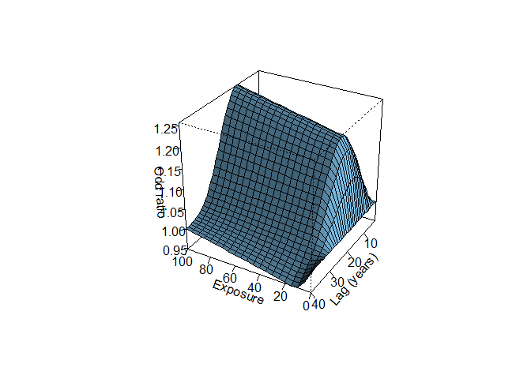
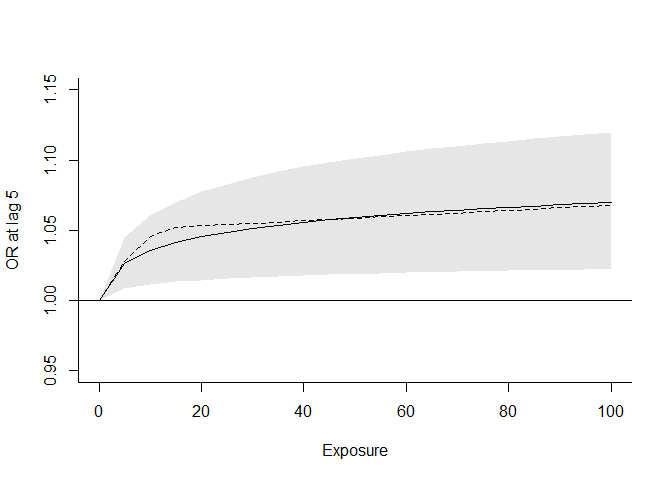

Extensions of `dlnm` package
================

``` r
pacman::p_load(
        rio,            # import and export files
        here,           # locate files 
        tidyverse,      # data management and visualization
        dlnm,
        splines,
        skimr,
        survival,
        mgcv
)
```

# Data

``` r
# data #-------------------
```

## `drug`: A Trial on the Effect of Time-Varying Doses of a Drug

``` r
## drug #----------------------------
```

- `id`: subject ID.  
- `out`: the outcome level measured at day 28.  
- `sex`: the sex of the subject.  
- `day1.7`, `day8.14`, `day15.21`, `day22.28`: daily dose for the 1st,
  2nd, 3rd, 4th week.

``` r
tibble(drug)
```

    ## # A tibble: 200 × 7
    ##       id   out sex   day1.7 day8.14 day15.21 day22.28
    ##    <int> <dbl> <fct>  <dbl>   <dbl>    <dbl>    <dbl>
    ##  1     1    46 M          0       0       40       37
    ##  2     2    50 F          0      47       55        0
    ##  3     3     7 F         56      22        0        0
    ##  4     4    70 M         91       0        0       87
    ##  5     5    -3 F          0      42       28        0
    ##  6     6    44 F          0       0       45       77
    ##  7     7    25 M         83       0       55        0
    ##  8     8    25 M          0       0       61       14
    ##  9     9    48 M          0      15       98        0
    ## 10    10    44 M          0      37        0       40
    ## # ℹ 190 more rows

``` r
skimr::skim(drug)
```

|                                                  |      |
|:-------------------------------------------------|:-----|
| Name                                             | drug |
| Number of rows                                   | 200  |
| Number of columns                                | 7    |
| \_\_\_\_\_\_\_\_\_\_\_\_\_\_\_\_\_\_\_\_\_\_\_   |      |
| Column type frequency:                           |      |
| factor                                           | 1    |
| numeric                                          | 6    |
| \_\_\_\_\_\_\_\_\_\_\_\_\_\_\_\_\_\_\_\_\_\_\_\_ |      |
| Group variables                                  | None |

Data summary

**Variable type: factor**

| skim_variable | n_missing | complete_rate | ordered | n_unique | top_counts    |
|:--------------|----------:|--------------:|:--------|---------:|:--------------|
| sex           |         0 |             1 | FALSE   |        2 | F: 105, M: 95 |

**Variable type: numeric**

| skim_variable | n_missing | complete_rate | mean | sd | p0 | p25 | p50 | p75 | p100 | hist |
|:---|---:|---:|---:|---:|---:|---:|---:|---:|---:|:---|
| id | 0 | 1 | 100.50 | 57.88 | 1 | 50.75 | 100.5 | 150.25 | 200 | ▇▇▇▇▇ |
| out | 0 | 1 | 27.47 | 18.69 | -31 | 13.00 | 26.0 | 40.25 | 81 | ▁▅▇▅▁ |
| day1.7 | 0 | 1 | 21.99 | 30.80 | 0 | 0.00 | 0.0 | 41.25 | 99 | ▇▁▁▁▁ |
| day8.14 | 0 | 1 | 22.71 | 30.50 | 0 | 0.00 | 0.0 | 43.00 | 100 | ▇▁▂▁▁ |
| day15.21 | 0 | 1 | 27.25 | 32.64 | 0 | 0.00 | 9.5 | 54.00 | 100 | ▇▂▂▂▂ |
| day22.28 | 0 | 1 | 23.14 | 31.68 | 0 | 0.00 | 1.0 | 44.25 | 98 | ▇▂▁▁▁ |

## `nested`: Nested Case-Control Study with a Time-Varying Exposure and a Cancer Outcome

``` r
## nested #------------------------
```

- `id`: subject ID.  
- `case`: indicator for case (1) or control (0).  
- `age`: age of each subject.  
- `riskset`: risk set id.  
- `exp15`, `exp20`, …, `exp60`: yearly exposure in the age period
  (15-19), (20-24), …, (60-64) year.

``` r
tibble(nested)
```

    ## # A tibble: 600 × 14
    ##       id  case   age riskset exp15 exp20 exp25 exp30 exp35 exp40 exp45 exp50 exp55 exp60
    ##    <dbl> <dbl> <dbl>   <dbl> <dbl> <dbl> <dbl> <dbl> <dbl> <dbl> <dbl> <dbl> <dbl> <dbl>
    ##  1     1     1    81     240     5    84    34    45   128    81    14    52    11    16
    ##  2     2     1    69     129    11     8    25     6     8    12    19    60    16    10
    ##  3     3     1    73     180    14    15     7    69    10   143    18    19    44    23
    ##  4     4     0    52      19    10    16     5    30    24    33    14   122    NA    NA
    ##  5     4     0    66      96    10    16     5    30    24    33    14   122     2    11
    ##  6     4     1    72     168    10    16     5    30    24    33    14   122     2    11
    ##  7     5     0    70     139    18    42     6    22    22    10     5    16    68    18
    ##  8     5     0    80     235    18    42     6    22    22    10     5    16    68    18
    ##  9     5     0    83     252    18    42     6    22    22    10     5    16    68    18
    ## 10     5     0    99     298    18    42     6    22    22    10     5    16    68    18
    ## # ℹ 590 more rows

``` r
nested %>% nest(.by = id)
```

    ## # A tibble: 301 × 2
    ##       id data             
    ##    <dbl> <list>           
    ##  1     1 <tibble [1 × 13]>
    ##  2     2 <tibble [1 × 13]>
    ##  3     3 <tibble [1 × 13]>
    ##  4     4 <tibble [3 × 13]>
    ##  5     5 <tibble [6 × 13]>
    ##  6     6 <tibble [2 × 13]>
    ##  7     7 <tibble [1 × 13]>
    ##  8     8 <tibble [3 × 13]>
    ##  9     9 <tibble [1 × 13]>
    ## 10    10 <tibble [1 × 13]>
    ## # ℹ 291 more rows

``` r
nested %>% nest(.by = id) %>% pluck("data", 5)
```

    ## # A tibble: 6 × 13
    ##    case   age riskset exp15 exp20 exp25 exp30 exp35 exp40 exp45 exp50 exp55 exp60
    ##   <dbl> <dbl>   <dbl> <dbl> <dbl> <dbl> <dbl> <dbl> <dbl> <dbl> <dbl> <dbl> <dbl>
    ## 1     0    70     139    18    42     6    22    22    10     5    16    68    18
    ## 2     0    80     235    18    42     6    22    22    10     5    16    68    18
    ## 3     0    83     252    18    42     6    22    22    10     5    16    68    18
    ## 4     0    99     298    18    42     6    22    22    10     5    16    68    18
    ## 5     0    99     299    18    42     6    22    22    10     5    16    68    18
    ## 6     1    99     300    18    42     6    22    22    10     5    16    68    18

``` r
skimr::skim(nested)
```

|                                                  |        |
|:-------------------------------------------------|:-------|
| Name                                             | nested |
| Number of rows                                   | 600    |
| Number of columns                                | 14     |
| \_\_\_\_\_\_\_\_\_\_\_\_\_\_\_\_\_\_\_\_\_\_\_   |        |
| Column type frequency:                           |        |
| numeric                                          | 14     |
| \_\_\_\_\_\_\_\_\_\_\_\_\_\_\_\_\_\_\_\_\_\_\_\_ |        |
| Group variables                                  | None   |

Data summary

**Variable type: numeric**

| skim_variable | n_missing | complete_rate | mean | sd | p0 | p25 | p50 | p75 | p100 | hist |
|:---|---:|---:|---:|---:|---:|---:|---:|---:|---:|:---|
| id | 0 | 1.00 | 153.74 | 87.59 | 1 | 78.00 | 155.5 | 234.25 | 301 | ▇▇▆▇▇ |
| case | 0 | 1.00 | 0.50 | 0.50 | 0 | 0.00 | 0.5 | 1.00 | 1 | ▇▁▁▁▇ |
| age | 0 | 1.00 | 70.63 | 11.78 | 38 | 62.00 | 71.0 | 79.00 | 99 | ▁▅▇▆▂ |
| riskset | 0 | 1.00 | 150.50 | 86.67 | 1 | 75.75 | 150.5 | 225.25 | 300 | ▇▇▇▇▇ |
| exp15 | 0 | 1.00 | 33.85 | 40.32 | 2 | 9.75 | 19.0 | 45.00 | 348 | ▇▁▁▁▁ |
| exp20 | 0 | 1.00 | 30.74 | 32.27 | 1 | 10.00 | 20.0 | 41.00 | 287 | ▇▁▁▁▁ |
| exp25 | 0 | 1.00 | 32.58 | 43.82 | 1 | 9.00 | 21.0 | 43.00 | 529 | ▇▁▁▁▁ |
| exp30 | 0 | 1.00 | 38.86 | 54.88 | 1 | 11.75 | 21.0 | 46.00 | 438 | ▇▁▁▁▁ |
| exp35 | 0 | 1.00 | 34.33 | 38.69 | 1 | 11.00 | 22.0 | 44.00 | 275 | ▇▁▁▁▁ |
| exp40 | 2 | 1.00 | 29.58 | 36.86 | 1 | 9.00 | 19.0 | 33.00 | 358 | ▇▁▁▁▁ |
| exp45 | 6 | 0.99 | 28.62 | 38.39 | 2 | 8.00 | 18.0 | 33.00 | 417 | ▇▁▁▁▁ |
| exp50 | 20 | 0.97 | 33.38 | 55.56 | 1 | 10.00 | 20.0 | 42.00 | 1064 | ▇▁▁▁▁ |
| exp55 | 60 | 0.90 | 31.47 | 37.38 | 0 | 10.00 | 20.0 | 43.00 | 414 | ▇▁▁▁▁ |
| exp60 | 114 | 0.81 | 29.23 | 36.44 | 1 | 10.00 | 16.0 | 34.00 | 252 | ▇▁▁▁▁ |

# Matrix of exposure history

``` r
# matrix of exposure history #-----------------------
```

## `drug`

``` r
## drug #--------------------
```

**Note:** exposure at lag0 → lag27: day 28th → day 1st

``` r
#---
```

### Reference code

``` r
### reference code #--------------
rep(7:4, each = 7)
```

    ##  [1] 7 7 7 7 7 7 7 6 6 6 6 6 6 6 5 5 5 5 5 5 5 4 4 4 4 4 4 4

``` r
drug[, rep(7:4, each = 7)] %>% tibble()
```

    ## # A tibble: 200 × 28
    ##    day22.28 day22.28.1 day22.28.2 day22.28.3 day22.28.4 day22.28.5 day22.28.6 day15.21 day15.21.1
    ##       <dbl>      <dbl>      <dbl>      <dbl>      <dbl>      <dbl>      <dbl>    <dbl>      <dbl>
    ##  1       37         37         37         37         37         37         37       40         40
    ##  2        0          0          0          0          0          0          0       55         55
    ##  3        0          0          0          0          0          0          0        0          0
    ##  4       87         87         87         87         87         87         87        0          0
    ##  5        0          0          0          0          0          0          0       28         28
    ##  6       77         77         77         77         77         77         77       45         45
    ##  7        0          0          0          0          0          0          0       55         55
    ##  8       14         14         14         14         14         14         14       61         61
    ##  9        0          0          0          0          0          0          0       98         98
    ## 10       40         40         40         40         40         40         40        0          0
    ## # ℹ 190 more rows
    ## # ℹ 19 more variables: day15.21.2 <dbl>, day15.21.3 <dbl>, day15.21.4 <dbl>, day15.21.5 <dbl>,
    ## #   day15.21.6 <dbl>, day8.14 <dbl>, day8.14.1 <dbl>, day8.14.2 <dbl>, day8.14.3 <dbl>, day8.14.4 <dbl>,
    ## #   day8.14.5 <dbl>, day8.14.6 <dbl>, day1.7 <dbl>, day1.7.1 <dbl>, day1.7.2 <dbl>, day1.7.3 <dbl>,
    ## #   day1.7.4 <dbl>, day1.7.5 <dbl>, day1.7.6 <dbl>

``` r
Qdrug <- as.matrix(drug[, rep(7:4, each = 7)])
Qdrug[1:3, 1:9]
```

    ##   day22.28 day22.28.1 day22.28.2 day22.28.3 day22.28.4 day22.28.5 day22.28.6 day15.21 day15.21.1
    ## 1       37         37         37         37         37         37         37       40         40
    ## 2        0          0          0          0          0          0          0       55         55
    ## 3        0          0          0          0          0          0          0        0          0

``` r
colnames(Qdrug) <- paste("lag", 0:27, sep = "")
Qdrug[1:3, 1:14]
```

    ##   lag0 lag1 lag2 lag3 lag4 lag5 lag6 lag7 lag8 lag9 lag10 lag11 lag12 lag13
    ## 1   37   37   37   37   37   37   37   40   40   40    40    40    40    40
    ## 2    0    0    0    0    0    0    0   55   55   55    55    55    55    55
    ## 3    0    0    0    0    0    0    0    0    0    0     0     0     0     0

### `tidyverse` style

``` r
### tidyverse style #--------------------

(week4 <- map_dfc(1:7, ~ drug$day22.28) %>% 
        rename_with(~paste0("lag", 0:6), everything()))
```

    ## New names:
    ## • `` -> `...1`
    ## • `` -> `...2`
    ## • `` -> `...3`
    ## • `` -> `...4`
    ## • `` -> `...5`
    ## • `` -> `...6`
    ## • `` -> `...7`

    ## # A tibble: 200 × 7
    ##     lag0  lag1  lag2  lag3  lag4  lag5  lag6
    ##    <dbl> <dbl> <dbl> <dbl> <dbl> <dbl> <dbl>
    ##  1    37    37    37    37    37    37    37
    ##  2     0     0     0     0     0     0     0
    ##  3     0     0     0     0     0     0     0
    ##  4    87    87    87    87    87    87    87
    ##  5     0     0     0     0     0     0     0
    ##  6    77    77    77    77    77    77    77
    ##  7     0     0     0     0     0     0     0
    ##  8    14    14    14    14    14    14    14
    ##  9     0     0     0     0     0     0     0
    ## 10    40    40    40    40    40    40    40
    ## # ℹ 190 more rows

``` r
(week3 <- map_dfc(1:7, ~ drug$day15.21) %>% 
                rename_with(~paste0("lag", 7:13), everything()))
```

    ## New names:
    ## • `` -> `...1`
    ## • `` -> `...2`
    ## • `` -> `...3`
    ## • `` -> `...4`
    ## • `` -> `...5`
    ## • `` -> `...6`
    ## • `` -> `...7`

    ## # A tibble: 200 × 7
    ##     lag7  lag8  lag9 lag10 lag11 lag12 lag13
    ##    <dbl> <dbl> <dbl> <dbl> <dbl> <dbl> <dbl>
    ##  1    40    40    40    40    40    40    40
    ##  2    55    55    55    55    55    55    55
    ##  3     0     0     0     0     0     0     0
    ##  4     0     0     0     0     0     0     0
    ##  5    28    28    28    28    28    28    28
    ##  6    45    45    45    45    45    45    45
    ##  7    55    55    55    55    55    55    55
    ##  8    61    61    61    61    61    61    61
    ##  9    98    98    98    98    98    98    98
    ## 10     0     0     0     0     0     0     0
    ## # ℹ 190 more rows

``` r
(week2 <- map_dfc(1:7, ~ drug$day8.14) %>% 
                rename_with(~paste0("lag", 14:20), everything()))
```

    ## New names:
    ## • `` -> `...1`
    ## • `` -> `...2`
    ## • `` -> `...3`
    ## • `` -> `...4`
    ## • `` -> `...5`
    ## • `` -> `...6`
    ## • `` -> `...7`

    ## # A tibble: 200 × 7
    ##    lag14 lag15 lag16 lag17 lag18 lag19 lag20
    ##    <dbl> <dbl> <dbl> <dbl> <dbl> <dbl> <dbl>
    ##  1     0     0     0     0     0     0     0
    ##  2    47    47    47    47    47    47    47
    ##  3    22    22    22    22    22    22    22
    ##  4     0     0     0     0     0     0     0
    ##  5    42    42    42    42    42    42    42
    ##  6     0     0     0     0     0     0     0
    ##  7     0     0     0     0     0     0     0
    ##  8     0     0     0     0     0     0     0
    ##  9    15    15    15    15    15    15    15
    ## 10    37    37    37    37    37    37    37
    ## # ℹ 190 more rows

``` r
(week1 <- map_dfc(1:7, ~ drug$day1.7) %>% 
                rename_with(~paste0("lag", 21:27), everything()))
```

    ## New names:
    ## • `` -> `...1`
    ## • `` -> `...2`
    ## • `` -> `...3`
    ## • `` -> `...4`
    ## • `` -> `...5`
    ## • `` -> `...6`
    ## • `` -> `...7`

    ## # A tibble: 200 × 7
    ##    lag21 lag22 lag23 lag24 lag25 lag26 lag27
    ##    <dbl> <dbl> <dbl> <dbl> <dbl> <dbl> <dbl>
    ##  1     0     0     0     0     0     0     0
    ##  2     0     0     0     0     0     0     0
    ##  3    56    56    56    56    56    56    56
    ##  4    91    91    91    91    91    91    91
    ##  5     0     0     0     0     0     0     0
    ##  6     0     0     0     0     0     0     0
    ##  7    83    83    83    83    83    83    83
    ##  8     0     0     0     0     0     0     0
    ##  9     0     0     0     0     0     0     0
    ## 10     0     0     0     0     0     0     0
    ## # ℹ 190 more rows

``` r
Qdrug_tidy <- bind_cols(week4, week3, week2, week1) %>% 
        as.matrix()
Qdrug_tidy[1:3, 1:14]
```

    ##      lag0 lag1 lag2 lag3 lag4 lag5 lag6 lag7 lag8 lag9 lag10 lag11 lag12 lag13
    ## [1,]   37   37   37   37   37   37   37   40   40   40    40    40    40    40
    ## [2,]    0    0    0    0    0    0    0   55   55   55    55    55    55    55
    ## [3,]    0    0    0    0    0    0    0    0    0    0     0     0     0     0

## `nested`

``` r
## nested #--------------------
```

**Note:** read vignette `dlnmExtended` in `dlnm` package for details.

``` r
Qnest <- t(apply(nested, 
                 1, 
                 function(sub) exphist(rep(c(0, 0, 0, sub[5:14]), each = 5), 
                                       sub["age"], 
                                       lag = c(3, 40)))
           )

colnames(Qnest) <- paste0("lag", 3:40)
Qnest[1:3,1:16]
```

    ##   lag3 lag4 lag5 lag6 lag7 lag8 lag9 lag10 lag11 lag12 lag13 lag14 lag15 lag16 lag17 lag18
    ## 1    0    0    0    0    0    0    0     0     0     0     0     0     0    16    16    16
    ## 2    0   10   10   10   10   10   16    16    16    16    16    60    60    60    60    60
    ## 3    0    0    0    0    0   23   23    23    23    23    44    44    44    44    44    19

# Simple DLM

``` r
# simple DLM #-------------------
```

Find temporal dependency between daily dose of drug and health
outcome.  
**Step1**: cross-basis matrix of dose and lag time

``` r
# step1: cross-basis matrix
cbdrug <- crossbasis(Qdrug, # matrix of exposure history
                     # lag period, minimum lag = 0 by default
                     # MUST be consistent with dimension (i.e. number of columns)
                     # of exposure history matrix
                     lag = 27, 
                     # assume dose and outcome have linear association
                     argvar = list("lin"),
                     # lag: natural cubic spline with 2 knots at lag9 and lag18
                     arglag = list(fun = "ns", knots = c(9, 18)))

summary(cbdrug)
```

    ## CROSSBASIS FUNCTIONS
    ## observations: 200 
    ## range: 0 to 100 
    ## lag period: 0 27 
    ## total df:  4 
    ## 
    ## BASIS FOR VAR:
    ## fun: lin 
    ## intercept: FALSE 
    ## 
    ## BASIS FOR LAG:
    ## fun: ns 
    ## knots: 9 18 
    ## intercept: TRUE 
    ## Boundary.knots: 0 27

**Step2**: model fitting. Include cross-basis matrix formula of
regression model

``` r
# step2: model fitting
mod_drug <- lm(out ~ cbdrug + sex, # controlling for effect of sex
               data = drug)

summary(mod_drug)
```

    ## 
    ## Call:
    ## lm(formula = out ~ cbdrug + sex, data = drug)
    ## 
    ## Residuals:
    ##     Min      1Q  Median      3Q     Max 
    ## -49.848  -9.079   0.095   8.679  39.969 
    ## 
    ## Coefficients:
    ##              Estimate Std. Error t value Pr(>|t|)    
    ## (Intercept) 15.393468   2.816393   5.466 1.41e-07 ***
    ## cbdrugv1.l1  0.006007   0.011800   0.509   0.6113    
    ## cbdrugv1.l2 -0.025210   0.010898  -2.313   0.0218 *  
    ## cbdrugv1.l3  0.078388   0.010017   7.826 3.19e-13 ***
    ## cbdrugv1.l4 -0.046391   0.010232  -4.534 1.01e-05 ***
    ## sexF        -4.822529   2.067981  -2.332   0.0207 *  
    ## ---
    ## Signif. codes:  0 '***' 0.001 '**' 0.01 '*' 0.05 '.' 0.1 ' ' 1
    ## 
    ## Residual standard error: 14.56 on 194 degrees of freedom
    ## Multiple R-squared:  0.4089, Adjusted R-squared:  0.3937 
    ## F-statistic: 26.84 on 5 and 194 DF,  p-value: < 2.2e-16

**Step3**: Interpretation. Predict specific effect of dose and lag on
outcome.

``` r
# step3: prediction
# reference value: set by default to 0 for `lin()`
pdrug <- crosspred(cbdrug, mod_drug, at = 0:20*5)
```

`all-`: Overall cumulative effects associated with exposure to 50.  
- `backward` perspective: total effect today after being exposed to 50
for the past 28 days.  
- `forward` perspective: total effect over the next 28 days after being
exposed to 50 today.

``` r
with(pdrug, cbind(allfit, alllow, allhigh)["50", ])
```

    ##   allfit   alllow  allhigh 
    ## 30.29584 20.12871 40.46298

`mat-`: specific combinations of exposure levels and lag.

``` r
# increase in outcome associated with dose 20, three days earlier
pdrug$matfit["20","lag3"]
```

    ## [1] 1.118139

**Step4**: Plot  
Effect of a dose of the drug is pronounced in the 1st days after the
intake and then tends to disappear after 15-20 days

``` r
plot(pdrug, zlab = "Effect", xlab = "Dose", ylab = "Lag (days)")
```

<!-- -->

Lag-response curve specific to exposure 60: exponential decay in effects

``` r
plot(pdrug, var = 60, ylab = "Effect at dose 60", xlab = "Lag (days)", ylim = c(-1,5))
```

<!-- -->

Exposure-response curve specific to lag 10

``` r
plot(pdrug, lag = 10, ylab = "Effect at lag 10", xlab = "Dose", ylim = c(-1,5))
```

<!-- -->

# DLNM

``` r
# DLNM #-------------------
```

How long-term exposures to an agent at work affect the risk of
developing cancer.  
**Step1**: Cross-basis

``` r
cbnest <- crossbasis(Qnest,
                     lag = c(3, 40),
                     # quadratic splines, single knot at median by default
                     argvar = list(fun = "bs", degree = 2, df = 3),
                     # natural cubic splines
                     # exclude intercept: null effect at beginning of lag period
                     arglag = list(fun = "ns", knots = c(10, 30), intercept = F))

summary(cbnest)
```

    ## CROSSBASIS FUNCTIONS
    ## observations: 600 
    ## range: 0 to 1064 
    ## lag period: 3 40 
    ## total df:  9 
    ## 
    ## BASIS FOR VAR:
    ## fun: bs 
    ## knots: 15 
    ## degree: 2 
    ## intercept: FALSE 
    ## Boundary.knots: 0 1064 
    ## 
    ## BASIS FOR LAG:
    ## fun: ns 
    ## knots: 10 30 
    ## intercept: FALSE 
    ## Boundary.knots: 3 40

**Step2**: Model fitting: conditional logistic regression

``` r
mod_nest <- survival::clogit(case ~ cbnest + strata(riskset), data = nested)

summary(mod_nest)
```

    ## Call:
    ## coxph(formula = Surv(rep(1, 600L), case) ~ cbnest + strata(riskset), 
    ##     data = nested, method = "exact")
    ## 
    ##   n= 600, number of events= 300 
    ## 
    ##                 coef exp(coef) se(coef)      z Pr(>|z|)  
    ## cbnestv1.l1 -0.02684   0.97352  0.18760 -0.143   0.8863  
    ## cbnestv1.l2  0.19168   1.21128  0.15047  1.274   0.2027  
    ## cbnestv1.l3 -0.23130   0.79350  0.13228 -1.748   0.0804 .
    ## cbnestv2.l1 -0.22924   0.79514  0.85634 -0.268   0.7889  
    ## cbnestv2.l2  0.86996   2.38682  0.60621  1.435   0.1513  
    ## cbnestv2.l3 -0.15780   0.85402  0.50745 -0.311   0.7558  
    ## cbnestv3.l1 -0.76684   0.46448  5.92826 -0.129   0.8971  
    ## cbnestv3.l2  0.94308   2.56789  3.63253  0.260   0.7952  
    ## cbnestv3.l3 -1.14566   0.31802  2.80851 -0.408   0.6833  
    ## ---
    ## Signif. codes:  0 '***' 0.001 '**' 0.01 '*' 0.05 '.' 0.1 ' ' 1
    ## 
    ##             exp(coef) exp(-coef) lower .95 upper .95
    ## cbnestv1.l1    0.9735     1.0272 6.740e-01     1.406
    ## cbnestv1.l2    1.2113     0.8256 9.019e-01     1.627
    ## cbnestv1.l3    0.7935     1.2602 6.123e-01     1.028
    ## cbnestv2.l1    0.7951     1.2576 1.484e-01     4.259
    ## cbnestv2.l2    2.3868     0.4190 7.275e-01     7.831
    ## cbnestv2.l3    0.8540     1.1709 3.159e-01     2.309
    ## cbnestv3.l1    0.4645     2.1529 4.177e-06 51655.136
    ## cbnestv3.l2    2.5679     0.3894 2.078e-03  3173.904
    ## cbnestv3.l3    0.3180     3.1445 1.294e-03    78.173
    ## 
    ## Concordance= 0.583  (se = 0.04 )
    ## Likelihood ratio test= 17.98  on 9 df,   p=0.04
    ## Wald test            = 15.88  on 9 df,   p=0.07
    ## Score (logrank) test = 17.26  on 9 df,   p=0.04

**Step3**: Interpretation  
Note: MUST provide `cen =`, as no straightforward reference exist for
non-linear functions (e.g. `bs()`).

``` r
pnest <- crosspred(cbnest, mod_nest, cen = 0, at = 0:20*5)
```

**Step4**: Plot  
Initial increase in risk, measured as odds ratio (OR), followed by a
decrease.

``` r
plot(pnest, zlab = "Odd ratio", xlab = "Exposure", ylab = "Lag (years)")
```

<!-- -->

Estimated lag-response curve displays a peak in risk 10 to 15 years
after the exposure. Then 30 years after the exposure, the risk returns
to the baseline level (wide confidence intervals).

``` r
plot(pnest,
     var = 50, 
     ylab = "Odd ratio for exposure 50",
     xlab = "Lag (years)",
     xlim = c(0, 40))
```

<!-- -->

Exposure-response curve suggests that the relationship between exposure
and outcome becomes weaker at higher exposure levels.

``` r
plot(pnest,
     lag = 5,
     ylab = "Odd ratio at lag 5",
     xlab = "Exposure",
     ylim = c(0.95, 1.15))
```

<!-- -->

# User-defined functions in `onebasis()` and `crossbasis()`

``` r
# user-defined function #------------------------
```

## Example1

``` r
## example1 #-----------
mylog <- function(x) log(x+1)

# cross-basis
cbnest2 <- crossbasis(Qnest,
                     lag = c(3, 40),
                     # user-defined function
                     argvar = list(fun = "mylog"),
                     # natural cubic splines
                     # exclude intercept: null effect at beginning of lag period
                     arglag = list(fun = "ns", knots = c(10, 30), intercept = F))

summary(cbnest2)
```

    ## CROSSBASIS FUNCTIONS
    ## observations: 600 
    ## range: 0 to 1064 
    ## lag period: 3 40 
    ## total df:  3 
    ## 
    ## BASIS FOR VAR:
    ## fun: mylog 
    ## 
    ## BASIS FOR LAG:
    ## fun: ns 
    ## knots: 10 30 
    ## intercept: FALSE 
    ## Boundary.knots: 3 40

``` r
# model fitting
mod_nest2 <- clogit(case ~ cbnest2 + strata(riskset), data = nested)
summary(mod_nest2)
```

    ## Call:
    ## coxph(formula = Surv(rep(1, 600L), case) ~ cbnest2 + strata(riskset), 
    ##     data = nested, method = "exact")
    ## 
    ##   n= 600, number of events= 300 
    ## 
    ##                  coef exp(coef) se(coef)      z Pr(>|z|)  
    ## cbnest2v1.l1 -0.01871   0.98146  0.03620 -0.517   0.6053  
    ## cbnest2v1.l2  0.07638   1.07937  0.03000  2.546   0.0109 *
    ## cbnest2v1.l3 -0.03774   0.96296  0.02320 -1.627   0.1037  
    ## ---
    ## Signif. codes:  0 '***' 0.001 '**' 0.01 '*' 0.05 '.' 0.1 ' ' 1
    ## 
    ##              exp(coef) exp(-coef) lower .95 upper .95
    ## cbnest2v1.l1    0.9815     1.0189    0.9142     1.054
    ## cbnest2v1.l2    1.0794     0.9265    1.0177     1.145
    ## cbnest2v1.l3    0.9630     1.0385    0.9202     1.008
    ## 
    ## Concordance= 0.577  (se = 0.04 )
    ## Likelihood ratio test= 17.49  on 3 df,   p=6e-04
    ## Wald test            = 15.77  on 3 df,   p=0.001
    ## Score (logrank) test = 16.89  on 3 df,   p=7e-04

``` r
# prediction
pnest2 <- crosspred(cbnest2, mod_nest2, cen = 0, at = 0:20*5)

# plot
plot(pnest2, zlab = "OR", xlab = "Exposure", ylab = "Lag (years)")
```

<!-- -->

``` r
plot(pnest2, var = 50, ylab = "OR for exposure 50", xlab = "Lag (years)", xlim = c(0, 40))
lines(pnest, var = 50, lty = 2)
```

<!-- -->

``` r
plot(pnest2, lag = 5, ylab = "OR at lag 5", xlab = "Exposure", ylim = c(0.95, 1.15))
lines(pnest, lag = 5, lty = 2)
```

<!-- -->

## Example2

``` r
## example2 #-----------
fdecay <- function(x, scale = 5) { 
        
        # scale: control degree of decay
        basis <- exp(-x/scale) 
        
        # must include attribute in the returned vector
        attributes(basis)$scale <- scale 
        return(basis) 
        }

# cross-basis
cbdrug2 <- crossbasis(Qdrug,
                      lag = 27,
                      argvar = list("lin"),
                      arglag = list(fun = "fdecay", scale = 6))
summary(cbdrug2)
```

    ## CROSSBASIS FUNCTIONS
    ## observations: 200 
    ## range: 0 to 100 
    ## lag period: 0 27 
    ## total df:  1 
    ## 
    ## BASIS FOR VAR:
    ## fun: lin 
    ## intercept: FALSE 
    ## 
    ## BASIS FOR LAG:
    ## fun: fdecay 
    ## scale: 6

``` r
# model fitting
mod_drug2 <- lm(out ~ cbdrug2 + sex, data = drug)
summary(mod_drug2)
```

    ## 
    ## Call:
    ## lm(formula = out ~ cbdrug2 + sex, data = drug)
    ## 
    ## Residuals:
    ##     Min      1Q  Median      3Q     Max 
    ## -49.944  -8.430  -0.159   8.155  40.105 
    ## 
    ## Coefficients:
    ##              Estimate Std. Error t value Pr(>|t|)    
    ## (Intercept) 16.428627   1.886895   8.707 1.26e-15 ***
    ## cbdrug2      0.087511   0.007663  11.420  < 2e-16 ***
    ## sexF        -4.753622   2.050582  -2.318   0.0215 *  
    ## ---
    ## Signif. codes:  0 '***' 0.001 '**' 0.01 '*' 0.05 '.' 0.1 ' ' 1
    ## 
    ## Residual standard error: 14.48 on 197 degrees of freedom
    ## Multiple R-squared:  0.4062, Adjusted R-squared:  0.4002 
    ## F-statistic: 67.39 on 2 and 197 DF,  p-value: < 2.2e-16

``` r
# prediction
pdrug2 <- crosspred(cbdrug2, mod_drug2, at = 0:20*5)

# plot
plot(pdrug2, zlab = "Effect", xlab = "Dose", ylab = "Lag (days)")
```

<!-- -->

``` r
plot(pdrug2, 
     var = 60, 
     ylab = "Effect at dose 60", 
     xlab = "Lag (days)", 
     ylim=c(-1,5))
lines(pdrug, var = 60, lty = 2)
```

<!-- -->

``` r
plot(pdrug2,
     lag = 10,
     ylab = "Effect at lag 10",
     xlab = "Dose",
     ylim = c(-1,5))
lines(pdrug, lag = 10, lty = 2)
```

<!-- -->

# `dlnm` as a general tool for regression analysis

``` r
# general tool #------------------------
```

## Linear regression

``` r
## linear regression #-----------------
# data
tibble(women)
```

    ## # A tibble: 15 × 2
    ##    height weight
    ##     <dbl>  <dbl>
    ##  1     58    115
    ##  2     59    117
    ##  3     60    120
    ##  4     61    123
    ##  5     62    126
    ##  6     63    129
    ##  7     64    132
    ##  8     65    135
    ##  9     66    139
    ## 10     67    142
    ## 11     68    146
    ## 12     69    150
    ## 13     70    154
    ## 14     71    159
    ## 15     72    164

``` r
# cross-basis
oneheight <- onebasis(women$height, "ns", df = 5)
summary(oneheight)
```

    ## BASIS FUNCTION
    ## observations: 15 
    ## range: 58 72 
    ## df: 5 
    ## fun: ns 
    ## knots: 60.8 63.6 66.4 69.2 
    ## intercept: FALSE 
    ## Boundary.knots: 58 72

``` r
# model fitting
mod_women <- lm(weight ~ oneheight, data = women)
summary(mod_women)
```

    ## 
    ## Call:
    ## lm(formula = weight ~ oneheight, data = women)
    ## 
    ## Residuals:
    ##      Min       1Q   Median       3Q      Max 
    ## -0.38333 -0.12585  0.07083  0.15401  0.30426 
    ## 
    ## Coefficients:
    ##             Estimate Std. Error t value Pr(>|t|)    
    ## (Intercept) 114.7447     0.2338  490.88  < 2e-16 ***
    ## oneheightb1  15.9474     0.3699   43.12 9.69e-12 ***
    ## oneheightb2  25.1695     0.4323   58.23 6.55e-13 ***
    ## oneheightb3  33.2582     0.3541   93.93 8.91e-15 ***
    ## oneheightb4  50.7894     0.6062   83.78 2.49e-14 ***
    ## oneheightb5  45.0363     0.2784  161.75  < 2e-16 ***
    ## ---
    ## Signif. codes:  0 '***' 0.001 '**' 0.01 '*' 0.05 '.' 0.1 ' ' 1
    ## 
    ## Residual standard error: 0.2645 on 9 degrees of freedom
    ## Multiple R-squared:  0.9998, Adjusted R-squared:  0.9997 
    ## F-statistic:  9609 on 5 and 9 DF,  p-value: < 2.2e-16

``` r
# interpretation
pwomen <- crosspred(oneheight, mod_women, cen = 65, at = 58:72)
# `all-`: estimated association
with(pwomen, cbind(allfit, alllow, allhigh)["70",])
```

    ##   allfit   alllow  allhigh 
    ## 18.92287 18.46545 19.38030

``` r
# plot
plot(pwomen,
     ci = "l",
     ylab = "Weight (lb) difference", 
     xlab = "Height (in)", 
     col = 4)
```

<!-- -->

## GAM using `mgcv`

``` r
## mgcv::gam #-----------------
# data
dat <- gamSim(1, n = 200, dist = "poisson", scale = .1)
```

    ## Gu & Wahba 4 term additive model

``` r
tibble(dat)
```

    ## # A tibble: 200 × 10
    ##        y     x0     x1    x2    x3     f    f0    f1         f2    f3
    ##    <int>  <dbl>  <dbl> <dbl> <dbl> <dbl> <dbl> <dbl>      <dbl> <dbl>
    ##  1     1 0.0923 0.539  0.462 0.250 0.651 0.572  2.94 3.00           0
    ##  2     0 0.838  0.877  0.854 0.351 0.710 0.975  5.78 0.346          0
    ##  3     2 0.236  0.584  0.940 0.596 0.457 1.35   3.21 0.00488        0
    ##  4     3 0.0224 0.644  0.124 0.601 0.884 0.141  3.63 5.07           0
    ##  5     3 0.648  0.0249 0.202 0.472 1.15  1.79   1.05 8.64           0
    ##  6     0 0.759  0.719  0.982 0.688 0.559 1.37   4.21 0.00000597     0
    ##  7     2 0.410  0.215  0.212 0.686 1.23  1.92   1.54 8.80           0
    ##  8     2 0.716  0.539  0.951 0.601 0.450 1.56   2.94 0.00165        0
    ##  9     1 0.797  0.714  0.680 0.807 0.849 1.19   4.17 3.12           0
    ## 10     4 0.797  0.455  0.474 0.945 0.656 1.19   2.48 2.88           0
    ## # ℹ 190 more rows

``` r
# model fitting
b2 <- gam(y ~ s(x0,bs = "cr") + 
                  s(x1, bs = "cr") + 
                  s(x2, bs = "cr") + 
                  s(x3, bs = "cr"), 
          family = poisson, 
          data = dat, 
          method = "REML")

summary(b2)
```

    ## 
    ## Family: poisson 
    ## Link function: log 
    ## 
    ## Formula:
    ## y ~ s(x0, bs = "cr") + s(x1, bs = "cr") + s(x2, bs = "cr") + 
    ##     s(x3, bs = "cr")
    ## 
    ## Parametric coefficients:
    ##             Estimate Std. Error z value Pr(>|z|)    
    ## (Intercept)  0.84155    0.04725   17.81   <2e-16 ***
    ## ---
    ## Signif. codes:  0 '***' 0.001 '**' 0.01 '*' 0.05 '.' 0.1 ' ' 1
    ## 
    ## Approximate significance of smooth terms:
    ##         edf Ref.df Chi.sq  p-value    
    ## s(x0) 1.636  2.023  1.907  0.39615    
    ## s(x1) 1.001  1.002 10.613  0.00113 ** 
    ## s(x2) 4.888  5.962 37.175 4.02e-06 ***
    ## s(x3) 1.000  1.000  0.189  0.66383    
    ## ---
    ## Signif. codes:  0 '***' 0.001 '**' 0.01 '*' 0.05 '.' 0.1 ' ' 1
    ## 
    ## R-sq.(adj) =  0.215   Deviance explained = 20.8%
    ## -REML = 362.35  Scale est. = 1         n = 200

``` r
plot(b2, select = 3)
```

<!-- -->

``` r
# prediction
pgam <- crosspred("x2", b2, cen = 0, at = 0:100/100)
with(pgam, cbind(allRRfit, allRRlow, allRRhigh)["0.7",])
```

    ##  allRRfit  allRRlow allRRhigh 
    ## 1.2091687 0.7704153 1.8977932

``` r
# plot
plot(pgam, ylim = c(0, 3), ylab = "RR", xlab = "x2", col = 2)
```

<!-- -->
