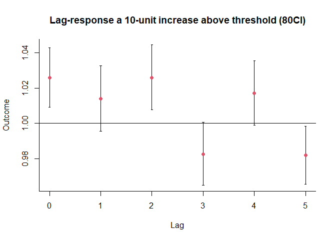

DLNM for time series data 01
================

``` r
pacman::p_load(
        rio,            # import and export files
        here,           # locate files 
        tidyverse,      # data management and visualization
        dlnm,
        splines,
        skimr
)
```

## Data

``` r
# data #-----------
chicagoNMMAPS %>% tibble()
```

    ## # A tibble: 5,114 × 14
    ##    date        time  year month   doy dow       death   cvd  resp   temp  dptp  rhum  pm10    o3
    ##    <date>     <int> <dbl> <dbl> <int> <fct>     <int> <int> <int>  <dbl> <dbl> <dbl> <dbl> <dbl>
    ##  1 1987-01-01     1  1987     1     1 Thursday    130    65    13 -0.278  31.5  95.5  27.0  4.38
    ##  2 1987-01-02     2  1987     1     2 Friday      150    73    14  0.556  29.9  88.2  NA    4.93
    ##  3 1987-01-03     3  1987     1     3 Saturday    101    43    11  0.556  27.4  89.5  32.8  3.75
    ##  4 1987-01-04     4  1987     1     4 Sunday      135    72     7 -1.67   28.6  84.5  40.0  4.29
    ##  5 1987-01-05     5  1987     1     5 Monday      126    64    12  0      28.9  74.5  NA    4.75
    ##  6 1987-01-06     6  1987     1     6 Tuesday     130    63    12  4.44   35.1  77.4  41.0  6.33
    ##  7 1987-01-07     7  1987     1     7 Wednesday   129    72    12  1.39   26.8  74.5  34.0  8.59
    ##  8 1987-01-08     8  1987     1     8 Thursday    109    51    13 -1.67   22    77.9  29.0 11.8 
    ##  9 1987-01-09     9  1987     1     9 Friday      125    62     7 -3.06   29    95.1  32.3  3.88
    ## 10 1987-01-10    10  1987     1    10 Saturday    153    90    11  0.278  27.8  81.9  NA    5.39
    ## # ℹ 5,104 more rows

``` r
skimr::skim(chicagoNMMAPS)
```

|                                                  |               |
|:-------------------------------------------------|:--------------|
| Name                                             | chicagoNMMAPS |
| Number of rows                                   | 5114          |
| Number of columns                                | 14            |
| \_\_\_\_\_\_\_\_\_\_\_\_\_\_\_\_\_\_\_\_\_\_\_   |               |
| Column type frequency:                           |               |
| Date                                             | 1             |
| factor                                           | 1             |
| numeric                                          | 12            |
| \_\_\_\_\_\_\_\_\_\_\_\_\_\_\_\_\_\_\_\_\_\_\_\_ |               |
| Group variables                                  | None          |

Data summary

**Variable type: Date**

| skim_variable | n_missing | complete_rate | min | max | median | n_unique |
|:---|---:|---:|:---|:---|:---|---:|
| date | 0 | 1 | 1987-01-01 | 2000-12-31 | 1993-12-31 | 5114 |

**Variable type: factor**

| skim_variable | n_missing | complete_rate | ordered | n_unique | top_counts |
|:---|---:|---:|:---|---:|:---|
| dow | 0 | 1 | FALSE | 7 | Sun: 731, Thu: 731, Fri: 731, Sat: 731 |

**Variable type: numeric**

| skim_variable | n_missing | complete_rate | mean | sd | p0 | p25 | p50 | p75 | p100 | hist |
|:---|---:|---:|---:|---:|---:|---:|---:|---:|---:|:---|
| time | 0 | 1.00 | 2557.50 | 1476.43 | 1.00 | 1279.25 | 2557.50 | 3835.75 | 5114.00 | ▇▇▇▇▇ |
| year | 0 | 1.00 | 1993.50 | 4.03 | 1987.00 | 1990.00 | 1993.50 | 1997.00 | 2000.00 | ▇▇▅▇▇ |
| month | 0 | 1.00 | 6.52 | 3.45 | 1.00 | 4.00 | 7.00 | 10.00 | 12.00 | ▇▅▅▅▇ |
| doy | 0 | 1.00 | 183.14 | 105.46 | 1.00 | 92.00 | 183.00 | 274.00 | 366.00 | ▇▇▇▇▇ |
| death | 0 | 1.00 | 115.42 | 15.30 | 69.00 | 105.00 | 114.00 | 124.00 | 411.00 | ▇▁▁▁▁ |
| cvd | 0 | 1.00 | 50.90 | 10.41 | 25.00 | 44.00 | 50.00 | 57.00 | 312.00 | ▇▁▁▁▁ |
| resp | 0 | 1.00 | 9.18 | 3.58 | 0.00 | 7.00 | 9.00 | 11.00 | 34.00 | ▃▇▂▁▁ |
| temp | 0 | 1.00 | 10.11 | 10.81 | -26.67 | 1.67 | 10.56 | 19.44 | 33.33 | ▁▃▇▇▅ |
| dptp | 0 | 1.00 | 40.41 | 18.49 | -25.62 | 27.25 | 39.75 | 55.75 | 78.25 | ▁▂▇▇▅ |
| rhum | 1096 | 0.79 | 69.17 | 15.30 | 25.62 | 58.12 | 69.75 | 80.38 | 100.00 | ▁▅▇▇▅ |
| pm10 | 251 | 0.95 | 33.74 | 19.31 | -3.05 | 20.77 | 30.25 | 42.42 | 356.18 | ▇▁▁▁▁ |
| o3 | 0 | 1.00 | 20.14 | 10.24 | -0.83 | 11.96 | 19.05 | 26.62 | 65.81 | ▅▇▃▁▁ |

## Example 1: simple DLM

``` r
# eg1: simple DLM #------------------------
```

**Goal:** Assessing effect of PM10 on mortality, while adjusting for
effect of temperature.

### **Step1**: build 2 cross-basis matrices for 2 predictors

``` r
## step1: cross-basis #--------------------------
```

#### PM10

``` r
cb1_pm <- crossbasis(chicagoNMMAPS$pm10,
                     # lagged effect of PM10 up to 15 days, minimum lag = 0 by default
                     lag = 15,
                     # assume linear effect for PM10 
                     argvar = list(fun = "lin"),
                     # lagged effect:  4th degree polynomial function
                     arglag = list(fun = "poly", degree = 4))

summary(cb1_pm)
```

    ## CROSSBASIS FUNCTIONS
    ## observations: 5114 
    ## range: -3.049835 to 356.1768 
    ## lag period: 0 15 
    ## total df:  5 
    ## 
    ## BASIS FOR VAR:
    ## fun: lin 
    ## intercept: FALSE 
    ## 
    ## BASIS FOR LAG:
    ## fun: poly 
    ## degree: 4 
    ## scale: 15 
    ## intercept: TRUE

``` r
cb1_pm
```

    ##            v1.l1    v1.l2     v1.l3     v1.l4     v1.l5
    ##    [1,]       NA       NA        NA        NA        NA
    ##    [2,]       NA       NA        NA        NA        NA
    ##    [3,]       NA       NA        NA        NA        NA
    ##    [4,]       NA       NA        NA        NA        NA
    ##    [5,]       NA       NA        NA        NA        NA
    ##    [6,]       NA       NA        NA        NA        NA
    ##    [7,]       NA       NA        NA        NA        NA
    ##    [8,]       NA       NA        NA        NA        NA
    ##    [9,]       NA       NA        NA        NA        NA
    ##   [10,]       NA       NA        NA        NA        NA
    ##   [11,]       NA       NA        NA        NA        NA
    ##   [12,]       NA       NA        NA        NA        NA
    ##   [13,]       NA       NA        NA        NA        NA
    ##   [14,]       NA       NA        NA        NA        NA
    ##   [15,]       NA       NA        NA        NA        NA
    ##   [16,]       NA       NA        NA        NA        NA
    ##   [17,]       NA       NA        NA        NA        NA
    ##   [18,]       NA       NA        NA        NA        NA
    ##   [19,]       NA       NA        NA        NA        NA
    ##   [20,]       NA       NA        NA        NA        NA
    ##   [21,]       NA       NA        NA        NA        NA
    ##   [22,]       NA       NA        NA        NA        NA
    ##   [23,]       NA       NA        NA        NA        NA
    ##   [24,]       NA       NA        NA        NA        NA
    ##   [25,]       NA       NA        NA        NA        NA
    ##   [26,]       NA       NA        NA        NA        NA
    ##   [27,]       NA       NA        NA        NA        NA
    ##   [28,]       NA       NA        NA        NA        NA
    ##   [29,]       NA       NA        NA        NA        NA
    ##   [30,]       NA       NA        NA        NA        NA
    ##   [31,]       NA       NA        NA        NA        NA
    ##   [32,]       NA       NA        NA        NA        NA
    ##   [33,]       NA       NA        NA        NA        NA
    ##   [34,]       NA       NA        NA        NA        NA
    ##   [35,]       NA       NA        NA        NA        NA
    ##   [36,]       NA       NA        NA        NA        NA
    ##   [37,]       NA       NA        NA        NA        NA
    ##   [38,]       NA       NA        NA        NA        NA
    ##   [39,]       NA       NA        NA        NA        NA
    ##   [40,]       NA       NA        NA        NA        NA
    ##   [41,]       NA       NA        NA        NA        NA
    ##   [42,]       NA       NA        NA        NA        NA
    ##   [43,]       NA       NA        NA        NA        NA
    ##   [44,]       NA       NA        NA        NA        NA
    ##   [45,]       NA       NA        NA        NA        NA
    ##   [46,]       NA       NA        NA        NA        NA
    ##   [47,]       NA       NA        NA        NA        NA
    ##   [48,] 595.7330 344.5761 242.27054 188.58993 156.12316
    ##   [49,] 575.4605 341.3813 245.09065 192.99242 161.21720
    ##   [50,] 565.4605 324.3255 234.05129 183.67737 152.37443
    ##   [51,] 601.6305 328.6155 244.17334 196.96937 167.44783
    ##   [52,] 590.6305 301.5711 219.03263 173.95848 145.38659
    ##   [53,] 573.6305 281.2600 198.20155 154.05101 125.54820
    ##   [54,] 576.6305 280.0822 196.20455 152.76043 124.41746
    ##   [55,] 600.3465 300.1348 216.49632 174.98361 148.41116
    ##   [56,] 606.3465 302.8715 219.41026 180.03882 155.96228
    ##   [57,] 604.5949 312.4081 229.54242 192.99687 172.70977
    ##   [58,] 577.5949 271.6946 187.46278 151.06739 132.35089
    ##   [59,] 524.5949 228.1144 138.69691  98.95751  78.34537
    ##   [60,] 500.5949 229.0010 135.08479  91.11101  67.34498
    ##   [61,] 507.0788 238.4036 142.27480  94.05677  66.43375
    ##   [62,] 527.0788 266.9224 170.67672 119.82585  89.18629
    ##   [63,] 558.6143 294.6412 200.69448 149.23424 117.01309
    ##   [64,] 565.6143 314.8623 224.30824 174.10243 141.86523
    ##   [65,] 614.6143 331.2835 246.09815 199.11055 168.82454
    ##   [66,] 614.6143 327.5046 245.26421 202.01027 174.57433
    ##   [67,] 601.0811 296.4903 214.87527 173.70492 148.01691
    ##   [68,] 567.0811 281.1426 197.96432 157.75584 133.17237
    ##   [69,] 545.6655 277.3948 193.64700 153.98705 130.43392
    ##   [70,] 536.6655 271.1527 187.59702 148.08485 125.27593
    ##   [71,] 560.6655 263.2439 179.53699 139.67313 117.08058
    ##   [72,] 559.6655 256.9352 170.52911 129.55107 106.41826
    ##   [73,] 574.4172 265.2281 176.32195 134.23242 110.61105
    ##   [74,]       NA       NA        NA        NA        NA
    ##   [75,]       NA       NA        NA        NA        NA
    ##   [76,]       NA       NA        NA        NA        NA
    ##   [77,]       NA       NA        NA        NA        NA
    ##   [78,]       NA       NA        NA        NA        NA
    ##   [79,]       NA       NA        NA        NA        NA
    ##   [80,]       NA       NA        NA        NA        NA
    ##   [81,]       NA       NA        NA        NA        NA
    ##   [82,]       NA       NA        NA        NA        NA
    ##   [83,]       NA       NA        NA        NA        NA
    ##   [84,]       NA       NA        NA        NA        NA
    ##   [85,]       NA       NA        NA        NA        NA
    ##   [86,]       NA       NA        NA        NA        NA
    ##   [87,]       NA       NA        NA        NA        NA
    ##   [88,]       NA       NA        NA        NA        NA
    ##   [89,]       NA       NA        NA        NA        NA
    ##   [90,] 557.7692 291.3667 202.31401 156.43680 128.67167
    ##   [91,] 561.8441 302.0113 215.33259 170.75320 143.92987
    ##   [92,] 550.8441 288.3145 203.53450 159.81209 133.49432
    ##   [93,] 513.8974 265.3509 180.75905 136.61645 109.45377
    ##   [94,] 507.8974 272.9909 190.02869 146.17111 118.72311
    ##   [95,] 497.8974 284.4976 204.84145 162.53430 135.97465
    ##   [96,] 476.8974 282.5376 207.49066 167.44695 142.46368
    ##   [97,] 462.0218 276.1103 206.51338 169.36715 146.60807
    ##   [98,] 411.0218 239.7586 173.75150 138.08284 116.11699
    ##   [99,] 436.4144 212.8069 149.56940 114.30990  91.90015
    ##  [100,] 491.4144 234.4814 171.96881 138.74842 117.62724
    ##  [101,] 472.4144 228.8892 164.50704 132.77685 112.95375
    ##  [102,] 462.4144 217.7637 151.66409 120.37821 101.30370
    ##  [103,] 470.7431 214.8555 146.76954 115.36768  96.77336
    ##  [104,] 466.7431 214.2852 143.42578 111.37023  92.93659
    ##  [105,] 476.1822 224.1150 151.36598 118.83154 100.88929
    ##  [106,] 459.4839 217.5073 142.45432 108.59667  90.34264
    ##  [107,] 466.4839 217.2531 140.55187 104.98183  85.88265
    ##  [108,] 528.4839 208.9322 129.54441  91.27614  70.05150
    ##  [109,]       NA       NA        NA        NA        NA
    ##  [110,]       NA       NA        NA        NA        NA
    ##  [111,]       NA       NA        NA        NA        NA
    ##  [112,]       NA       NA        NA        NA        NA
    ##  [113,]       NA       NA        NA        NA        NA
    ##  [114,]       NA       NA        NA        NA        NA
    ##  [115,]       NA       NA        NA        NA        NA
    ##  [116,]       NA       NA        NA        NA        NA
    ##  [117,]       NA       NA        NA        NA        NA
    ##  [118,]       NA       NA        NA        NA        NA
    ##  [119,]       NA       NA        NA        NA        NA
    ##  [120,]       NA       NA        NA        NA        NA
    ##  [121,]       NA       NA        NA        NA        NA
    ##  [122,]       NA       NA        NA        NA        NA
    ##  [123,]       NA       NA        NA        NA        NA
    ##  [124,]       NA       NA        NA        NA        NA
    ##  [125,] 542.0802 264.0023 178.58790 137.73010 115.17452
    ##  [126,]       NA       NA        NA        NA        NA
    ##  [127,]       NA       NA        NA        NA        NA
    ##  [128,]       NA       NA        NA        NA        NA
    ##  [129,]       NA       NA        NA        NA        NA
    ##  [130,]       NA       NA        NA        NA        NA
    ##  [131,]       NA       NA        NA        NA        NA
    ##  [132,]       NA       NA        NA        NA        NA
    ##  [133,]       NA       NA        NA        NA        NA
    ##  [134,]       NA       NA        NA        NA        NA
    ##  [135,]       NA       NA        NA        NA        NA
    ##  [136,]       NA       NA        NA        NA        NA
    ##  [137,]       NA       NA        NA        NA        NA
    ##  [138,]       NA       NA        NA        NA        NA
    ##  [139,]       NA       NA        NA        NA        NA
    ##  [140,]       NA       NA        NA        NA        NA
    ##  [141,]       NA       NA        NA        NA        NA
    ##  [142,]       NA       NA        NA        NA        NA
    ##  [143,]       NA       NA        NA        NA        NA
    ##  [144,]       NA       NA        NA        NA        NA
    ##  [145,]       NA       NA        NA        NA        NA
    ##  [146,]       NA       NA        NA        NA        NA
    ##  [147,]       NA       NA        NA        NA        NA
    ##  [148,]       NA       NA        NA        NA        NA
    ##  [149,]       NA       NA        NA        NA        NA
    ##  [150,]       NA       NA        NA        NA        NA
    ##  [151,]       NA       NA        NA        NA        NA
    ##  [152,]       NA       NA        NA        NA        NA
    ##  [153,]       NA       NA        NA        NA        NA
    ##  [154,]       NA       NA        NA        NA        NA
    ##  [155,]       NA       NA        NA        NA        NA
    ##  [156,]       NA       NA        NA        NA        NA
    ##  [157,]       NA       NA        NA        NA        NA
    ##  [158,]       NA       NA        NA        NA        NA
    ##  [159,]       NA       NA        NA        NA        NA
    ##  [160,] 566.7391 281.7483 192.22605 149.71514 124.64465
    ##  [161,] 566.7391 273.7111 183.43686 139.95215 114.43156
    ##  [162,] 584.7391 289.1406 198.60716 155.02402 129.85093
    ##  [163,] 579.0800 285.8669 194.68476 150.69571 125.55768
    ##  [164,] 603.0800 279.7191 187.63735 142.69666 116.97130
    ##  [165,] 600.6891 274.1046 178.73912 131.99965 104.76255
    ##  [166,] 593.6891 284.3308 186.14834 137.65186 108.87536
    ##  [167,] 607.6891 297.2902 198.30326 148.56109 118.58860
    ##  [168,] 648.6891 313.3164 214.52389 164.50549 134.13980
    ##  [169,] 700.3318 323.1614 223.55478 173.77716 143.57634
    ##  [170,] 738.3318 332.5637 229.98330 180.58072 151.02324
    ##  [171,] 757.6076 341.2993 234.42102 185.16571 156.58413
    ##  [172,] 738.6076 334.2533 221.90472 171.34236 142.78415
    ##  [173,] 733.6076 330.2074 212.91562 159.77069 130.13359
    ##  [174,] 736.6076 337.5614 215.88039 159.69570 128.39258
    ##  [175,] 745.1822 336.1282 210.25271 150.08719 115.81230
    ##  [176,] 783.1822 377.3206 249.32949 187.18451 151.55594
    ##  [177,] 767.8224 383.7129 254.24525 190.18064 152.97498
    ##  [178,] 757.8224 393.3479 264.49616 199.09512 160.50950
    ##  [179,] 750.8224 407.6496 281.67618 216.25343 177.17849
    ##  [180,] 720.8224 387.3513 264.32309 198.20022 157.47274
    ##  [181,] 716.2132 392.1365 273.01937 207.21193 165.33483
    ##  [182,] 710.2132 417.5309 304.64405 241.82359 201.22232
    ##  [183,] 712.9494 423.3253 319.14799 261.25167 223.91120
    ##  [184,] 689.9494 402.6355 305.99223 253.31786 219.81114
    ##  [185,] 623.9494 360.1456 268.35783 219.41126 188.62338
    ##  [186,]       NA       NA        NA        NA        NA
    ##  [187,]       NA       NA        NA        NA        NA
    ##  [188,]       NA       NA        NA        NA        NA
    ##  [189,]       NA       NA        NA        NA        NA
    ##  [190,]       NA       NA        NA        NA        NA
    ##  [191,]       NA       NA        NA        NA        NA
    ##  [192,]       NA       NA        NA        NA        NA
    ##  [193,]       NA       NA        NA        NA        NA
    ##  [194,]       NA       NA        NA        NA        NA
    ##  [195,]       NA       NA        NA        NA        NA
    ##  [196,]       NA       NA        NA        NA        NA
    ##  [197,]       NA       NA        NA        NA        NA
    ##  [198,]       NA       NA        NA        NA        NA
    ##  [199,]       NA       NA        NA        NA        NA
    ##  [200,]       NA       NA        NA        NA        NA
    ##  [ reached 'max' / getOption("max.print") -- omitted 4914 rows ]
    ## attr(,"df")
    ## [1] 1 5
    ## attr(,"range")
    ## [1]  -3.049835 356.176754
    ## attr(,"lag")
    ## [1]  0 15
    ## attr(,"argvar")
    ## attr(,"argvar")$fun
    ## [1] "lin"
    ## 
    ## attr(,"argvar")$intercept
    ## [1] FALSE
    ## 
    ## attr(,"arglag")
    ## attr(,"arglag")$fun
    ## [1] "poly"
    ## 
    ## attr(,"arglag")$degree
    ## [1] 4
    ## 
    ## attr(,"arglag")$scale
    ## [1] 15
    ## 
    ## attr(,"arglag")$intercept
    ## [1] TRUE
    ## 
    ## attr(,"class")
    ## [1] "crossbasis" "matrix"

#### temperature

``` r
cb1_temp <- crossbasis(chicagoNMMAPS$temp,
                     lag = 3,
                     # non-linear effect of temperature, natural cubic splines
                     argvar = list(fun = "ns", df = 5),
                     arglag = list(fun = "strata", 
                                   # lower boundary of the second interval
                                   breaks = 1))

summary(cb1_temp)
```

    ## CROSSBASIS FUNCTIONS
    ## observations: 5114 
    ## range: -26.66667 to 33.33333 
    ## lag period: 0 3 
    ## total df:  10 
    ## 
    ## BASIS FOR VAR:
    ## fun: ns 
    ## knots: 0.2777778 6.666667 14.44444 20.94444 
    ## intercept: FALSE 
    ## Boundary.knots: -26.66667 33.33333 
    ## 
    ## BASIS FOR LAG:
    ## fun: strata 
    ## df: 2 
    ## breaks: 1 
    ## ref: 1 
    ## intercept: TRUE

``` r
cb1_temp
```

    ##                v1.l1        v1.l2        v2.l1        v2.l2         v3.l1         v3.l2      v4.l1
    ##    [1,]           NA           NA           NA           NA            NA            NA         NA
    ##    [2,]           NA           NA           NA           NA            NA            NA         NA
    ##    [3,]           NA           NA           NA           NA            NA            NA         NA
    ##    [4,] 2.013496e+00 1.590328e+00 2.291707e-05 2.291707e-05 -0.5512630632 -3.951725e-01 1.39175383
    ##    [5,] 2.029378e+00 1.515809e+00 2.291707e-05 2.291707e-05 -0.5474844084 -4.116528e-01 1.38221400
    ##    [6,] 2.230252e+00 1.483058e+00 3.868401e-02 1.145853e-05 -0.4822259269 -4.197033e-01 1.21745828
    ##    [7,] 2.280702e+00 1.683931e+00 3.940590e-02 3.867255e-02 -0.4690794038 -3.544448e-01 1.18426773
    ##    [8,] 2.280702e+00 1.857534e+00 3.940590e-02 3.940590e-02 -0.4690794038 -3.129888e-01 1.18426773
    ##    [9,] 2.123618e+00 1.767133e+00 3.940590e-02 3.940590e-02 -0.5019547923 -3.332478e-01 1.26726703
    ##   [10,] 1.906210e+00 1.376424e+00 7.333462e-04 7.333462e-04 -0.5713201962 -4.394322e-01 1.44239135
    ##   [11,] 1.746871e+00 1.309440e+00 0.000000e+00 0.000000e+00 -0.6097961235 -4.566856e-01 1.53953012
    ##   [12,] 1.920473e+00 1.323703e+00 7.333462e-04 0.000000e+00 -0.5683401113 -4.537055e-01 1.43486764
    ##   [13,] 2.143918e+00 1.563988e+00 1.042727e-03 7.333462e-04 -0.5187701822 -3.996332e-01 1.30972024
    ##   [14,] 2.304995e+00 1.614132e+00 1.250126e-02 1.042727e-03 -0.4730714887 -3.868821e-01 1.19434640
    ##   [15,] 2.397350e+00 1.867564e+00 1.250126e-02 1.250126e-02 -0.4518490069 -3.199610e-01 1.14076678
    ##   [16,] 2.120636e+00 1.800579e+00 1.176791e-02 1.176791e-02 -0.5117257268 -3.372144e-01 1.29193536
    ##   [17,] 1.909921e+00 1.540705e+00 1.145853e-02 1.145853e-02 -0.5590712070 -3.925887e-01 1.41146677
    ##   [18,] 1.393645e+00 1.219059e+00 0.000000e+00 0.000000e+00 -0.6583312544 -4.728819e-01 1.66206501
    ##   [19,] 1.139326e+00 8.638589e-01 0.000000e+00 0.000000e+00 -0.7067301732 -5.264432e-01 1.78425600
    ##   [20,] 1.045085e+00 8.192689e-01 0.000000e+00 0.000000e+00 -0.7167242956 -5.322189e-01 1.80948780
    ##   [21,] 9.306840e-01 6.758684e-01 0.000000e+00 0.000000e+00 -0.7326059845 -5.502418e-01 1.84958372
    ##   [22,] 9.638572e-01 7.560979e-01 0.000000e+00 0.000000e+00 -0.7324598290 -5.471566e-01 1.84921473
    ##   [23,] 7.177934e-01 6.883905e-01 0.000000e+00 0.000000e+00 -0.6876271267 -5.521729e-01 1.73602723
    ##   [24,] 5.190606e-01 4.919778e-01 0.000000e+00 0.000000e+00 -0.6356672219 -5.031217e-01 1.60484595
    ##   [25,] 3.412458e-01 2.642449e-01 0.000000e+00 0.000000e+00 -0.6220261124 -4.533030e-01 1.57040673
    ##   [26,] 2.856552e-01 1.334866e-01 0.000000e+00 0.000000e+00 -0.6210677147 -4.367229e-01 1.56798710
    ##   [27,] 4.308384e-01 2.562523e-01 0.000000e+00 0.000000e+00 -0.6710628520 -4.856135e-01 1.69420801
    ##   [28,] 8.411866e-01 4.037557e-01 0.000000e+00 0.000000e+00 -0.6916278418 -5.385173e-01 1.74612769
    ##   [29,] 1.201617e+00 7.641857e-01 0.000000e+00 0.000000e+00 -0.6760152836 -5.229048e-01 1.70671123
    ##   [30,] 1.579234e+00 1.049448e+00 0.000000e+00 0.000000e+00 -0.6235584829 -4.916704e-01 1.57427545
    ##   [31,] 1.786894e+00 1.404648e+00 0.000000e+00 0.000000e+00 -0.6022194484 -4.381091e-01 1.52040157
    ##   [32,] 2.109991e+00 1.349463e+00 5.629578e-02 0.000000e+00 -0.5027014905 -4.491089e-01 1.26915219
    ##   [33,] 2.334168e+00 1.672560e+00 6.216255e-02 5.629578e-02 -0.4454187477 -3.495910e-01 1.12453253
    ##   [34,] 2.384313e+00 1.804382e+00 6.247193e-02 6.216255e-02 -0.4326677281 -3.135307e-01 1.09234050
    ##   [35,] 2.499754e+00 2.002067e+00 6.247193e-02 6.247193e-02 -0.4081675846 -2.685574e-01 1.03048588
    ##   [36,] 2.176657e+00 1.739226e+00 6.176150e-03 6.176150e-03 -0.5076855425 -3.545750e-01 1.28173525
    ##   [37,] 2.191646e+00 1.515048e+00 8.662652e-03 3.093804e-04 -0.5028714329 -4.118578e-01 1.26958124
    ##   [38,] 2.366351e+00 1.611715e+00 5.528743e-02 8.353271e-03 -0.4417363086 -3.837344e-01 1.11523561
    ##   [39,] 2.398450e+00 1.868664e+00 5.528743e-02 5.528743e-02 -0.4340141328 -3.021261e-01 1.09573972
    ##   [40,] 2.269509e+00 1.961020e+00 5.528743e-02 5.528743e-02 -0.4570657778 -2.809036e-01 1.15393737
    ##   [41,] 2.206388e+00 1.592911e+00 4.836647e-02 4.693415e-02 -0.4760871914 -3.660521e-01 1.20196004
    ##   [42,] 2.190072e+00 1.451752e+00 3.287453e-02 1.432317e-03 -0.4852227047 -4.180853e-01 1.22502414
    ##   [43,] 2.240217e+00 1.660286e+00 3.318391e-02 3.287453e-02 -0.4724716851 -3.533347e-01 1.19283210
    ##   [44,] 2.528498e+00 1.931727e+00 3.391726e-02 3.318391e-02 -0.4109441128 -2.963095e-01 1.03749568
    ##   [45,] 2.412708e+00 1.915021e+00 3.248494e-02 3.248494e-02 -0.4405192457 -3.009090e-01 1.11216294
    ##   [46,] 1.960586e+00 1.674388e+00 1.042727e-03 1.042727e-03 -0.5524301078 -3.733818e-01 1.39470023
    ##   [47,] 1.677860e+00 1.380655e+00 7.333462e-04 7.333462e-04 -0.6109670008 -4.332931e-01 1.54248619
    ##   [48,] 1.578776e+00 1.081089e+00 0.000000e+00 0.000000e+00 -0.6359426221 -4.963324e-01 1.60554124
    ##   [49,] 1.578776e+00 1.081089e+00 0.000000e+00 0.000000e+00 -0.6359426221 -4.963324e-01 1.60554124
    ##   [50,] 1.872509e+00 1.292578e+00 3.093804e-04 0.000000e+00 -0.5760313709 -4.568943e-01 1.45428548
    ##   [51,] 2.105090e+00 1.575304e+00 3.093804e-04 3.093804e-04 -0.5302454975 -3.983575e-01 1.33869155
    ##   [52,] 2.311689e+00 1.607404e+00 1.556069e-02 3.093804e-04 -0.4720074662 -3.906353e-01 1.19166011
    ##   [53,] 2.443932e+00 1.814002e+00 1.803573e-02 1.556069e-02 -0.4377531106 -3.323972e-01 1.10517938
    ##   [54,] 2.493931e+00 1.864001e+00 2.020140e-02 1.772635e-02 -0.4239719504 -3.186161e-01 1.07038658
    ##   [55,] 2.461832e+00 1.964145e+00 2.020140e-02 2.020140e-02 -0.4316941262 -2.920839e-01 1.08988248
    ##   [56,] 2.354317e+00 1.757547e+00 5.683433e-03 4.950087e-03 -0.4649565363 -3.503219e-01 1.17385888
    ##   [57,] 2.370401e+00 1.724387e+00 7.138667e-03 3.208389e-03 -0.4602149768 -3.596007e-01 1.16188804
    ##   [58,] 2.478791e+00 1.740471e+00 3.610584e-02 4.663623e-03 -0.4219965260 -3.548591e-01 1.06539930
    ##   [59,] 2.728298e+00 1.981104e+00 7.477839e-02 3.610584e-02 -0.3449089463 -2.823863e-01 0.87077909
    ##   [60,] 2.859660e+00 2.131528e+00 9.921944e-02 7.404505e-02 -0.3021031934 -2.302744e-01 0.76270896
    ##   [61,] 2.974174e+00 2.213646e+00 1.515849e-01 9.528917e-02 -0.2550814565 -2.014889e-01 0.64399489
    ##   [62,] 2.897462e+00 2.235854e+00 1.260095e-01 1.201427e-01 -0.2837718261 -1.879440e-01 0.71642842
    ##   [63,] 2.854553e+00 2.150268e+00 1.025883e-01 8.733695e-02 -0.3026213744 -2.212492e-01 0.76401719
    ##   [64,] 2.883137e+00 2.126421e+00 2.168298e-01 7.741385e-02 -0.2612416343 -2.307925e-01 0.65954727
    ##   [65,] 2.736705e+00 2.122609e+00 5.087078e-01 1.605341e-01 -0.2124306960 -2.076491e-01 0.54963712
    ##   [66,] 2.169968e+00 2.075096e+00 1.192953e+00 5.028411e-01  0.0760840937 -1.166029e-01 0.36369644
    ##   [67,] 1.767752e+00 1.465683e+00 1.806981e+00 1.177702e+00  0.2170986380  1.574563e-01 0.17690890
    ##   [68,] 1.493171e+00 1.011036e+00 1.667565e+00 1.667565e+00  0.1043220175  2.475477e-01 0.46163194
    ##   [69,] 1.210985e+00 8.790756e-01 1.319391e+00 1.319391e+00 -0.0636159959  1.091036e-01 0.87229789
    ##   [70,] 1.525332e+00 1.116113e+00 6.292793e-01 6.292793e-01 -0.4152191363 -2.563030e-01 1.21751543
    ##   [71,] 1.786338e+00 1.223263e+00 9.166827e-05 0.000000e+00 -0.5983864824 -4.748615e-01 1.51072462
    ##   [72,] 1.884133e+00 1.304203e+00 4.010487e-04 9.166827e-05 -0.5742977809 -4.551608e-01 1.44990875
    ##   [73,] 2.228821e+00 1.552224e+00 8.754320e-03 4.010487e-04 -0.4925918113 -4.015781e-01 1.24362865
    ##   [74,] 2.433079e+00 1.819603e+00 1.018664e-02 8.754320e-03 -0.4437107646 -3.336757e-01 1.12022045
    ##   [75,] 2.560867e+00 1.870005e+00 2.155350e-02 1.009497e-02 -0.4063751247 -3.201858e-01 1.02596052
    ##   [76,] 2.697684e+00 1.980936e+00 4.104447e-02 2.124412e-02 -0.3638176624 -2.872381e-01 0.91851724
    ##   [77,] 2.759407e+00 2.021086e+00 6.413341e-02 3.269120e-02 -0.3399414024 -2.728040e-01 0.85823771
    ##   [78,] 2.910681e+00 2.145930e+00 1.295273e-01 6.270110e-02 -0.2792183332 -2.299063e-01 0.70493238
    ##   [79,] 2.986051e+00 2.219819e+00 2.241862e-01 1.180687e-01 -0.2304457877 -1.930290e-01 0.58179811
    ##   [80,] 3.031906e+00 2.269303e+00 3.263963e-01 2.043859e-01 -0.1876913536 -1.538662e-01 0.47385754
    ##   [81,] 2.929840e+00 2.293586e+00 6.171420e-01 2.949541e-01 -0.1283268876 -1.205539e-01 0.33333804
    ##   [82,] 2.519910e+00 2.165089e+00 1.142401e+00 5.503158e-01 -0.0355005977 -7.901487e-02 0.22431775
    ##   [83,] 1.915980e+00 1.753678e+00 1.731514e+00 1.036283e+00  0.1296877436  1.916205e-03 0.16694128
    ##   [84,] 1.891416e+00 1.153377e+00 1.788244e+00 1.609504e+00  0.1391855451  1.635129e-01 0.14310871
    ##   [85,] 1.993202e+00 1.255163e+00 1.644796e+00 1.466056e+00  0.1226311661  1.469585e-01 0.17569333
    ##   [86,] 2.404613e+00 1.638381e+00 1.158828e+00 1.052711e+00  0.0417000890  7.911689e-02 0.25468220
    ##   [87,] 2.953296e+00 2.242310e+00 6.867392e-01 4.635975e-01 -0.1048309368 -8.607145e-02 0.26612470
    ##   [88,] 2.953577e+00 2.215256e+00 5.394414e-01 5.079992e-01 -0.1476410238 -8.050361e-02 0.37405959
    ##   [89,] 2.638706e+00 2.215538e+00 3.607014e-01 3.607014e-01 -0.2794043080 -1.233137e-01 0.70657138
    ##   [90,] 2.324484e+00 1.872473e+00 2.545839e-01 2.545839e-01 -0.3919616647 -2.419875e-01 0.99074085
    ##   [91,] 2.378250e+00 1.613499e+00 9.826839e-02 3.144222e-02 -0.4225141930 -3.732022e-01 1.06670624
    ##   [92,] 2.077361e+00 1.639930e+00 6.682617e-02 6.682617e-02 -0.5084873054 -3.553768e-01 1.28375943
    ##   [93,] 2.049772e+00 1.654193e+00 6.682617e-02 6.682617e-02 -0.5139855068 -3.523967e-01 1.29764054
    ##   [94,] 2.227691e+00 1.597761e+00 6.930121e-02 6.682617e-02 -0.4693672094 -3.640113e-01 1.18499434
    ##   [95,] 2.225543e+00 1.462940e+00 1.244855e-01 2.475043e-03 -0.4538803196 -4.200552e-01 1.14589516
    ##   [96,] 2.329649e+00 1.788112e+00 5.510603e-01 1.244855e-01 -0.2952338855 -3.007698e-01 0.77694210
    ##   [97,] 2.500667e+00 1.934070e+00 9.515834e-01 5.510603e-01 -0.1318195467 -1.336451e-01 0.38869730
    ##   [98,] 2.617931e+00 1.870737e+00 9.877809e-01 9.491084e-01 -0.0889863226 -2.646369e-02 0.28055781
    ##   [99,] 2.396866e+00 1.855329e+00 1.292345e+00 8.657705e-01 -0.0496252863 -5.516120e-02 0.21276027
    ##  [100,] 1.950201e+00 1.855329e+00 1.555883e+00 8.657705e-01  0.1375258120 -5.516120e-02 0.25115299
    ##              v4.l2        v5.l1         v5.l2
    ##    [1,]         NA           NA            NA
    ##    [2,]         NA           NA            NA
    ##    [3,]         NA           NA            NA
    ##    [4,] 0.99767754 -0.840490769 -6.025051e-01
    ##    [5,] 1.03928499 -0.834729591 -6.276321e-01
    ##    [6,] 1.05960965 -0.735232355 -6.399064e-01
    ##    [7,] 0.89485393 -0.715188329 -5.404091e-01
    ##    [8,] 0.79019144 -0.715188329 -4.772026e-01
    ##    [9,] 0.84133872 -0.765312239 -5.080909e-01
    ##   [10,] 1.10941840 -0.871071151 -6.699862e-01
    ##   [11,] 1.15297755 -0.929734000 -6.962919e-01
    ##   [12,] 1.14545383 -0.866527524 -6.917483e-01
    ##   [13,] 1.00893932 -0.790950054 -6.093062e-01
    ##   [14,] 0.97674729 -0.721274915 -5.898651e-01
    ##   [15,] 0.80779383 -0.688917768 -4.878329e-01
    ##   [16,] 0.85135297 -0.780209628 -5.141386e-01
    ##   [17,] 0.99115444 -0.852395562 -5.985657e-01
    ##   [18,] 1.19386765 -1.003733751 -7.209858e-01
    ##   [19,] 1.32909206 -1.077525825 -8.026488e-01
    ##   [20,] 1.34367362 -1.092763500 -8.114548e-01
    ##   [21,] 1.38917547 -1.116977734 -8.389337e-01
    ##   [22,] 1.38138637 -1.116754896 -8.342298e-01
    ##   [23,] 1.39405079 -1.048400104 -8.418779e-01
    ##   [24,] 1.27021305 -0.969178724 -7.670914e-01
    ##   [25,] 1.14443770 -0.948380620 -6.911347e-01
    ##   [26,] 1.10257837 -0.946919386 -6.658555e-01
    ##   [27,] 1.22601066 -1.023145156 -7.403972e-01
    ##   [28,] 1.35957511 -1.054499849 -8.210578e-01
    ##   [29,] 1.32015866 -1.030695948 -7.972539e-01
    ##   [30,] 1.24130250 -0.950716969 -7.496321e-01
    ##   [31,] 1.10607810 -0.918182119 -6.679690e-01
    ##   [32,] 1.13384899 -0.766450703 -6.847401e-01
    ##   [33,] 0.88259962 -0.679113786 -5.330086e-01
    ##   [34,] 0.79155959 -0.659672769 -4.780289e-01
    ##   [35,] 0.67801703 -0.622318290 -4.094597e-01
    ##   [36,] 0.89518267 -0.774049706 -5.406077e-01
    ##   [37,] 1.03980233 -0.766709808 -6.279446e-01
    ##   [38,] 0.96880033 -0.673499305 -5.850659e-01
    ##   [39,] 0.76276677 -0.661725584 -4.606407e-01
    ##   [40,] 0.70918714 -0.696871590 -4.282835e-01
    ##   [41,] 0.92415846 -0.725872848 -5.581064e-01
    ##   [42,] 1.05552476 -0.739801433 -6.374395e-01
    ##   [43,] 0.89205119 -0.720360417 -5.387165e-01
    ##   [44,] 0.74808187 -0.626551562 -4.517724e-01
    ##   [45,] 0.75969409 -0.671643693 -4.587851e-01
    ##   [46,] 0.94266356 -0.842270120 -5.692817e-01
    ##   [47,] 1.09391932 -0.931519194 -6.606262e-01
    ##   [48,] 1.25307239 -0.969598617 -7.567400e-01
    ##   [49,] 1.25307239 -0.969598617 -7.567400e-01
    ##   [50,] 1.15350457 -0.878254108 -6.966102e-01
    ##   [51,] 1.00571860 -0.808446050 -6.073611e-01
    ##   [52,] 0.98622270 -0.719652639 -5.955874e-01
    ##   [53,] 0.83919126 -0.667426267 -5.067940e-01
    ##   [54,] 0.80439847 -0.646414633 -4.857824e-01
    ##   [55,] 0.73741364 -0.658188354 -4.453297e-01
    ##   [56,] 0.88444508 -0.708902342 -5.341231e-01
    ##   [57,] 0.90787076 -0.701673059 -5.482701e-01
    ##   [58,] 0.89589992 -0.643402775 -5.410408e-01
    ##   [59,] 0.71293046 -0.525870142 -4.305441e-01
    ##   [60,] 0.58136529 -0.460605766 -3.510909e-01
    ##   [61,] 0.50869169 -0.388913431 -3.072028e-01
    ##   [62,] 0.47449551 -0.432656596 -2.865515e-01
    ##   [63,] 0.55857979 -0.461395817 -3.373306e-01
    ##   [64,] 0.58267352 -0.398305631 -3.518810e-01
    ##   [65,] 0.52424406 -0.331930054 -3.165950e-01
    ##   [66,] 0.30770420 -0.219488364 -1.858249e-01
    ##   [67,] 0.15825904 -0.106685942 -9.542315e-02
    ##   [68,] 0.10003516 -0.278632358 -6.026130e-02
    ##   [69,] 0.43623888 -0.526636660 -2.632973e-01
    ##   [70,] 0.81630564 -0.735266866 -4.929732e-01
    ##   [71,] 1.19886557 -0.912338135 -7.240041e-01
    ##   [72,] 1.14912784 -0.875610966 -6.939671e-01
    ##   [73,] 1.01384974 -0.751036842 -6.122716e-01
    ##   [74,] 0.84241887 -0.676509686 -5.087432e-01
    ##   [75,] 0.80836140 -0.619585392 -4.881756e-01
    ##   [76,] 0.72517961 -0.554699575 -4.379415e-01
    ##   [77,] 0.68873833 -0.518296309 -4.159343e-01
    ##   [78,] 0.58043613 -0.425714051 -3.505298e-01
    ##   [79,] 0.48733327 -0.351352322 -2.943043e-01
    ##   [80,] 0.38846048 -0.286166189 -2.345942e-01
    ##   [81,] 0.30435816 -0.201305386 -1.838042e-01
    ##   [82,] 0.20884178 -0.135467205 -1.261211e-01
    ##   [83,] 0.12985291 -0.100817114 -7.841917e-02
    ##   [84,] 0.08154421 -0.086424443 -4.924517e-02
    ##   [85,] 0.11412883 -0.106102544 -6.892327e-02
    ##   [86,] 0.16021736 -0.153804525 -9.675649e-02
    ##   [87,] 0.21759383 -0.160714741 -1.314066e-01
    ##   [88,] 0.20456021 -0.225897443 -1.235355e-01
    ##   [89,] 0.31249509 -0.426703855 -1.887182e-01
    ##   [90,] 0.61210654 -0.598315968 -3.696558e-01
    ##   [91,] 0.94220998 -0.644192043 -5.690078e-01
    ##   [92,] 0.89720685 -0.775272125 -5.418301e-01
    ##   [93,] 0.88968314 -0.783655033 -5.372864e-01
    ##   [94,] 0.91900623 -0.715627135 -5.549949e-01
    ##   [95,] 1.06049809 -0.692014837 -6.404429e-01
    ##   [96,] 0.75934258 -0.469201271 -4.585728e-01
    ##   [97,] 0.36898471 -0.234737265 -2.228327e-01
    ##   [98,] 0.12270918 -0.169431004 -7.410501e-02
    ##   [99,] 0.19516074 -0.128487552 -1.178591e-01
    ##  [100,] 0.19516074 -0.151522510 -1.178591e-01
    ##  [ reached 'max' / getOption("max.print") -- omitted 5014 rows ]
    ## attr(,"df")
    ## [1] 5 2
    ## attr(,"range")
    ## [1] -26.66667  33.33333
    ## attr(,"lag")
    ## [1] 0 3
    ## attr(,"argvar")
    ## attr(,"argvar")$fun
    ## [1] "ns"
    ## 
    ## attr(,"argvar")$knots
    ## [1]  0.2777778  6.6666667 14.4444444 20.9444444
    ## 
    ## attr(,"argvar")$intercept
    ## [1] FALSE
    ## 
    ## attr(,"argvar")$Boundary.knots
    ## [1] -26.66667  33.33333
    ## 
    ## attr(,"arglag")
    ## attr(,"arglag")$fun
    ## [1] "strata"
    ## 
    ## attr(,"arglag")$df
    ## [1] 2
    ## 
    ## attr(,"arglag")$breaks
    ## [1] 1
    ## 
    ## attr(,"arglag")$ref
    ## [1] 1
    ## 
    ## attr(,"arglag")$intercept
    ## [1] TRUE
    ## 
    ## attr(,"class")
    ## [1] "crossbasis" "matrix"

### **Step2**: fit model

``` r
## step2: fit model #--------------------------
model1 <- glm(death ~ cb1_pm + cb1_temp + ns(time, 7*14) + dow,
              family = quasipoisson(),
              data = chicagoNMMAPS)

summary(model1)
```

    ## 
    ## Call:
    ## glm(formula = death ~ cb1_pm + cb1_temp + ns(time, 7 * 14) + 
    ##     dow, family = quasipoisson(), data = chicagoNMMAPS)
    ## 
    ## Coefficients: (2 not defined because of singularities)
    ##                      Estimate Std. Error t value Pr(>|t|)    
    ## (Intercept)         4.899e+00  4.778e-01  10.254  < 2e-16 ***
    ## cb1_pmv1.l1         1.131e-04  9.759e-05   1.159 0.246725    
    ## cb1_pmv1.l2         1.105e-03  1.380e-03   0.801 0.423453    
    ## cb1_pmv1.l3        -7.541e-03  5.635e-03  -1.338 0.180904    
    ## cb1_pmv1.l4         1.170e-02  8.376e-03   1.397 0.162462    
    ## cb1_pmv1.l5        -5.406e-03  4.093e-03  -1.321 0.186686    
    ## cb1_tempv1.l1       5.781e-02  3.309e-02   1.747 0.080648 .  
    ## cb1_tempv1.l2      -1.057e-01  4.133e-02  -2.558 0.010567 *  
    ## cb1_tempv2.l1       9.717e-02  3.770e-02   2.577 0.010000 *  
    ## cb1_tempv2.l2      -1.320e-01  4.662e-02  -2.831 0.004668 ** 
    ## cb1_tempv3.l1       1.234e-01  2.711e-02   4.552 5.49e-06 ***
    ## cb1_tempv3.l2      -2.363e-01  3.342e-02  -7.071 1.86e-12 ***
    ## cb1_tempv4.l1       2.661e-01  7.417e-02   3.588 0.000339 ***
    ## cb1_tempv4.l2      -3.247e-01  9.166e-02  -3.542 0.000403 ***
    ## cb1_tempv5.l1       1.920e-01  3.413e-02   5.625 2.01e-08 ***
    ## cb1_tempv5.l2      -1.499e-01  4.179e-02  -3.586 0.000340 ***
    ## ns(time, 7 * 14)1  -1.554e-01  4.323e-01  -0.360 0.719215    
    ## ns(time, 7 * 14)2  -4.907e-02  4.923e-01  -0.100 0.920597    
    ## ns(time, 7 * 14)3  -2.730e-01  4.732e-01  -0.577 0.563932    
    ## ns(time, 7 * 14)4   3.171e-02  5.020e-01   0.063 0.949638    
    ## ns(time, 7 * 14)5  -2.211e-01  5.010e-01  -0.441 0.659014    
    ## ns(time, 7 * 14)6   9.810e-02  5.027e-01   0.195 0.845293    
    ## ns(time, 7 * 14)7  -1.785e-01  4.821e-01  -0.370 0.711185    
    ## ns(time, 7 * 14)8   3.579e-02  5.090e-01   0.070 0.943939    
    ## ns(time, 7 * 14)9  -3.218e-01  5.918e-01  -0.544 0.586653    
    ## ns(time, 7 * 14)10  2.257e+00  5.056e+00   0.446 0.655426    
    ## ns(time, 7 * 14)11 -5.689e+01  5.984e+01  -0.951 0.341826    
    ## ns(time, 7 * 14)12  3.245e+00  3.763e+00   0.862 0.388649    
    ## ns(time, 7 * 14)13         NA         NA      NA       NA    
    ## ns(time, 7 * 14)14         NA         NA      NA       NA    
    ## ns(time, 7 * 14)15 -5.886e+07  6.036e+07  -0.975 0.329524    
    ## ns(time, 7 * 14)16  3.210e-01  1.060e+00   0.303 0.761998    
    ## ns(time, 7 * 14)17 -2.877e-01  5.072e-01  -0.567 0.570600    
    ## ns(time, 7 * 14)18 -1.402e-02  4.858e-01  -0.029 0.976980    
    ## ns(time, 7 * 14)19 -1.456e-01  4.804e-01  -0.303 0.761878    
    ## ns(time, 7 * 14)20  1.195e-01  4.802e-01   0.249 0.803431    
    ## ns(time, 7 * 14)21 -9.274e-02  4.781e-01  -0.194 0.846202    
    ## ns(time, 7 * 14)22 -1.009e-01  4.778e-01  -0.211 0.832766    
    ## ns(time, 7 * 14)23 -1.234e-01  4.773e-01  -0.259 0.795961    
    ## ns(time, 7 * 14)24 -1.992e-01  4.775e-01  -0.417 0.676616    
    ## ns(time, 7 * 14)25 -1.082e-01  4.775e-01  -0.227 0.820799    
    ## ns(time, 7 * 14)26 -1.132e-01  4.785e-01  -0.236 0.813063    
    ## ns(time, 7 * 14)27 -7.632e-02  4.801e-01  -0.159 0.873705    
    ## ns(time, 7 * 14)28  3.270e-02  4.824e-01   0.068 0.945964    
    ## ns(time, 7 * 14)29 -9.058e-02  4.830e-01  -0.188 0.851241    
    ## ns(time, 7 * 14)30 -1.077e-01  4.803e-01  -0.224 0.822652    
    ## ns(time, 7 * 14)31 -3.036e-01  4.873e-01  -0.623 0.533382    
    ## ns(time, 7 * 14)32 -1.343e-01  4.815e-01  -0.279 0.780279    
    ## ns(time, 7 * 14)33 -2.473e-02  4.888e-01  -0.051 0.959652    
    ## ns(time, 7 * 14)34  7.514e-02  4.781e-01   0.157 0.875129    
    ## ns(time, 7 * 14)35 -1.300e-01  4.772e-01  -0.272 0.785391    
    ## ns(time, 7 * 14)36 -1.275e-01  4.774e-01  -0.267 0.789358    
    ## ns(time, 7 * 14)37 -7.490e-02  4.797e-01  -0.156 0.875919    
    ## ns(time, 7 * 14)38 -2.057e-01  4.791e-01  -0.429 0.667700    
    ## ns(time, 7 * 14)39 -1.403e-01  4.777e-01  -0.294 0.768987    
    ## ns(time, 7 * 14)40 -4.748e-02  4.775e-01  -0.099 0.920799    
    ## ns(time, 7 * 14)41 -1.326e-01  4.769e-01  -0.278 0.780926    
    ## ns(time, 7 * 14)42 -1.622e-02  4.768e-01  -0.034 0.972865    
    ## ns(time, 7 * 14)43  6.287e-02  4.771e-01   0.132 0.895153    
    ## ns(time, 7 * 14)44 -1.875e-01  4.774e-01  -0.393 0.694554    
    ## ns(time, 7 * 14)45 -1.501e-01  4.786e-01  -0.314 0.753776    
    ## ns(time, 7 * 14)46 -7.505e-02  4.773e-01  -0.157 0.875077    
    ## ns(time, 7 * 14)47 -1.341e-01  4.772e-01  -0.281 0.778769    
    ## ns(time, 7 * 14)48  4.232e-02  4.769e-01   0.089 0.929284    
    ## ns(time, 7 * 14)49 -5.731e-02  4.768e-01  -0.120 0.904334    
    ## ns(time, 7 * 14)50 -1.231e-01  4.771e-01  -0.258 0.796347    
    ## ns(time, 7 * 14)51 -7.982e-02  4.772e-01  -0.167 0.867156    
    ## ns(time, 7 * 14)52 -2.558e-01  4.777e-01  -0.535 0.592394    
    ## ns(time, 7 * 14)53  8.801e-03  4.788e-01   0.018 0.985337    
    ## ns(time, 7 * 14)54 -1.727e-01  4.783e-01  -0.361 0.718035    
    ## ns(time, 7 * 14)55  6.948e-02  4.772e-01   0.146 0.884249    
    ## ns(time, 7 * 14)56  5.190e-02  4.769e-01   0.109 0.913348    
    ## ns(time, 7 * 14)57 -1.890e-01  4.771e-01  -0.396 0.692002    
    ## ns(time, 7 * 14)58 -6.664e-02  4.773e-01  -0.140 0.888955    
    ## ns(time, 7 * 14)59 -6.884e-02  4.773e-01  -0.144 0.885332    
    ## ns(time, 7 * 14)60 -2.473e-01  4.773e-01  -0.518 0.604376    
    ## ns(time, 7 * 14)61 -9.152e-02  4.769e-01  -0.192 0.847830    
    ## ns(time, 7 * 14)62  9.600e-03  4.768e-01   0.020 0.983937    
    ## ns(time, 7 * 14)63 -1.714e-01  4.769e-01  -0.359 0.719309    
    ## ns(time, 7 * 14)64 -8.031e-02  4.770e-01  -0.168 0.866304    
    ## ns(time, 7 * 14)65 -1.928e-01  4.772e-01  -0.404 0.686254    
    ## ns(time, 7 * 14)66 -1.704e-01  4.775e-01  -0.357 0.721201    
    ## ns(time, 7 * 14)67 -2.253e-01  4.772e-01  -0.472 0.636868    
    ## ns(time, 7 * 14)68 -2.967e-02  4.769e-01  -0.062 0.950396    
    ## ns(time, 7 * 14)69  4.057e-02  4.768e-01   0.085 0.932201    
    ## ns(time, 7 * 14)70 -1.951e-01  4.768e-01  -0.409 0.682488    
    ## ns(time, 7 * 14)71 -8.226e-02  4.771e-01  -0.172 0.863115    
    ## ns(time, 7 * 14)72 -1.986e-01  4.772e-01  -0.416 0.677372    
    ## ns(time, 7 * 14)73 -2.635e-01  4.775e-01  -0.552 0.581092    
    ## ns(time, 7 * 14)74 -1.689e-01  4.775e-01  -0.354 0.723591    
    ## ns(time, 7 * 14)75 -1.173e-01  4.772e-01  -0.246 0.805873    
    ## ns(time, 7 * 14)76 -1.052e-01  4.773e-01  -0.220 0.825567    
    ## ns(time, 7 * 14)77  4.015e-02  4.774e-01   0.084 0.932985    
    ## ns(time, 7 * 14)78 -2.629e-01  4.772e-01  -0.551 0.581747    
    ## ns(time, 7 * 14)79 -1.789e-01  4.773e-01  -0.375 0.707746    
    ## ns(time, 7 * 14)80 -2.641e-01  4.775e-01  -0.553 0.580251    
    ## ns(time, 7 * 14)81 -1.238e-01  4.773e-01  -0.259 0.795374    
    ## ns(time, 7 * 14)82 -2.288e-01  4.772e-01  -0.480 0.631573    
    ## ns(time, 7 * 14)83 -2.922e-02  4.773e-01  -0.061 0.951183    
    ## ns(time, 7 * 14)84  1.283e-01  4.768e-01   0.269 0.787934    
    ## ns(time, 7 * 14)85 -1.673e-01  4.770e-01  -0.351 0.725834    
    ## ns(time, 7 * 14)86 -2.226e-01  4.772e-01  -0.466 0.640998    
    ## ns(time, 7 * 14)87 -2.633e-01  4.774e-01  -0.552 0.581287    
    ## ns(time, 7 * 14)88 -1.700e-01  4.773e-01  -0.356 0.721682    
    ## ns(time, 7 * 14)89 -2.176e-01  4.772e-01  -0.456 0.648388    
    ## ns(time, 7 * 14)90  1.492e-01  4.768e-01   0.313 0.754318    
    ## ns(time, 7 * 14)91 -2.604e-01  4.769e-01  -0.546 0.585087    
    ## ns(time, 7 * 14)92 -1.398e-01  4.772e-01  -0.293 0.769566    
    ## ns(time, 7 * 14)93 -1.852e-01  4.772e-01  -0.388 0.698069    
    ## ns(time, 7 * 14)94 -2.476e-01  4.779e-01  -0.518 0.604466    
    ## ns(time, 7 * 14)95 -1.891e-01  4.773e-01  -0.396 0.691980    
    ## ns(time, 7 * 14)96 -9.690e-02  3.138e-01  -0.309 0.757518    
    ## ns(time, 7 * 14)97 -1.209e-01  9.692e-01  -0.125 0.900751    
    ## ns(time, 7 * 14)98 -1.456e-02  1.556e-01  -0.094 0.925424    
    ## dowMonday           3.244e-02  6.758e-03   4.800 1.66e-06 ***
    ## dowTuesday          2.421e-02  6.846e-03   3.536 0.000411 ***
    ## dowWednesday        8.750e-03  6.920e-03   1.264 0.206171    
    ## dowThursday         8.585e-03  6.946e-03   1.236 0.216555    
    ## dowFriday           1.845e-02  6.923e-03   2.665 0.007744 ** 
    ## dowSaturday         2.128e-02  6.786e-03   3.136 0.001726 ** 
    ## ---
    ## Signif. codes:  0 '***' 0.001 '**' 0.01 '*' 0.05 '.' 0.1 ' ' 1
    ## 
    ## (Dispersion parameter for quasipoisson family taken to be 1.293922)
    ## 
    ##     Null deviance: 7178.3  on 3504  degrees of freedom
    ## Residual deviance: 4232.8  on 3387  degrees of freedom
    ##   (1609 observations deleted due to missingness)
    ## AIC: NA
    ## 
    ## Number of Fisher Scoring iterations: 4

### **Step3**: estimated association with specific levels of PM10 on mortality

``` r
## step3: interpretation #--------------------------
pred1_pm <- crosspred(cb1_pm,
                      model1,
                      # compute prediction for each integer value from 0 to 20 (ugr/m3)
                      at = 0:20,
                      # compute prediction along lag space with increment of 0.2
                      bylag = 0.2,
                      # include incremental cumulative associations along lags
                      # note: only returned for integer lags
                      cumul = TRUE)
```

### **Step4**: visualization

``` r
## step4: visualization #--------------------------
```

Note: This association is defined using the reference value of 0 µgr/m3,
thus providing the predictor-specific association for a 10-unit
increase.

``` r
plot(pred1_pm, 
     # relationship corresponding to specific values of predictor and lag
     ptype = "slices",
     # lag-response relationship for a specific value of PM10 (10 ugr/m3)
     var = 10,
     col = 3, 
     ylab = "RR",
     ci.arg = list(density = 15, lwd = 2),
     main = "Association with a 10-unit increase in PM10")
```

<!-- -->

``` r
plot(pred1_pm, 
     ptype = "slices",
     var = 10, 
     col = 2, 
     cumul = TRUE, 
     ylab = "Cumulative RR",
     main = "Cumulative association with a 10-unit increase in PM10")
```

<!-- -->

**Interpretation:**  
- **lag curve** represents increase in risk in each future day following
an increase of 10 µgr/m3 in PM10 in a specific day.  
- initial increase in risk of PM10 is reversed at longer lags.

``` r
#---
```

## Example 2: seasonal analysis

``` r
# eg2: seasonal analysis #------------------------
```

Data are restricted to a specific season:  
- not represent a single continuous series.  
- be composed by multiple equally-spaced and ordered series of multiple
seasons in different years.

``` r
(chicagoNMMAPSseas <- chicagoNMMAPS %>% 
        filter(month %in% 6:9) %>% 
        tibble())
```

    ## # A tibble: 1,708 × 14
    ##    date        time  year month   doy dow       death   cvd  resp  temp  dptp  rhum  pm10    o3
    ##    <date>     <int> <dbl> <dbl> <int> <fct>     <int> <int> <int> <dbl> <dbl> <dbl> <dbl> <dbl>
    ##  1 1987-06-01   152  1987     6   152 Monday      112    60     5  23.6  68.5  71.9 23.0   34.9
    ##  2 1987-06-02   153  1987     6   153 Tuesday     111    57     7  22.2  64.8  95.2 31.3   19.0
    ##  3 1987-06-03   154  1987     6   154 Wednesday   120    59     9  20.6  47.2  47.1 35.0   23.6
    ##  4 1987-06-04   155  1987     6   155 Thursday    103    50    14  17.2  45    49.1 38.0   21.1
    ##  5 1987-06-05   156  1987     6   156 Friday       98    43     8  21.1  54.9  61.6 54.0   33.2
    ##  6 1987-06-06   157  1987     6   157 Saturday    101    46     8  21.7  54.6  48.5 50.0   43.9
    ##  7 1987-06-07   158  1987     6   158 Sunday      102    45     8  25.3  58.1  45.8 39.0   51.0
    ##  8 1987-06-08   159  1987     6   159 Monday      143    74     8  23.6  60.2  76.8 47.4   49.5
    ##  9 1987-06-09   160  1987     6   160 Tuesday      88    30     7  14.2  41.1  56.5  7.96  30.3
    ## 10 1987-06-10   161  1987     6   161 Wednesday   106    57     3  16.1  51    55.1 43.0   29.3
    ## # ℹ 1,698 more rows

### **Step1**: build 2 cross-basis matrices for 2 predictors

``` r
## step1: cross-basis #--------------------------
```

#### ozone

``` r
cb2_o3 <- crossbasis(chicagoNMMAPSseas$o3, 
                     lag = 5,
                     # assumption: effect of O3 is null up to 40.3 µgr/m3, then linear
                     argvar = list(fun = "thr", # high threshold parameterization
                                   thr = 40.3),
                     # one parameter for each lag(??),  up to 5 days (minimum-lag = 0 by default)
                     arglag = list(fun = "integer"),
                     group = chicagoNMMAPSseas$year)
summary(cb2_o3)
```

    ## CROSSBASIS FUNCTIONS
    ## observations: 1708 
    ## groups: 14 
    ## range: 4.080899 to 65.80827 
    ## lag period: 0 5 
    ## total df:  6 
    ## 
    ## BASIS FOR VAR:
    ## fun: thr 
    ## thr.value: 40.3 
    ## side: h 
    ## intercept: FALSE 
    ## 
    ## BASIS FOR LAG:
    ## fun: integer 
    ## values: 0 1 2 3 4 5 
    ## intercept: TRUE

#### temperature

``` r
cb2_temp <- crossbasis(chicagoNMMAPSseas$temp,
                       lag = 10,
                       # assumption: temp effect is linear below 15◦C and above 25◦C, 
                       # null in between
                       argvar = list(fun = "thr", thr = c(15, 25)),
                       # 3 strata intervals at lag 0-1, 2-5, 6-10
                       arglag = list(fun = "strata", breaks = c(2, 6)),
                       group = chicagoNMMAPSseas$year)
summary(cb2_temp)
```

    ## CROSSBASIS FUNCTIONS
    ## observations: 1708 
    ## groups: 14 
    ## range: 6.666667 to 33.33333 
    ## lag period: 0 10 
    ## total df:  6 
    ## 
    ## BASIS FOR VAR:
    ## fun: thr 
    ## thr.value: 15 25 
    ## side: d 
    ## intercept: FALSE 
    ## 
    ## BASIS FOR LAG:
    ## fun: strata 
    ## df: 3 
    ## breaks: 2 6 
    ## ref: 1 
    ## intercept: TRUE

### **Step2**: fit model

``` r
## step2: fit model #--------------------------
model2 <- glm(death ~ cb2_o3 + cb2_temp + ns(doy, 4) + ns(time, 3) + dow,
              family = quasipoisson(), 
              data = chicagoNMMAPSseas)

summary(model2)
```

    ## 
    ## Call:
    ## glm(formula = death ~ cb2_o3 + cb2_temp + ns(doy, 4) + ns(time, 
    ##     3) + dow, family = quasipoisson(), data = chicagoNMMAPSseas)
    ## 
    ## Coefficients:
    ##                 Estimate Std. Error t value Pr(>|t|)    
    ## (Intercept)    4.6939782  0.0292073 160.712  < 2e-16 ***
    ## cb2_o3v1.l1    0.0025663  0.0012863   1.995 0.046209 *  
    ## cb2_o3v1.l2    0.0013894  0.0014330   0.970 0.332395    
    ## cb2_o3v1.l3    0.0025603  0.0013987   1.830 0.067381 .  
    ## cb2_o3v1.l4   -0.0017587  0.0014183  -1.240 0.215163    
    ## cb2_o3v1.l5    0.0016981  0.0014074   1.207 0.227794    
    ## cb2_o3v1.l6   -0.0018326  0.0013053  -1.404 0.160534    
    ## cb2_tempv1.l1 -0.0035137  0.0023819  -1.475 0.140371    
    ## cb2_tempv1.l2  0.0075663  0.0032278   2.344 0.019198 *  
    ## cb2_tempv1.l3  0.0028608  0.0028626   0.999 0.317772    
    ## cb2_tempv2.l1  0.0142963  0.0017496   8.171  6.3e-16 ***
    ## cb2_tempv2.l2 -0.0078958  0.0023381  -3.377 0.000751 ***
    ## cb2_tempv2.l3 -0.0167580  0.0018993  -8.823  < 2e-16 ***
    ## ns(doy, 4)1   -0.0295175  0.0243243  -1.214 0.225124    
    ## ns(doy, 4)2   -0.0385076  0.0237313  -1.623 0.104868    
    ## ns(doy, 4)3   -0.0371513  0.0603606  -0.615 0.538322    
    ## ns(doy, 4)4    0.0609192  0.0179673   3.391 0.000715 ***
    ## ns(time, 3)1   0.0009518  0.0132288   0.072 0.942650    
    ## ns(time, 3)2  -0.0654607  0.0260122  -2.517 0.011952 *  
    ## ns(time, 3)3  -0.0967913  0.0105103  -9.209  < 2e-16 ***
    ## dowMonday      0.0205784  0.0116902   1.760 0.078552 .  
    ## dowTuesday     0.0230403  0.0116789   1.973 0.048696 *  
    ## dowWednesday   0.0056431  0.0117117   0.482 0.629993    
    ## dowThursday    0.0057581  0.0117255   0.491 0.623445    
    ## dowFriday      0.0119354  0.0116839   1.022 0.307164    
    ## dowSaturday    0.0243004  0.0116848   2.080 0.037722 *  
    ## ---
    ## Signif. codes:  0 '***' 0.001 '**' 0.01 '*' 0.05 '.' 0.1 ' ' 1
    ## 
    ## (Dispersion parameter for quasipoisson family taken to be 1.63422)
    ## 
    ##     Null deviance: 2957.9  on 1567  degrees of freedom
    ## Residual deviance: 2322.3  on 1542  degrees of freedom
    ##   (140 observations deleted due to missingness)
    ## AIC: NA
    ## 
    ## Number of Fisher Scoring iterations: 4

### **Step3**: estimated association with specific levels of ozone on mortality

``` r
## step3: interpretation #--------------------------
```

Note: reference value is automatically selected

``` r
pred2_o3 <- crosspred(cb2_o3,
                      model2,
                      # compute prediction from 0 to 65 µgr/m3 (approx. range of ozone)
                      # + threshold 40.3 µgr/m3
                      # + value 50.3 µgr/m3 → 10-unit increase above threshold
                      at = c(0:65, 40.3, 50.3))
```

### **Step4**: visualization

``` r
## step4: visualization #--------------------------
plot(pred2_o3, 
     ptype = "slices",
     var = 50.3, 
     ci = "bars", 
     type = "p", # points, not default line
     col = 2, 
     pch = 19,
     ci.level = 0.80, 
     main = "Lag-response a 10-unit increase above threshold (80CI)")
```

<!-- -->

``` r
plot(pred2_o3,
     ptype = "overall", # overall cumulative association
     xlab = "Ozone", 
     ci = "l", # lines
     col = 3, 
     ylim = c(0.9, 1.3), # range of y-axis
     lwd = 2,
     ci.arg = list(col = 1, lty = 3), 
     main = "Overall cumulative association for 5 lags")
```

<!-- -->

## Example 3: bi-dimensional DLNM

``` r
# eg3:  bi-dimensional DLNM #------------------------
```

### **Step1**: build 2 cross-basis matrices for 2 predictors

``` r
## step1: cross-basis #--------------------------
```

#### PM10

``` r
cb3_pm <- crossbasis(chicagoNMMAPS$pm10,
                     lag = 1, 
                     argvar = list(fun = "lin"),
                     # single strata up to lag 1, minimum lag = 0 by default
                     arglag = list(fun = "strata"))
summary(cb3_pm)
```

    ## CROSSBASIS FUNCTIONS
    ## observations: 5114 
    ## range: -3.049835 to 356.1768 
    ## lag period: 0 1 
    ## total df:  1 
    ## 
    ## BASIS FOR VAR:
    ## fun: lin 
    ## intercept: FALSE 
    ## 
    ## BASIS FOR LAG:
    ## fun: strata 
    ## df: 1 
    ## ref: 1 
    ## intercept: TRUE

#### temperature

``` r
# knots placed by default at equally spaced value in the space of the predictor
(varknots <- equalknots(chicagoNMMAPS$temp,
                       fun = "bs", 
                       df = 5,
                       degree = 2))
```

    ## [1] -11.666667   3.333333  18.333333

``` r
# knots for spline for lags are placed at equally-spaced values in log scale of lags
(lagknots <- logknots(30, 3))
```

    ## [1] 1.105502 3.322105 9.983144

``` r
cb3_temp <- crossbasis(chicagoNMMAPS$temp, 
                       lag = 30, 
                       argvar = list(fun = "bs", # quadratic B-spline
                                     knots = varknots), 
                       arglag = list(fun = "ns",
                                     knots = lagknots))

summary(cb3_temp)
```

    ## CROSSBASIS FUNCTIONS
    ## observations: 5114 
    ## range: -26.66667 to 33.33333 
    ## lag period: 0 30 
    ## total df:  30 
    ## 
    ## BASIS FOR VAR:
    ## fun: bs 
    ## knots: -11.66667 3.333333 18.33333 
    ## degree: 3 
    ## intercept: FALSE 
    ## Boundary.knots: -26.66667 33.33333 
    ## 
    ## BASIS FOR LAG:
    ## fun: ns 
    ## knots: 1.105502 3.322105 9.983144 
    ## intercept: TRUE 
    ## Boundary.knots: 0 30

### **Step2**: fit model

``` r
## step2: fit model #--------------------------
model3 <- glm(death ~ cb3_pm + cb3_temp + ns(time, 7*14) + dow,
              family = quasipoisson(), 
              data = chicagoNMMAPS)

summary(model3)
```

    ## 
    ## Call:
    ## glm(formula = death ~ cb3_pm + cb3_temp + ns(time, 7 * 14) + 
    ##     dow, family = quasipoisson(), data = chicagoNMMAPS)
    ## 
    ## Coefficients:
    ##                      Estimate Std. Error t value Pr(>|t|)    
    ## (Intercept)         5.332e+00  4.343e-01  12.278  < 2e-16 ***
    ## cb3_pm              1.551e-04  6.281e-05   2.469 0.013580 *  
    ## cb3_tempv1.l1      -3.008e-02  7.781e-02  -0.387 0.699047    
    ## cb3_tempv1.l2      -1.982e-03  5.304e-02  -0.037 0.970199    
    ## cb3_tempv1.l3       2.789e-02  5.708e-02   0.489 0.625093    
    ## cb3_tempv1.l4      -1.821e-01  8.174e-02  -2.228 0.025941 *  
    ## cb3_tempv1.l5       5.189e-02  5.626e-02   0.922 0.356408    
    ## cb3_tempv2.l1      -2.365e-02  5.902e-02  -0.401 0.688627    
    ## cb3_tempv2.l2       3.022e-04  3.705e-02   0.008 0.993492    
    ## cb3_tempv2.l3       6.737e-03  4.206e-02   0.160 0.872737    
    ## cb3_tempv2.l4      -6.173e-02  6.256e-02  -0.987 0.323807    
    ## cb3_tempv2.l5       6.079e-03  4.143e-02   0.147 0.883348    
    ## cb3_tempv3.l1      -7.293e-02  6.383e-02  -1.143 0.253291    
    ## cb3_tempv3.l2      -1.179e-02  4.168e-02  -0.283 0.777182    
    ## cb3_tempv3.l3       1.104e-02  4.674e-02   0.236 0.813289    
    ## cb3_tempv3.l4      -1.130e-01  6.738e-02  -1.677 0.093608 .  
    ## cb3_tempv3.l5       2.058e-02  4.555e-02   0.452 0.651379    
    ## cb3_tempv4.l1      -4.363e-02  6.179e-02  -0.706 0.480201    
    ## cb3_tempv4.l2      -9.006e-03  3.944e-02  -0.228 0.819367    
    ## cb3_tempv4.l3      -1.735e-03  4.449e-02  -0.039 0.968903    
    ## cb3_tempv4.l4      -6.481e-02  6.514e-02  -0.995 0.319822    
    ## cb3_tempv4.l5      -5.640e-03  4.365e-02  -0.129 0.897193    
    ## cb3_tempv5.l1      -2.128e-01  6.420e-02  -3.315 0.000925 ***
    ## cb3_tempv5.l2      -1.090e-02  4.159e-02  -0.262 0.793325    
    ## cb3_tempv5.l3      -2.631e-02  4.685e-02  -0.562 0.574427    
    ## cb3_tempv5.l4      -3.914e-02  6.836e-02  -0.572 0.567036    
    ## cb3_tempv5.l5      -1.156e-02  4.600e-02  -0.251 0.801661    
    ## cb3_tempv6.l1       1.811e-01  6.616e-02   2.737 0.006228 ** 
    ## cb3_tempv6.l2      -3.706e-02  4.201e-02  -0.882 0.377763    
    ## cb3_tempv6.l3      -9.038e-02  4.802e-02  -1.882 0.059858 .  
    ## cb3_tempv6.l4       1.040e-01  7.063e-02   1.473 0.140881    
    ## cb3_tempv6.l5      -8.596e-02  4.706e-02  -1.827 0.067836 .  
    ## ns(time, 7 * 14)1   1.456e-01  1.171e-01   1.243 0.213823    
    ## ns(time, 7 * 14)2   2.567e-01  1.525e-01   1.683 0.092492 .  
    ## ns(time, 7 * 14)3   1.513e-01  1.400e-01   1.081 0.279906    
    ## ns(time, 7 * 14)4   2.626e-01  1.474e-01   1.782 0.074803 .  
    ## ns(time, 7 * 14)5   2.173e-01  1.380e-01   1.574 0.115545    
    ## ns(time, 7 * 14)6   2.517e-01  1.396e-01   1.803 0.071526 .  
    ## ns(time, 7 * 14)7   1.426e-01  1.361e-01   1.048 0.294800    
    ## ns(time, 7 * 14)8   3.074e-01  1.394e-01   2.204 0.027566 *  
    ## ns(time, 7 * 14)9   1.360e-01  1.425e-01   0.954 0.340067    
    ## ns(time, 7 * 14)10  1.968e-01  1.482e-01   1.328 0.184382    
    ## ns(time, 7 * 14)11  2.000e-01  1.458e-01   1.372 0.170244    
    ## ns(time, 7 * 14)12  2.663e-01  1.404e-01   1.897 0.057886 .  
    ## ns(time, 7 * 14)13  1.016e-01  1.405e-01   0.723 0.469859    
    ## ns(time, 7 * 14)14  2.880e-01  1.384e-01   2.081 0.037487 *  
    ## ns(time, 7 * 14)15  1.062e-01  1.398e-01   0.760 0.447313    
    ## ns(time, 7 * 14)16  2.403e-01  1.463e-01   1.643 0.100553    
    ## ns(time, 7 * 14)17  1.508e-01  1.454e-01   1.037 0.299740    
    ## ns(time, 7 * 14)18  2.618e-01  1.424e-01   1.839 0.065996 .  
    ## ns(time, 7 * 14)19  1.389e-01  1.389e-01   1.000 0.317387    
    ## ns(time, 7 * 14)20  4.010e-01  1.371e-01   2.924 0.003469 ** 
    ## ns(time, 7 * 14)21  1.496e-01  1.371e-01   1.091 0.275222    
    ## ns(time, 7 * 14)22  1.966e-01  1.373e-01   1.432 0.152254    
    ## ns(time, 7 * 14)23  1.979e-01  1.408e-01   1.405 0.160046    
    ## ns(time, 7 * 14)24  1.492e-01  1.427e-01   1.045 0.295999    
    ## ns(time, 7 * 14)25  2.223e-01  1.428e-01   1.556 0.119701    
    ## ns(time, 7 * 14)26  2.126e-01  1.395e-01   1.524 0.127605    
    ## ns(time, 7 * 14)27  1.545e-01  1.372e-01   1.127 0.259947    
    ## ns(time, 7 * 14)28  2.603e-01  1.364e-01   1.909 0.056385 .  
    ## ns(time, 7 * 14)29  1.678e-01  1.390e-01   1.207 0.227395    
    ## ns(time, 7 * 14)30  2.369e-01  1.425e-01   1.663 0.096405 .  
    ## ns(time, 7 * 14)31  1.472e-01  1.440e-01   1.022 0.306790    
    ## ns(time, 7 * 14)32  2.194e-01  1.431e-01   1.534 0.125201    
    ## ns(time, 7 * 14)33  1.552e-01  1.380e-01   1.125 0.260666    
    ## ns(time, 7 * 14)34  3.602e-01  1.363e-01   2.642 0.008281 ** 
    ## ns(time, 7 * 14)35  1.017e-01  1.360e-01   0.748 0.454635    
    ## ns(time, 7 * 14)36  2.020e-01  1.376e-01   1.468 0.142178    
    ## ns(time, 7 * 14)37  1.615e-01  1.405e-01   1.150 0.250246    
    ## ns(time, 7 * 14)38  1.432e-01  1.423e-01   1.007 0.314133    
    ## ns(time, 7 * 14)39  1.666e-01  1.421e-01   1.173 0.240963    
    ## ns(time, 7 * 14)40  2.525e-01  1.386e-01   1.823 0.068431 .  
    ## ns(time, 7 * 14)41  1.201e-01  1.362e-01   0.882 0.377819    
    ## ns(time, 7 * 14)42  2.081e-01  1.353e-01   1.538 0.124077    
    ## ns(time, 7 * 14)43  3.599e-01  1.377e-01   2.615 0.008965 ** 
    ## ns(time, 7 * 14)44  1.212e-01  1.413e-01   0.858 0.391128    
    ## ns(time, 7 * 14)45  2.620e-01  1.449e-01   1.808 0.070631 .  
    ## ns(time, 7 * 14)46  2.047e-01  1.419e-01   1.443 0.149171    
    ## ns(time, 7 * 14)47  1.970e-01  1.383e-01   1.424 0.154445    
    ## ns(time, 7 * 14)48  3.004e-01  1.368e-01   2.196 0.028114 *  
    ## ns(time, 7 * 14)49  1.227e-01  1.362e-01   0.901 0.367518    
    ## ns(time, 7 * 14)50  2.133e-01  1.394e-01   1.531 0.125949    
    ## ns(time, 7 * 14)51  2.225e-01  1.399e-01   1.590 0.111844    
    ## ns(time, 7 * 14)52  1.409e-01  1.438e-01   0.980 0.327330    
    ## ns(time, 7 * 14)53  2.463e-01  1.417e-01   1.738 0.082263 .  
    ## ns(time, 7 * 14)54  1.664e-01  1.393e-01   1.195 0.232102    
    ## ns(time, 7 * 14)55  3.381e-01  1.369e-01   2.470 0.013542 *  
    ## ns(time, 7 * 14)56  2.614e-01  1.352e-01   1.934 0.053175 .  
    ## ns(time, 7 * 14)57  1.453e-01  1.389e-01   1.046 0.295578    
    ## ns(time, 7 * 14)58  2.275e-01  1.410e-01   1.613 0.106863    
    ## ns(time, 7 * 14)59  3.199e-01  1.464e-01   2.185 0.028930 *  
    ## ns(time, 7 * 14)60  7.442e-02  1.427e-01   0.522 0.602041    
    ## ns(time, 7 * 14)61  2.076e-01  1.383e-01   1.501 0.133390    
    ## ns(time, 7 * 14)62  2.513e-01  1.360e-01   1.848 0.064712 .  
    ## ns(time, 7 * 14)63  4.009e-02  1.366e-01   0.293 0.769194    
    ## ns(time, 7 * 14)64  2.138e-01  1.377e-01   1.553 0.120522    
    ## ns(time, 7 * 14)65  1.342e-01  1.401e-01   0.958 0.338200    
    ## ns(time, 7 * 14)66  1.769e-01  1.434e-01   1.233 0.217577    
    ## ns(time, 7 * 14)67  8.759e-02  1.429e-01   0.613 0.539873    
    ## ns(time, 7 * 14)68  2.770e-01  1.378e-01   2.010 0.044515 *  
    ## ns(time, 7 * 14)69  2.897e-01  1.363e-01   2.125 0.033600 *  
    ## ns(time, 7 * 14)70  3.869e-02  1.356e-01   0.285 0.775345    
    ## ns(time, 7 * 14)71  2.245e-01  1.385e-01   1.621 0.105011    
    ## ns(time, 7 * 14)72  1.116e-01  1.399e-01   0.798 0.425107    
    ## ns(time, 7 * 14)73  1.127e-01  1.444e-01   0.781 0.435058    
    ## ns(time, 7 * 14)74  1.151e-01  1.433e-01   0.803 0.421859    
    ## ns(time, 7 * 14)75  2.053e-01  1.386e-01   1.481 0.138717    
    ## ns(time, 7 * 14)76  1.458e-01  1.360e-01   1.072 0.283824    
    ## ns(time, 7 * 14)77  3.012e-01  1.369e-01   2.199 0.027907 *  
    ## ns(time, 7 * 14)78  4.510e-02  1.377e-01   0.327 0.743339    
    ## ns(time, 7 * 14)79  1.344e-01  1.418e-01   0.947 0.343478    
    ## ns(time, 7 * 14)80  1.445e-01  1.447e-01   0.999 0.317961    
    ## ns(time, 7 * 14)81  1.593e-01  1.432e-01   1.112 0.266020    
    ## ns(time, 7 * 14)82  1.129e-01  1.397e-01   0.808 0.419024    
    ## ns(time, 7 * 14)83  2.279e-01  1.360e-01   1.675 0.093986 .  
    ## ns(time, 7 * 14)84  3.804e-01  1.363e-01   2.791 0.005270 ** 
    ## ns(time, 7 * 14)85  1.316e-01  1.375e-01   0.957 0.338542    
    ## ns(time, 7 * 14)86  1.097e-01  1.415e-01   0.775 0.438169    
    ## ns(time, 7 * 14)87  1.200e-01  1.458e-01   0.823 0.410423    
    ## ns(time, 7 * 14)88  1.116e-01  1.414e-01   0.789 0.430005    
    ## ns(time, 7 * 14)89  1.152e-01  1.393e-01   0.827 0.408539    
    ## ns(time, 7 * 14)90  4.106e-01  1.364e-01   3.009 0.002632 ** 
    ## ns(time, 7 * 14)91 -4.685e-02  1.356e-01  -0.345 0.729738    
    ## ns(time, 7 * 14)92  2.079e-01  1.396e-01   1.489 0.136564    
    ## ns(time, 7 * 14)93  1.108e-01  1.400e-01   0.792 0.428564    
    ## ns(time, 7 * 14)94  1.328e-01  1.441e-01   0.921 0.356856    
    ## ns(time, 7 * 14)95  1.190e-01  1.420e-01   0.838 0.402206    
    ## ns(time, 7 * 14)96  1.389e-01  9.332e-02   1.489 0.136599    
    ## ns(time, 7 * 14)97  3.978e-01  2.839e-01   1.401 0.161318    
    ## ns(time, 7 * 14)98  1.860e-02  4.729e-02   0.393 0.694108    
    ## dowMonday           3.254e-02  5.621e-03   5.789 7.57e-09 ***
    ## dowTuesday          2.557e-02  5.630e-03   4.542 5.72e-06 ***
    ## dowWednesday        9.090e-03  5.641e-03   1.612 0.107129    
    ## dowThursday         1.113e-02  5.637e-03   1.975 0.048325 *  
    ## dowFriday           1.903e-02  5.631e-03   3.379 0.000732 ***
    ## dowSaturday         2.167e-02  5.585e-03   3.880 0.000106 ***
    ## ---
    ## Signif. codes:  0 '***' 0.001 '**' 0.01 '*' 0.05 '.' 0.1 ' ' 1
    ## 
    ## (Dispersion parameter for quasipoisson family taken to be 1.169294)
    ## 
    ##     Null deviance: 9027.3  on 4648  degrees of freedom
    ## Residual deviance: 5215.7  on 4513  degrees of freedom
    ##   (465 observations deleted due to missingness)
    ## AIC: NA
    ## 
    ## Number of Fisher Scoring iterations: 4

### **Step3**: estimated association with specific temperature on mortality

``` r
## step3: interpretation #--------------------------
pred3_temp <- crosspred(cb3_temp, 
                        model3, 
                        # prediction values are centered at 21◦C
                        # reference point for the interpretation of estimated effects
                        cen = 21, 
                        # predict all integer values within predictor range
                        by = 1)
```

### **Step4**: visualization

``` r
## step4: visualization #--------------------------
```

#### 3D plot

``` r
plot(pred3_temp, 
     xlab = "Temperature", 
     zlab = "RR", 
     theta = 200, 
     phi = 40, 
     lphi = 30,
     main = "3D graph of temperature effect")
```

<!-- -->

#### Contour plot

Lag-response curves specific to mild, extreme cold, extreme hot
temperatures of -20◦C, 0◦C, 27◦C, and 33◦C (with reference at 21◦C).

``` r
plot(pred3_temp, 
     ptype = "contour", 
     xlab = "Temperature", 
     key.title = title("RR"),
     plot.title = title("Contour plot",
                        xlab = "Temperature",
                        ylab = "Lag"))
```

<!-- -->

``` r
plot(pred3_temp,
     ptype = "slices",
     var = -20, 
     ci = "n", # none
     col = 1, 
     ylim = c(0.95, 1.25), 
     lwd = 1.5,
     main = "Lag-response curves for different temperatures, ref. 21C")

for(i in 1:3) lines(pred3_temp,
                    "slices",
                    var = c(0, 27, 33)[i], 
                    col = i+1, 
                    lwd = 1.5)

legend("topright",
       paste("Temperature =", c(-20, 0, 27, 33)), 
       col = 1:4, 
       lwd = 1.5)
```

<!-- -->

``` r
plot(pred3_temp, 
     "slices", 
     var = c(-20, 33), 
     lag = c(0, 5), 
     col = 4,
     ci.arg = list(density = 40, col = grey(0.7)))
```

<!-- -->

**Interpretation:** Cold temperatures are associated with longer
mortality risk than heat, but not immediate, showing a “protective”
effect at lag 0.

``` r
#---
```

## Example 4: reducing a DLNM

``` r
# eg4: reducing a DLNM #------------------------
```

cross-basis

``` r
cb4 <- crossbasis(chicagoNMMAPS$temp,
                  lag = 30,
                  # double-threshold functions with cut-off points at 10oC, 25oC
                  argvar = list(fun = "thr",
                                thr = c(10, 25)), 
                  # natural cubic splines with knots at equally-spaced values 
                  # in log scale for lags
                  arglag = list(fun = "ns",
                                knots = lagknots))
summary(cb4)
```

    ## CROSSBASIS FUNCTIONS
    ## observations: 5114 
    ## range: -26.66667 to 33.33333 
    ## lag period: 0 30 
    ## total df:  10 
    ## 
    ## BASIS FOR VAR:
    ## fun: thr 
    ## thr.value: 10 25 
    ## side: d 
    ## intercept: FALSE 
    ## 
    ## BASIS FOR LAG:
    ## fun: ns 
    ## knots: 1.105502 3.322105 9.983144 
    ## intercept: TRUE 
    ## Boundary.knots: 0 30

fit model

``` r
model4 <- glm(death ~ cb4 + ns(time, 7*14) + dow,
              family = quasipoisson(), 
              data = chicagoNMMAPS)
summary(model4)
```

    ## 
    ## Call:
    ## glm(formula = death ~ cb4 + ns(time, 7 * 14) + dow, family = quasipoisson(), 
    ##     data = chicagoNMMAPS)
    ## 
    ## Coefficients:
    ##                      Estimate Std. Error t value Pr(>|t|)    
    ## (Intercept)         4.648e+00  1.213e-01  38.306  < 2e-16 ***
    ## cb4v1.l1            1.930e-03  3.636e-04   5.309 1.15e-07 ***
    ## cb4v1.l2            3.845e-04  1.718e-04   2.238 0.025281 *  
    ## cb4v1.l3            4.942e-04  2.301e-04   2.148 0.031750 *  
    ## cb4v1.l4           -7.432e-04  3.816e-04  -1.948 0.051487 .  
    ## cb4v1.l5            6.786e-04  2.309e-04   2.940 0.003301 ** 
    ## cb4v2.l1            1.275e-02  2.069e-03   6.162 7.76e-10 ***
    ## cb4v2.l2           -3.111e-03  1.210e-03  -2.572 0.010145 *  
    ## cb4v2.l3           -1.104e-02  1.539e-03  -7.169 8.64e-13 ***
    ## cb4v2.l4            1.724e-02  2.314e-03   7.450 1.10e-13 ***
    ## cb4v2.l5           -7.226e-03  1.429e-03  -5.055 4.46e-07 ***
    ## ns(time, 7 * 14)1   5.720e-02  1.055e-01   0.542 0.587668    
    ## ns(time, 7 * 14)2   6.754e-02  1.362e-01   0.496 0.620078    
    ## ns(time, 7 * 14)3  -2.492e-02  1.215e-01  -0.205 0.837478    
    ## ns(time, 7 * 14)4   1.139e-01  1.284e-01   0.887 0.374978    
    ## ns(time, 7 * 14)5   7.874e-02  1.238e-01   0.636 0.524609    
    ## ns(time, 7 * 14)6   6.924e-02  1.238e-01   0.559 0.575919    
    ## ns(time, 7 * 14)7   1.441e-02  1.227e-01   0.117 0.906512    
    ## ns(time, 7 * 14)8   1.674e-01  1.254e-01   1.335 0.182010    
    ## ns(time, 7 * 14)9   6.209e-04  1.261e-01   0.005 0.996070    
    ## ns(time, 7 * 14)10  3.221e-02  1.297e-01   0.248 0.803899    
    ## ns(time, 7 * 14)11  6.171e-02  1.258e-01   0.491 0.623789    
    ## ns(time, 7 * 14)12  9.449e-02  1.249e-01   0.757 0.449186    
    ## ns(time, 7 * 14)13  5.404e-03  1.232e-01   0.044 0.965006    
    ## ns(time, 7 * 14)14  6.592e-02  1.230e-01   0.536 0.591898    
    ## ns(time, 7 * 14)15  1.611e-02  1.244e-01   0.130 0.896923    
    ## ns(time, 7 * 14)16  1.069e-01  1.261e-01   0.847 0.396783    
    ## ns(time, 7 * 14)17 -6.608e-02  1.255e-01  -0.527 0.598376    
    ## ns(time, 7 * 14)18  1.431e-01  1.255e-01   1.141 0.254084    
    ## ns(time, 7 * 14)19 -8.397e-03  1.258e-01  -0.067 0.946766    
    ## ns(time, 7 * 14)20  2.507e-01  1.227e-01   2.043 0.041083 *  
    ## ns(time, 7 * 14)21 -7.283e-05  1.240e-01  -0.001 0.999532    
    ## ns(time, 7 * 14)22  4.314e-02  1.238e-01   0.348 0.727489    
    ## ns(time, 7 * 14)23  7.271e-02  1.265e-01   0.575 0.565471    
    ## ns(time, 7 * 14)24 -6.447e-02  1.253e-01  -0.515 0.606801    
    ## ns(time, 7 * 14)25  8.541e-02  1.254e-01   0.681 0.495958    
    ## ns(time, 7 * 14)26  6.628e-02  1.257e-01   0.527 0.598067    
    ## ns(time, 7 * 14)27  1.859e-02  1.230e-01   0.151 0.879851    
    ## ns(time, 7 * 14)28  1.006e-01  1.231e-01   0.818 0.413671    
    ## ns(time, 7 * 14)29  3.424e-02  1.253e-01   0.273 0.784667    
    ## ns(time, 7 * 14)30  5.071e-02  1.257e-01   0.403 0.686756    
    ## ns(time, 7 * 14)31 -3.301e-02  1.259e-01  -0.262 0.793248    
    ## ns(time, 7 * 14)32  4.835e-02  1.259e-01   0.384 0.700930    
    ## ns(time, 7 * 14)33  4.779e-02  1.245e-01   0.384 0.701098    
    ## ns(time, 7 * 14)34  1.784e-01  1.229e-01   1.451 0.146808    
    ## ns(time, 7 * 14)35 -4.140e-02  1.233e-01  -0.336 0.737174    
    ## ns(time, 7 * 14)36  4.966e-02  1.243e-01   0.400 0.689522    
    ## ns(time, 7 * 14)37  3.028e-02  1.260e-01   0.240 0.810018    
    ## ns(time, 7 * 14)38 -5.580e-02  1.255e-01  -0.445 0.656541    
    ## ns(time, 7 * 14)39  5.928e-02  1.259e-01   0.471 0.637744    
    ## ns(time, 7 * 14)40  8.950e-02  1.249e-01   0.716 0.473785    
    ## ns(time, 7 * 14)41 -2.594e-02  1.231e-01  -0.211 0.833094    
    ## ns(time, 7 * 14)42  6.482e-02  1.228e-01   0.528 0.597712    
    ## ns(time, 7 * 14)43  1.978e-01  1.237e-01   1.599 0.109908    
    ## ns(time, 7 * 14)44  1.712e-02  1.264e-01   0.135 0.892276    
    ## ns(time, 7 * 14)45  1.344e-02  1.251e-01   0.107 0.914433    
    ## ns(time, 7 * 14)46  1.075e-01  1.256e-01   0.856 0.392184    
    ## ns(time, 7 * 14)47  3.700e-02  1.251e-01   0.296 0.767338    
    ## ns(time, 7 * 14)48  1.390e-01  1.230e-01   1.130 0.258461    
    ## ns(time, 7 * 14)49 -2.355e-02  1.234e-01  -0.191 0.848631    
    ## ns(time, 7 * 14)50  7.891e-02  1.260e-01   0.626 0.531323    
    ## ns(time, 7 * 14)51  7.364e-02  1.250e-01   0.589 0.555741    
    ## ns(time, 7 * 14)52 -4.503e-02  1.259e-01  -0.358 0.720656    
    ## ns(time, 7 * 14)53  1.041e-01  1.253e-01   0.831 0.406258    
    ## ns(time, 7 * 14)54  4.209e-02  1.258e-01   0.335 0.737846    
    ## ns(time, 7 * 14)55  1.679e-01  1.230e-01   1.365 0.172161    
    ## ns(time, 7 * 14)56  1.218e-01  1.229e-01   0.992 0.321432    
    ## ns(time, 7 * 14)57  1.343e-03  1.250e-01   0.011 0.991428    
    ## ns(time, 7 * 14)58  8.307e-02  1.262e-01   0.658 0.510485    
    ## ns(time, 7 * 14)59  1.555e-01  1.273e-01   1.222 0.221942    
    ## ns(time, 7 * 14)60 -7.069e-02  1.260e-01  -0.561 0.574918    
    ## ns(time, 7 * 14)61  6.607e-02  1.251e-01   0.528 0.597398    
    ## ns(time, 7 * 14)62  9.455e-02  1.228e-01   0.770 0.441436    
    ## ns(time, 7 * 14)63 -9.558e-02  1.232e-01  -0.776 0.437825    
    ## ns(time, 7 * 14)64  5.606e-02  1.241e-01   0.452 0.651500    
    ## ns(time, 7 * 14)65  1.664e-02  1.262e-01   0.132 0.895124    
    ## ns(time, 7 * 14)66 -4.870e-02  1.254e-01  -0.389 0.697655    
    ## ns(time, 7 * 14)67 -3.910e-02  1.260e-01  -0.310 0.756433    
    ## ns(time, 7 * 14)68  1.363e-01  1.249e-01   1.092 0.274955    
    ## ns(time, 7 * 14)69  1.230e-01  1.228e-01   1.001 0.316702    
    ## ns(time, 7 * 14)70 -1.199e-01  1.233e-01  -0.973 0.330612    
    ## ns(time, 7 * 14)71  8.118e-02  1.246e-01   0.651 0.514781    
    ## ns(time, 7 * 14)72 -8.504e-03  1.262e-01  -0.067 0.946292    
    ## ns(time, 7 * 14)73 -9.853e-02  1.259e-01  -0.783 0.433924    
    ## ns(time, 7 * 14)74 -6.073e-03  1.265e-01  -0.048 0.961717    
    ## ns(time, 7 * 14)75  3.676e-02  1.247e-01   0.295 0.768210    
    ## ns(time, 7 * 14)76  6.464e-03  1.233e-01   0.052 0.958183    
    ## ns(time, 7 * 14)77  1.225e-01  1.234e-01   0.992 0.321163    
    ## ns(time, 7 * 14)78 -8.305e-02  1.249e-01  -0.665 0.506264    
    ## ns(time, 7 * 14)79 -1.216e-02  1.262e-01  -0.096 0.923278    
    ## ns(time, 7 * 14)80 -8.254e-02  1.259e-01  -0.655 0.512179    
    ## ns(time, 7 * 14)81  1.019e-02  1.254e-01   0.081 0.935207    
    ## ns(time, 7 * 14)82 -7.359e-03  1.267e-01  -0.058 0.953692    
    ## ns(time, 7 * 14)83  6.457e-02  1.229e-01   0.526 0.599256    
    ## ns(time, 7 * 14)84  2.131e-01  1.231e-01   1.731 0.083484 .  
    ## ns(time, 7 * 14)85  1.001e-02  1.247e-01   0.080 0.935994    
    ## ns(time, 7 * 14)86 -5.013e-02  1.265e-01  -0.396 0.691931    
    ## ns(time, 7 * 14)87 -6.579e-02  1.271e-01  -0.518 0.604751    
    ## ns(time, 7 * 14)88 -2.480e-02  1.258e-01  -0.197 0.843737    
    ## ns(time, 7 * 14)89 -8.746e-03  1.262e-01  -0.069 0.944754    
    ## ns(time, 7 * 14)90  2.361e-01  1.230e-01   1.919 0.055037 .  
    ## ns(time, 7 * 14)91 -1.667e-01  1.234e-01  -1.351 0.176894    
    ## ns(time, 7 * 14)92  5.619e-02  1.259e-01   0.446 0.655528    
    ## ns(time, 7 * 14)93 -2.359e-02  1.254e-01  -0.188 0.850810    
    ## ns(time, 7 * 14)94 -9.376e-02  1.263e-01  -0.742 0.457863    
    ## ns(time, 7 * 14)95 -1.500e-02  1.252e-01  -0.120 0.904650    
    ## ns(time, 7 * 14)96  6.760e-02  8.432e-02   0.802 0.422760    
    ## ns(time, 7 * 14)97  5.737e-02  2.568e-01   0.223 0.823240    
    ## ns(time, 7 * 14)98 -1.679e-02  4.348e-02  -0.386 0.699430    
    ## dowMonday           3.475e-02  5.448e-03   6.379 1.95e-10 ***
    ## dowTuesday          2.704e-02  5.460e-03   4.952 7.58e-07 ***
    ## dowWednesday        1.137e-02  5.482e-03   2.074 0.038168 *  
    ## dowThursday         1.402e-02  5.478e-03   2.560 0.010494 *  
    ## dowFriday           2.052e-02  5.469e-03   3.752 0.000178 ***
    ## dowSaturday         2.254e-02  5.463e-03   4.127 3.74e-05 ***
    ## ---
    ## Signif. codes:  0 '***' 0.001 '**' 0.01 '*' 0.05 '.' 0.1 ' ' 1
    ## 
    ## (Dispersion parameter for quasipoisson family taken to be 1.242751)
    ## 
    ##     Null deviance: 9821.2  on 5083  degrees of freedom
    ## Residual deviance: 6041.1  on 4969  degrees of freedom
    ##   (30 observations deleted due to missingness)
    ## AIC: NA
    ## 
    ## Number of Fisher Scoring iterations: 4

interpretation

``` r
pred4 <- crosspred(cb4, model4, by = 1)
```

reduction for overall cumulative summary (exposure-response
relationship)

``` r
redall <- crossreduce(cb4, model4)
```

reduction for lag-specific summary (exposure-response relationship)

``` r
redlag <- crossreduce(cb4, model4, type = "lag", value = 5)
```

reduction for predictor-specific summary (lag-response relationship)

``` r
redvar <- crossreduce(cb4, model4, type = "var", value = 33)
```

number of parameters

``` r
length(coef(pred4))
```

    ## [1] 10

number of parameters has been reduced to 2 for the space of the
predictor

``` r
length(coef(redall))
```

    ## [1] 2

``` r
length(coef(redlag))
```

    ## [1] 2

number of parameters has been reduced to 5 for the space of lag

``` r
length(coef(redvar))
```

    ## [1] 5

Note: prediction from the original and reduced fit is identical

``` r
plot(pred4, 
     "overall", 
     xlab = "Temperature", 
     ylab = "RR",
     ylim = c(0.8, 1.6), 
     main = "Overall cumulative association")

lines(redall, 
      ci = "lines",
      col = 4,
      lty = 2)

legend("top",
       c("Original", "Reduced"),
       col = c(2, 4),
       lty = 1:2,
       ins = 0.1)
```

<!-- -->
