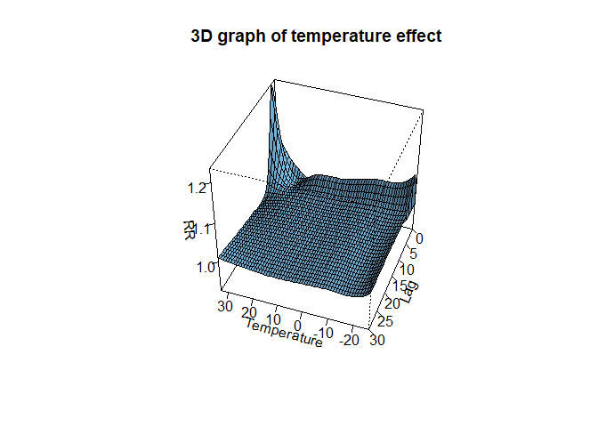
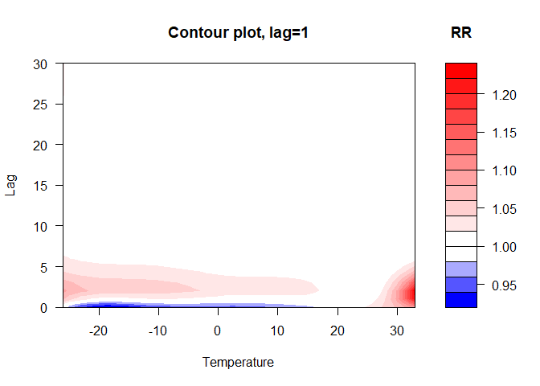
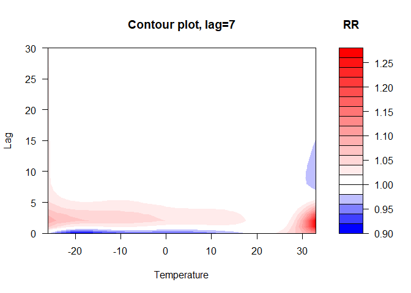
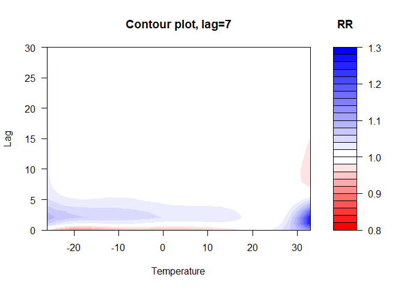
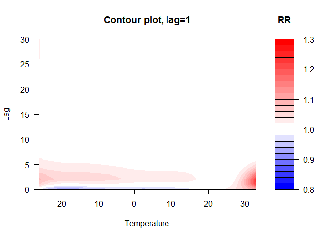
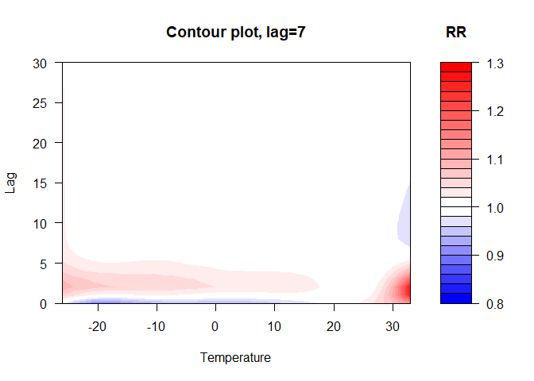

Test contour plot
================

``` r
pacman::p_load(
        tidyverse,      # data management and visualization
        dlnm,
        mgcv,
        splines
)
```

## Model fitting

``` r
# fit model #---------------------
cb3.pm <- crossbasis(chicagoNMMAPS$pm10,
                     lag = 1, 
                     argvar = list(fun = "lin"),
                     arglag = list(fun = "strata"))

cb4.pm <- crossbasis(chicagoNMMAPS$pm10,
                     lag = 7, 
                     argvar = list(fun = "lin"),
                     arglag = list(fun = "strata"))
                          
varknots <- equalknots(chicagoNMMAPS$temp, fun = "bs", df = 5, degree = 2)
lagknots <- logknots(30, 3)
cb3.temp <- crossbasis(chicagoNMMAPS$temp,
                       lag = 30,
                       argvar = list(fun = "bs", knots = varknots),
                       arglag = list(knots = lagknots))

# model with lag = 1
model3 <- glm(death ~ cb3.pm + cb3.temp + ns(time, 7 * 14) + dow,
              family = quasipoisson(),
              data = chicagoNMMAPS)
pred3.temp <- crosspred(cb3.temp, model3, cen = 21, by = 1)

# model with lag = 7
model4 <- glm(death ~ cb4.pm + cb3.temp + ns(time, 7 * 14) + dow,
              family = quasipoisson(),
              data = chicagoNMMAPS)
pred4.temp <- crosspred(cb3.temp, model4, cen = 21, by = 1)
```

## Default plot in `dlnm` package

``` r
# default dlnm #----------------------
```

### 3D plot

``` r
## 3D #-------------------
plot(pred3.temp,
     xlab = "Temperature",
     zlab = "RR",
     theta = 200,
     phi = 40,
     lphi = 30,
     main = "3D graph of temperature effect")
```

<!-- -->

### Contour

``` r
## contour #-------------------
```

By default, “Arguments `x-y-z` and `col-level` are automatically set and
CAN NOT BE SPECIFIED BY THE USER.

``` r
plot(pred3.temp,
     "contour",
     xlab = "Temperature",
     key.title = title("RR"),
     plot.title = title("Contour plot, lag=1", xlab = "Temperature", ylab = "Lag"))
```

<!-- -->

``` r
plot(pred4.temp,
     "contour",
     xlab = "Temperature",
     key.title = title("RR"),
     plot.title = title("Contour plot, lag=7", xlab = "Temperature", ylab = "Lag"))
```

<!-- -->

## Customized plot using `graphics` package

``` r
# graphics:: #------------------
```

The function `plot.contour()` below is modified version of
`dlnm::plot.crosspred()` to allow user-defined color levels through
argument `levels`.

``` r
plot.contour <- function(x,
                         levels = NULL,
                         var = NULL,
                         lag = NULL, 
                         ci = "area", 
                         ci.arg,
                         ci.level = x$ci.level,
                         cumul = FALSE,
                         exp = NULL, 
                         ...) {
                
                if(all(class(x)!="crosspred")) stop("'x' must be of class 'crosspred'")
                ci <- match.arg(ci,c("area","bars","lines","n"))
                if(missing(ci.arg)) {
                        ci.arg <- list()
                } else if(!is.list(ci.arg)) stop("'ci.arg' must be a list")
                if(!is.numeric(ci.level)||ci.level>=1||ci.level<=0) {
                        stop("'ci.level' must be numeric and between 0 and 1")
                }
                if(cumul==TRUE) {
                        # SET THE LAG STEP EQUAL TO 1
                        x$bylag <- 1
                        if(is.null(x$cumfit)) {
                                stop("Cumulative outcomes can be plotted if predicted in the 'crosspred'
                                     object. Set the argument 'cumul=TRUE' in the function crosspred()")
                        }
                }
                if(!is.null(exp)&&!is.logical(exp)) stop("'exp' must be logical")
                
        # COMPUTE OUTCOMES
                
                # CUMULATIVE IF CUMUL==T
                if(cumul==TRUE) {
                        x$matfit <- x$cumfit
                        x$matse <- x$cumse
                }
                # SET THE Z LEVEL EQUAL TO THAT STORED IN OBJECT IF NOT PROVIDED
                z <- qnorm(1-(1-ci.level)/2)
                x$mathigh <- x$matfit+z*x$matse
                x$matlow <- x$matfit-z*x$matse
                x$allhigh <- x$allfit+z*x$allse
                x$alllow <- x$allfit-z*x$allse
                noeff <- 0

                # EXPONENTIAL
                if((is.null(exp)&&!is.null(x$model.link)&&x$model.link%in%c("log","logit"))||
                   (!is.null(exp)&&exp==TRUE)) {
                        x$matfit <- exp(x$matfit)
                        x$mathigh <- exp(x$mathigh)
                        x$matlow <- exp(x$matlow)
                        x$allfit <- exp(x$allfit)
                        x$allhigh <- exp(x$allhigh)
                        x$alllow <- exp(x$alllow)
                        noeff <- 1
                }

         # CONTOURPLOT
                if(x$lag[2]==0) stop("contour plot not conceivable for unlagged associations")
                if(is.null(levels)) levels <- pretty(x$matfit, 20)
                col1 <- colorRampPalette(c("blue","white"))
                col2 <- colorRampPalette(c("white","red"))
                col <- c(col1(sum(levels<noeff)),col2(sum(levels>noeff)))
                filled.contour(
                        x = x$predvar,
                        y = dlnm:::seqlag(x$lag, x$bylag),
                        z = x$matfit,
                        col = col,
                        levels = levels,
                        ...)
                }
```

### Test function `plot.contour()`

When `levels` is not provided, the return plot matches contour plot from
`dlnm::plot.crosspred()` exactly.

``` r
plot.contour(pred3.temp,
             xlab = "Temperature",
             key.title = title("RR"),
             plot.title = title("Contour plot, lag=1", xlab = "Temperature", ylab = "Lag"))
```

<!-- -->

``` r
plot.contour(pred4.temp,
             xlab = "Temperature",
             key.title = title("RR"),
             plot.title = title("Contour plot, lag=7", xlab = "Temperature", ylab = "Lag"))
```

<!-- -->

Change `levels` range to get user-defined color levels.

``` r
rr_range <- c(0.8, 1.3)
nlevels <- 20

plot.contour(x = pred3.temp,
             levels = pretty(rr_range, nlevels),
             xlab = "Temperature",
             key.title = title("RR"),
             plot.title = title("Contour plot, lag=1", xlab = "Temperature", ylab = "Lag"))
```

<!-- -->

``` r
plot.contour(x = pred4.temp,
             levels = pretty(rr_range, nlevels),
             xlab = "Temperature",
             key.title = title("RR"),
             plot.title = title("Contour plot, lag=7", xlab = "Temperature", ylab = "Lag"))
```

<!-- -->
