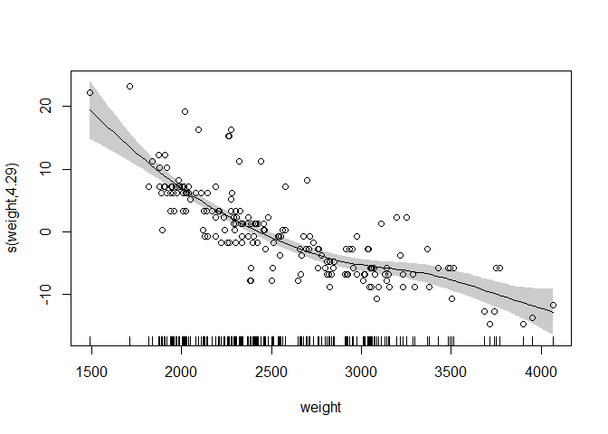
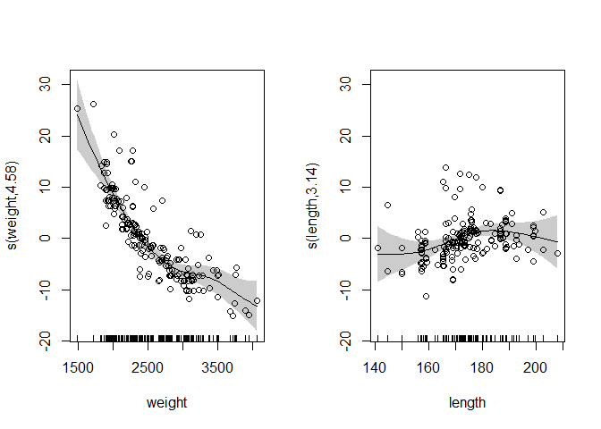
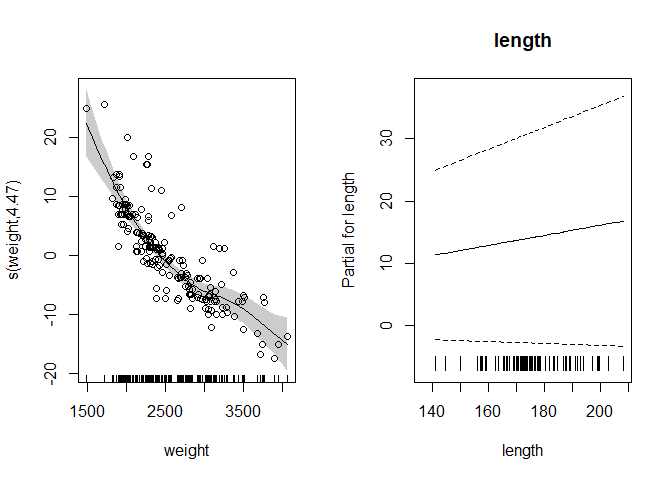
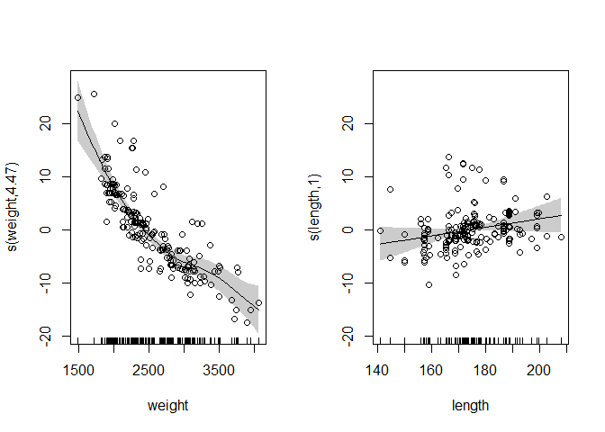
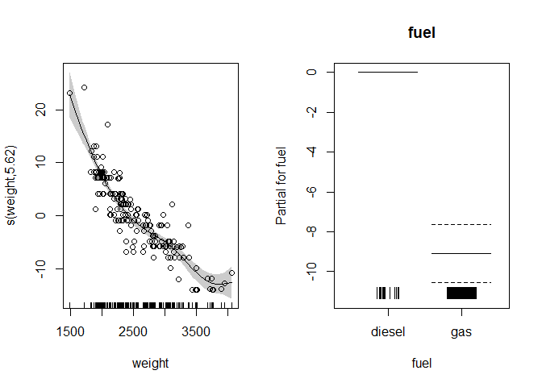
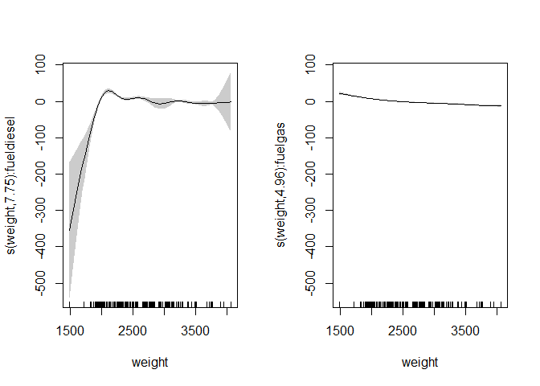
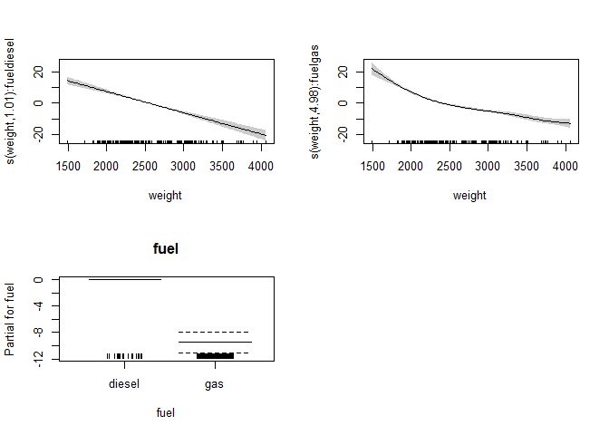

GAM in R - Noam Ross 01
================

``` r
pacman::p_load(
        here,           # locate files 
        tidyverse,      # data management and visualization
        chva.extras,    # supplementary functions
        gamair,         # load mpg data
        mgcv
)

## Data

``` r
# data #-----------
data("mpg", package = "gamair")

(mpg <- mpg %>% 
        tibble() %>% 
        mutate(fuel = as.factor(fuel)))
```

    ## # A tibble: 205 × 26
    ##    symbol  loss make    fuel  aspir doors style drive eng.loc    wb length width height weight eng.type cylinders eng.cc fuel.sys
    ##     <int> <int> <fct>   <fct> <fct> <fct> <fct> <fct> <fct>   <dbl>  <dbl> <dbl>  <dbl>  <int> <fct>    <fct>      <int> <fct>   
    ##  1      3    NA alfa-r… gas   std   two   conv… rwd   front    88.6   169.  64.1   48.8   2548 dohc     four         130 mpfi    
    ##  2      3    NA alfa-r… gas   std   two   conv… rwd   front    88.6   169.  64.1   48.8   2548 dohc     four         130 mpfi    
    ##  3      1    NA alfa-r… gas   std   two   hatc… rwd   front    94.5   171.  65.5   52.4   2823 ohcv     six          152 mpfi    
    ##  4      2   164 audi    gas   std   four  sedan fwd   front    99.8   177.  66.2   54.3   2337 ohc      four         109 mpfi    
    ##  5      2   164 audi    gas   std   four  sedan 4wd   front    99.4   177.  66.4   54.3   2824 ohc      five         136 mpfi    
    ##  6      2    NA audi    gas   std   two   sedan fwd   front    99.8   177.  66.3   53.1   2507 ohc      five         136 mpfi    
    ##  7      1   158 audi    gas   std   four  sedan fwd   front   106.    193.  71.4   55.7   2844 ohc      five         136 mpfi    
    ##  8      1    NA audi    gas   std   four  wagon fwd   front   106.    193.  71.4   55.7   2954 ohc      five         136 mpfi    
    ##  9      1   158 audi    gas   turbo four  sedan fwd   front   106.    193.  71.4   55.9   3086 ohc      five         131 mpfi    
    ## 10      0    NA audi    gas   turbo two   hatc… 4wd   front    99.5   178.  67.9   52     3053 ohc      five         131 mpfi    
    ## # ℹ 195 more rows
    ## # ℹ 8 more variables: bore <dbl>, stroke <dbl>, comp.ratio <dbl>, hp <int>, rpm <int>, city.mpg <int>, hw.mpg <int>, price <int>

## GAM

``` r
# gam #----------------
```

### 01. Single predictor

``` r
model1 <- gam(hw.mpg ~ s(weight),
              data = mpg,
              method = "REML")

plot(model1,
     residuals = TRUE,
     pch = 1,
     shade = TRUE)
```

<!-- -->

### 02. Multiple predictor, smooth term - continuous predictor

``` r
model2 <- gam(hw.mpg ~ s(weight) + s(length),
              data = mpg,
              method = "REML")
plot(model2,
     residuals = TRUE,
     pch = 1,
     shade = TRUE,
     pages = 1)
```

<!-- -->

#### 02.1 Multiple predictor, linear term - continuos predictor

``` r
model2a <- gam(hw.mpg ~ s(weight) + length, 
              data = mpg,
              method = "REML")
plot(model2a,
     residuals = TRUE,
     pch = 1,
     shade = TRUE,
     pages = 1,
     all.terms = TRUE)
```

<!-- -->

#### 02.2 Multiple predictor, smooth term - continuous predictor, large lambda

``` r
model2b <- gam(hw.mpg ~ s(weight) + s(length, sp = 1000), 
               data = mpg,
               method = "REML")

plot(model2b,
     residuals = TRUE,
     pch = 1,
     shade = TRUE,
     pages = 1)
```

<!-- -->

### 03. Multiple predictor, linear term - categorical predictor

``` r
model3 <- gam(hw.mpg ~ s(weight) + fuel, 
              data = mpg,
              method = "REML")

plot(model3,
     residuals = TRUE,
     pch = 1,
     shade = TRUE,
     pages = 1,
     all.terms = TRUE)
```

<!-- -->

#### 03.1 Multiple predictor, linear term - categorical predictor

``` r
model3a <- gam(hw.mpg ~ s(weight, by = fuel),
              data = mpg,
              method = "REML")

plot(model3a,
     residuals = TRUE,
     pch = 1,
     shade = TRUE,
     pages = 1)
```

<!-- -->

#### 03.2 Multiple predictor, linear term - categorical predictor

``` r
model3b <- gam(hw.mpg ~ s(weight, by = fuel) + fuel,
               data = mpg,
               method = "REML")

plot(model3b,
     residuals = TRUE,
     pch = 1,
     shade = TRUE,
     pages = 1,
     all.terms = TRUE)
```

<!-- -->
