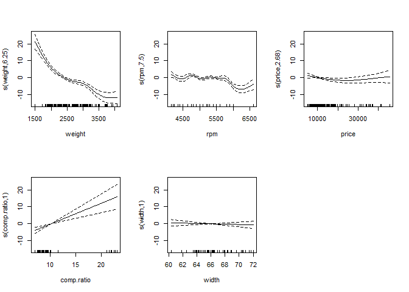
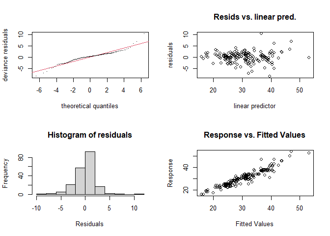

GAM in R - Noam Ross 02
================

``` r
pacman::p_load(
        here,           # locate files 
        tidyverse,      # data management and visualization
        gamair,         # load mpg data
        mgcv
)
```

## Data

``` r
# data #-----------
data("mpg", package = "gamair")

(mpg <- mpg %>% 
                tibble() %>% 
                mutate(fuel = as.factor(fuel)))
```

    ## # A tibble: 205 × 26
    ##    symbol  loss make    fuel  aspir doors style drive eng.loc    wb length width height weight eng.type cylinders eng.cc fuel.sys
    ##     <int> <int> <fct>   <fct> <fct> <fct> <fct> <fct> <fct>   <dbl>  <dbl> <dbl>  <dbl>  <int> <fct>    <fct>      <int> <fct>   
    ##  1      3    NA alfa-r… gas   std   two   conv… rwd   front    88.6   169.  64.1   48.8   2548 dohc     four         130 mpfi    
    ##  2      3    NA alfa-r… gas   std   two   conv… rwd   front    88.6   169.  64.1   48.8   2548 dohc     four         130 mpfi    
    ##  3      1    NA alfa-r… gas   std   two   hatc… rwd   front    94.5   171.  65.5   52.4   2823 ohcv     six          152 mpfi    
    ##  4      2   164 audi    gas   std   four  sedan fwd   front    99.8   177.  66.2   54.3   2337 ohc      four         109 mpfi    
    ##  5      2   164 audi    gas   std   four  sedan 4wd   front    99.4   177.  66.4   54.3   2824 ohc      five         136 mpfi    
    ##  6      2    NA audi    gas   std   two   sedan fwd   front    99.8   177.  66.3   53.1   2507 ohc      five         136 mpfi    
    ##  7      1   158 audi    gas   std   four  sedan fwd   front   106.    193.  71.4   55.7   2844 ohc      five         136 mpfi    
    ##  8      1    NA audi    gas   std   four  wagon fwd   front   106.    193.  71.4   55.7   2954 ohc      five         136 mpfi    
    ##  9      1   158 audi    gas   turbo four  sedan fwd   front   106.    193.  71.4   55.9   3086 ohc      five         131 mpfi    
    ## 10      0    NA audi    gas   turbo two   hatc… 4wd   front    99.5   178.  67.9   52     3053 ohc      five         131 mpfi    
    ## # ℹ 195 more rows
    ## # ℹ 8 more variables: bore <dbl>, stroke <dbl>, comp.ratio <dbl>, hp <int>, rpm <int>, city.mpg <int>, hw.mpg <int>, price <int>

## Model

``` r
# model #----------------
mod_hwy <- gam(hw.mpg ~ s(weight) + 
                       s(rpm) + 
                       s(price) + 
                       s(comp.ratio) +
                       s(width) + 
                       fuel,
               data = mpg, 
               method = "REML")

summary(mod_hwy)
```

    ## 
    ## Family: gaussian 
    ## Link function: identity 
    ## 
    ## Formula:
    ## hw.mpg ~ s(weight) + s(rpm) + s(price) + s(comp.ratio) + s(width) + 
    ##     fuel
    ## 
    ## Parametric coefficients:
    ##             Estimate Std. Error t value Pr(>|t|)    
    ## (Intercept)   23.873      3.531   6.760 1.89e-10 ***
    ## fuelgas        7.571      3.922   1.931   0.0551 .  
    ## ---
    ## Signif. codes:  0 '***' 0.001 '**' 0.01 '*' 0.05 '.' 0.1 ' ' 1
    ## 
    ## Approximate significance of smooth terms:
    ##                 edf Ref.df      F  p-value    
    ## s(weight)     6.254  7.439 20.909  < 2e-16 ***
    ## s(rpm)        7.499  8.285  8.534  < 2e-16 ***
    ## s(price)      2.681  3.421  1.678    0.155    
    ## s(comp.ratio) 1.000  1.001 18.923 2.27e-05 ***
    ## s(width)      1.001  1.001  0.357    0.551    
    ## ---
    ## Signif. codes:  0 '***' 0.001 '**' 0.01 '*' 0.05 '.' 0.1 ' ' 1
    ## 
    ## R-sq.(adj) =   0.89   Deviance explained = 90.1%
    ## -REML = 464.81  Scale est. = 5.171     n = 199

## Visualize

``` r
# visualize #---------------------------------
```

### All panels

``` r
plot(mod_hwy,
     pages = 1,
     all.terms = TRUE)
```

<!-- -->

``` r
plot(mod_hwy,
     pages = 1)
```

<!-- -->

``` r
plot(mod_hwy,
     select = 2)
```

<!-- -->

### Data points

``` r
plot(mod_hwy, residuals = TRUE, pages = 1)
```

<!-- -->

``` r
plot(mod_hwy,
     select = 1,
     rug = TRUE,
     residuals = TRUE,
     pch = 3,
     cex = 1)
```

<!-- -->

### Standard Errors

``` r
plot(mod_hwy,
     select = 1,
     se = TRUE)
```

<!-- -->

``` r
plot(mod_hwy,
     select = 1,
     shade = TRUE)
```

<!-- -->

``` r
plot(mod_hwy,
     select = 1,
     shade = TRUE,
     shade.col = "lightblue")
```

<!-- -->

``` r
plot(mod_hwy,
     select = 1,
     seWithMean = TRUE)
```

<!-- -->

``` r
plot(mod_hwy, 
     select = 1,
     seWithMean = TRUE, 
     shift = coef(mod_hwy)[1])
```

<!-- -->

## Model validation

``` r
# validate #-----------------
par(mfrow = c(2, 2))
gam.check(mod_hwy)
```

<!-- -->

    ## 
    ## Method: REML   Optimizer: outer newton
    ## full convergence after 10 iterations.
    ## Gradient range [-8.934668e-05,0.0003482871]
    ## (score 464.8093 & scale 5.170973).
    ## Hessian positive definite, eigenvalue range [7.507691e-05,96.19181].
    ## Model rank =  47 / 47 
    ## 
    ## Basis dimension (k) checking results. Low p-value (k-index<1) may
    ## indicate that k is too low, especially if edf is close to k'.
    ## 
    ##                 k'  edf k-index p-value   
    ## s(weight)     9.00 6.25    0.87    0.01 **
    ## s(rpm)        9.00 7.50    0.96    0.21   
    ## s(price)      9.00 2.68    1.02    0.54   
    ## s(comp.ratio) 9.00 1.00    0.96    0.30   
    ## s(width)      9.00 1.00    0.97    0.32   
    ## ---
    ## Signif. codes:  0 '***' 0.001 '**' 0.01 '*' 0.05 '.' 0.1 ' ' 1

``` r
concurvity(mod_hwy, full = TRUE)
```

    ##          para s(weight)    s(rpm)  s(price) s(comp.ratio)  s(width)
    ## worst       1 0.9463314 0.8411457 0.9255821     0.9999998 0.9179077
    ## observed    1 0.9389962 0.3619093 0.8671032     0.9831320 0.8583136
    ## estimate    1 0.8983342 0.5514933 0.7949378     0.9826352 0.7912967

``` r
concurvity(mod_hwy, full = FALSE)
```

    ## $worst
    ##                       para    s(weight)       s(rpm)     s(price) s(comp.ratio)     s(width)
    ## para          1.000000e+00 7.918579e-26 1.222220e-17 1.050389e-25  4.059695e-18 2.894301e-23
    ## s(weight)     7.841069e-26 1.000000e+00 3.105458e-01 8.687383e-01  5.318268e-01 8.971926e-01
    ## s(rpm)        1.222219e-17 3.105458e-01 1.000000e+00 3.871422e-01  6.969951e-01 3.077502e-01
    ## s(price)      1.069190e-25 8.687383e-01 3.871422e-01 1.000000e+00  4.739224e-01 7.028542e-01
    ## s(comp.ratio) 4.059580e-18 5.318268e-01 6.969951e-01 4.739224e-01  1.000000e+00 4.518573e-01
    ## s(width)      2.897345e-23 8.971926e-01 3.077502e-01 7.028542e-01  4.518573e-01 1.000000e+00
    ## 
    ## $observed
    ##                       para    s(weight)       s(rpm)     s(price) s(comp.ratio)     s(width)
    ## para          1.000000e+00 3.293868e-29 3.427248e-19 3.000037e-31  3.463596e-32 1.105975e-31
    ## s(weight)     7.841069e-26 1.000000e+00 6.363965e-02 7.853940e-01  1.608816e-01 7.915154e-01
    ## s(rpm)        1.222219e-17 1.113163e-01 1.000000e+00 1.105256e-01  4.081060e-01 1.134271e-01
    ## s(price)      1.069190e-25 8.123261e-01 1.904123e-02 1.000000e+00  1.004515e-01 6.539539e-01
    ## s(comp.ratio) 4.059580e-18 3.415297e-01 1.227548e-01 1.486654e-01  1.000000e+00 3.336997e-01
    ## s(width)      2.897345e-23 7.841210e-01 5.565369e-02 6.290764e-01  7.418460e-02 1.000000e+00
    ## 
    ## $estimate
    ##                       para    s(weight)       s(rpm)     s(price) s(comp.ratio)     s(width)
    ## para          1.000000e+00 2.835855e-28 3.267278e-20 4.007220e-28  2.781720e-22 2.269602e-25
    ## s(weight)     7.841069e-26 1.000000e+00 1.531803e-01 6.346244e-01  1.682909e-01 7.038482e-01
    ## s(rpm)        1.222219e-17 1.094319e-01 1.000000e+00 9.156212e-02  4.156068e-01 1.088586e-01
    ## s(price)      1.069190e-25 7.322584e-01 7.295623e-02 1.000000e+00  1.039837e-01 5.494941e-01
    ## s(comp.ratio) 4.059580e-18 3.336375e-01 3.435116e-01 2.448670e-01  1.000000e+00 2.948637e-01
    ## s(width)      2.897345e-23 7.170383e-01 7.701999e-02 4.988122e-01  8.003205e-02 1.000000e+00
