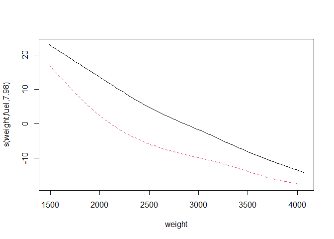
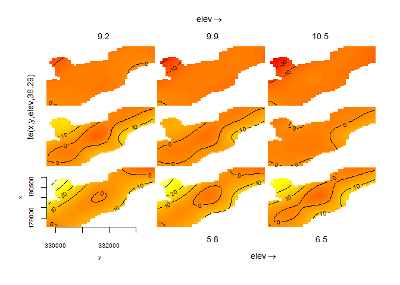
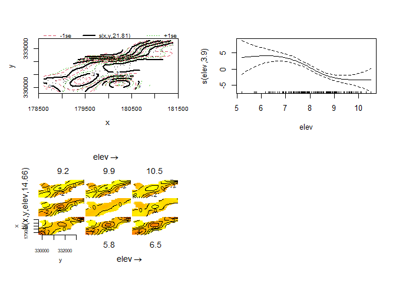

GAM in R - Noam Ross 03
================

``` r
pacman::p_load(
        here,           # locate files 
        tidyverse,      # data management and visualization
        gamair,         # load mpg data
        mgcv
)
```

## Model: factor-smooths interaction

``` r
# factor-smooth #----------------
data("mpg", package = "gamair")

(mpg <- mpg %>% 
                tibble() %>% 
                mutate(fuel = as.factor(fuel)))
```

    ## # A tibble: 205 × 26
    ##    symbol  loss make    fuel  aspir doors style drive eng.loc    wb length width height weight eng.type cylinders eng.cc fuel.sys
    ##     <int> <int> <fct>   <fct> <fct> <fct> <fct> <fct> <fct>   <dbl>  <dbl> <dbl>  <dbl>  <int> <fct>    <fct>      <int> <fct>   
    ##  1      3    NA alfa-r… gas   std   two   conv… rwd   front    88.6   169.  64.1   48.8   2548 dohc     four         130 mpfi    
    ##  2      3    NA alfa-r… gas   std   two   conv… rwd   front    88.6   169.  64.1   48.8   2548 dohc     four         130 mpfi    
    ##  3      1    NA alfa-r… gas   std   two   hatc… rwd   front    94.5   171.  65.5   52.4   2823 ohcv     six          152 mpfi    
    ##  4      2   164 audi    gas   std   four  sedan fwd   front    99.8   177.  66.2   54.3   2337 ohc      four         109 mpfi    
    ##  5      2   164 audi    gas   std   four  sedan 4wd   front    99.4   177.  66.4   54.3   2824 ohc      five         136 mpfi    
    ##  6      2    NA audi    gas   std   two   sedan fwd   front    99.8   177.  66.3   53.1   2507 ohc      five         136 mpfi    
    ##  7      1   158 audi    gas   std   four  sedan fwd   front   106.    193.  71.4   55.7   2844 ohc      five         136 mpfi    
    ##  8      1    NA audi    gas   std   four  wagon fwd   front   106.    193.  71.4   55.7   2954 ohc      five         136 mpfi    
    ##  9      1   158 audi    gas   turbo four  sedan fwd   front   106.    193.  71.4   55.9   3086 ohc      five         131 mpfi    
    ## 10      0    NA audi    gas   turbo two   hatc… 4wd   front    99.5   178.  67.9   52     3053 ohc      five         131 mpfi    
    ## # ℹ 195 more rows
    ## # ℹ 8 more variables: bore <dbl>, stroke <dbl>, comp.ratio <dbl>, hp <int>, rpm <int>, city.mpg <int>, hw.mpg <int>, price <int>

``` r
mod <- gam(hw.mpg ~ s(weight, fuel, bs = "fs"),
           data = mpg,
           method = "REML")

summary(mod)
```

    ## 
    ## Family: gaussian 
    ## Link function: identity 
    ## 
    ## Formula:
    ## hw.mpg ~ s(weight, fuel, bs = "fs")
    ## 
    ## Parametric coefficients:
    ##             Estimate Std. Error t value Pr(>|t|)    
    ## (Intercept)   34.720      4.913   7.067  2.7e-11 ***
    ## ---
    ## Signif. codes:  0 '***' 0.001 '**' 0.01 '*' 0.05 '.' 0.1 ' ' 1
    ## 
    ## Approximate significance of smooth terms:
    ##                  edf Ref.df     F p-value    
    ## s(weight,fuel) 7.978     19 53.32  <2e-16 ***
    ## ---
    ## Signif. codes:  0 '***' 0.001 '**' 0.01 '*' 0.05 '.' 0.1 ' ' 1
    ## 
    ## R-sq.(adj) =  0.832   Deviance explained = 83.9%
    ## -REML = 517.59  Scale est. = 7.949     n = 205

``` r
plot(mod)
```

<!-- -->

``` r
# vis.gam(mod, theta = 125, plot.type = "persp")
```

## Model: tensor smooths

``` r
# tensor #----------------
data(meuse, package="sp")

# Fit the model
tensor_mod <- gam(cadmium ~ te(x, y, elev), 
                  data = meuse, method = "REML")

# Summarize and plot
summary(tensor_mod)
```

    ## 
    ## Family: gaussian 
    ## Link function: identity 
    ## 
    ## Formula:
    ## cadmium ~ te(x, y, elev)
    ## 
    ## Parametric coefficients:
    ##             Estimate Std. Error t value Pr(>|t|)    
    ## (Intercept)   3.2458     0.1329   24.43   <2e-16 ***
    ## ---
    ## Signif. codes:  0 '***' 0.001 '**' 0.01 '*' 0.05 '.' 0.1 ' ' 1
    ## 
    ## Approximate significance of smooth terms:
    ##                edf Ref.df     F p-value    
    ## te(x,y,elev) 38.29  45.86 11.87  <2e-16 ***
    ## ---
    ## Signif. codes:  0 '***' 0.001 '**' 0.01 '*' 0.05 '.' 0.1 ' ' 1
    ## 
    ## R-sq.(adj) =   0.78   Deviance explained = 83.4%
    ## -REML = 318.09  Scale est. = 2.7358    n = 155

``` r
plot(tensor_mod)
```

<!-- -->

## Model: tensor interaction

``` r
# tensor interaction #----------------
tensor_mod2 <- gam(cadmium ~ s(x, y) + s(elev) + ti(x, y, elev), 
                   data = meuse, method = "REML")

summary(tensor_mod2)
```

    ## 
    ## Family: gaussian 
    ## Link function: identity 
    ## 
    ## Formula:
    ## cadmium ~ s(x, y) + s(elev) + ti(x, y, elev)
    ## 
    ## Parametric coefficients:
    ##             Estimate Std. Error t value Pr(>|t|)    
    ## (Intercept)   2.7044     0.2244   12.05   <2e-16 ***
    ## ---
    ## Signif. codes:  0 '***' 0.001 '**' 0.01 '*' 0.05 '.' 0.1 ' ' 1
    ## 
    ## Approximate significance of smooth terms:
    ##                 edf Ref.df     F  p-value    
    ## s(x,y)       21.812 25.491 6.386  < 2e-16 ***
    ## s(elev)       3.898  4.688 9.680 5.79e-07 ***
    ## ti(x,y,elev) 14.656 19.180 2.706 0.000569 ***
    ## ---
    ## Signif. codes:  0 '***' 0.001 '**' 0.01 '*' 0.05 '.' 0.1 ' ' 1
    ## 
    ## R-sq.(adj) =  0.793   Deviance explained = 84.7%
    ## -REML = 336.62  Scale est. = 2.5755    n = 155

``` r
plot(tensor_mod2, pages = 1)
```

<!-- -->
