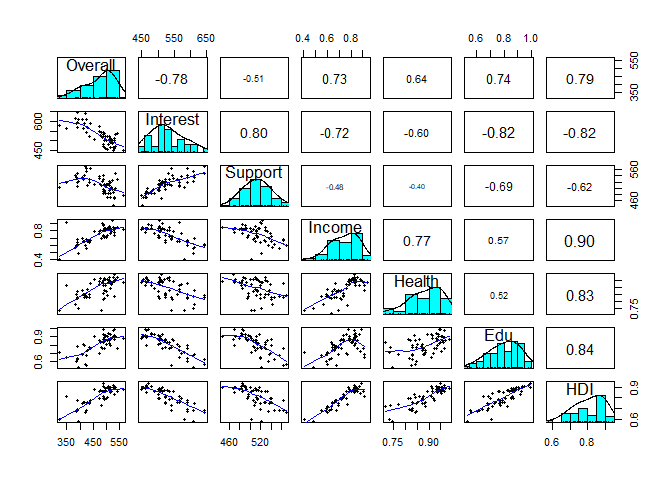
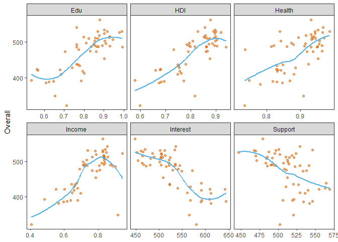
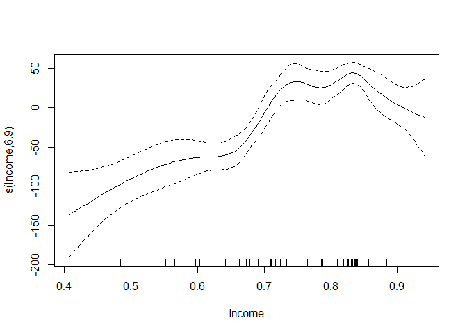
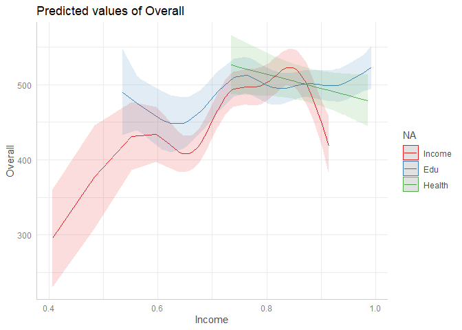
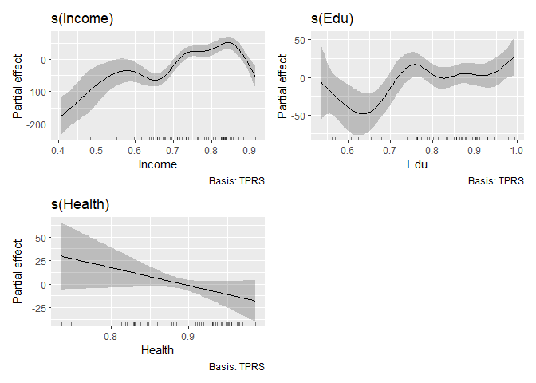
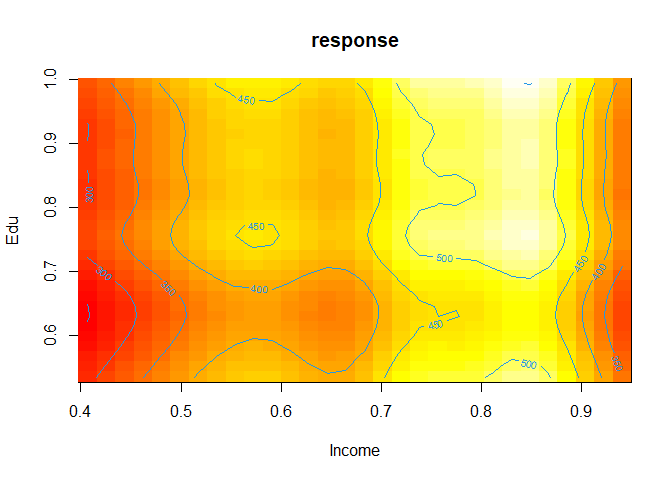
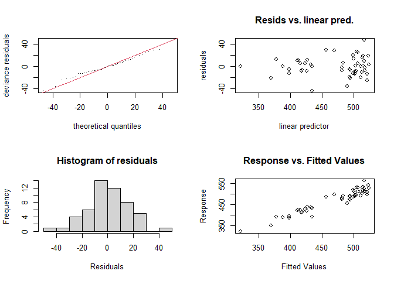
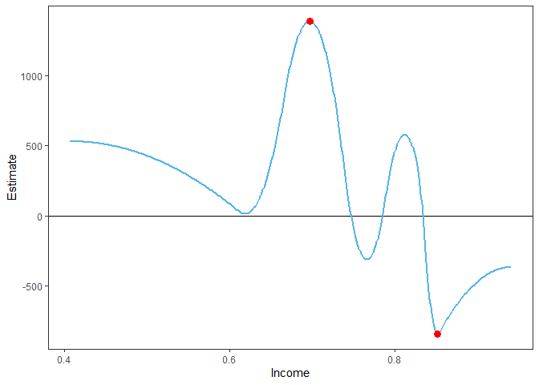

GAM using R
================

``` r
pacman::p_load(
        rio,            # import and export files
        here,           # locate files 
        tidyverse,      # data management and visualization
        mgcv,           # GAM modeling
        psych,
        skimr,
        ggeffects,
        gratia
)
```

## Data

``` r
# data #------------------------
```

- **Overall** Science Score (average score for 15 year olds)  
- **Interest** in science  
- Identifying scientific **Issues**  
- **Explaining** phenomena scientifically  
- **Support** for scientific inquiry  
- **Income** Index  
- **Health** Index  
- **Edu**cation Index  
- **H**uman **D**evelopment **I**ndex (composed of the Income index,
  Health Index, and Education Index)

``` r
(pisa <- rio::import("https://raw.githubusercontent.com/m-clark/generalized-additive-models/master/data/pisasci2006.csv") %>% 
        tibble())
```

    ## # A tibble: 65 × 11
    ##    Country    Overall Issues Explain Evidence Interest Support Income Health    Edu    HDI
    ##    <chr>        <int>  <int>   <int>    <int>    <int>   <int>  <dbl>  <dbl>  <dbl>  <dbl>
    ##  1 Albania         NA     NA      NA       NA       NA      NA  0.599  0.886  0.716  0.724
    ##  2 Argentina      391    395     386      385      567     506  0.678  0.868  0.786  0.773
    ##  3 Australia      527    535     520      531      465     487  0.826  0.965  0.978  0.92 
    ##  4 Austria        511    505     516      505      507     515  0.835  0.944  0.824  0.866
    ##  5 Azerbaijan     382    353     412      344      612     542  0.566  0.78  NA     NA    
    ##  6 Belgium        510    515     503      516      503     492  0.831  0.935  0.868  0.877
    ##  7 Brazil         390    398     390      378      592     519  0.637  0.818  0.646  0.695
    ##  8 Bulgaria       434    427     444      417      523     527  0.663  0.829  0.778  0.753
    ##  9 Canada         534    532     531      542      469     501  0.84   0.951  0.902  0.897
    ## 10 Chile          438    444     432      440      591     564  0.673  0.923  0.764  0.78 
    ## # ℹ 55 more rows

## EDA

``` r
# eda #---------------------
# skim data
skimr::skim(pisa)
```

|                                                  |      |
|:-------------------------------------------------|:-----|
| Name                                             | pisa |
| Number of rows                                   | 65   |
| Number of columns                                | 11   |
| \_\_\_\_\_\_\_\_\_\_\_\_\_\_\_\_\_\_\_\_\_\_\_   |      |
| Column type frequency:                           |      |
| character                                        | 1    |
| numeric                                          | 10   |
| \_\_\_\_\_\_\_\_\_\_\_\_\_\_\_\_\_\_\_\_\_\_\_\_ |      |
| Group variables                                  | None |

Data summary

**Variable type: character**

| skim_variable | n_missing | complete_rate | min | max | empty | n_unique | whitespace |
|:--------------|----------:|--------------:|----:|----:|------:|---------:|-----------:|
| Country       |         0 |             1 |   4 |  24 |     0 |       65 |          0 |

**Variable type: numeric**

| skim_variable | n_missing | complete_rate | mean | sd | p0 | p25 | p50 | p75 | p100 | hist |
|:---|---:|---:|---:|---:|---:|---:|---:|---:|---:|:---|
| Overall | 8 | 0.88 | 473.14 | 54.58 | 322.00 | 428.00 | 489.00 | 513.00 | 563.00 | ▁▃▂▇▅ |
| Issues | 8 | 0.88 | 469.91 | 53.93 | 321.00 | 427.00 | 489.00 | 514.00 | 555.00 | ▁▃▂▇▆ |
| Explain | 8 | 0.88 | 475.02 | 54.02 | 334.00 | 432.00 | 490.00 | 517.00 | 566.00 | ▁▃▂▇▃ |
| Evidence | 8 | 0.88 | 469.81 | 61.74 | 288.00 | 423.00 | 489.00 | 515.00 | 567.00 | ▁▂▃▇▆ |
| Interest | 8 | 0.88 | 528.16 | 49.84 | 448.00 | 501.00 | 522.00 | 565.00 | 644.00 | ▆▇▅▃▂ |
| Support | 8 | 0.88 | 512.18 | 26.08 | 447.00 | 494.00 | 512.00 | 529.00 | 569.00 | ▂▅▇▆▂ |
| Income | 4 | 0.94 | 0.74 | 0.11 | 0.41 | 0.66 | 0.76 | 0.83 | 0.94 | ▁▃▇▇▆ |
| Health | 4 | 0.94 | 0.89 | 0.07 | 0.72 | 0.84 | 0.89 | 0.94 | 0.99 | ▂▂▇▆▇ |
| Edu | 6 | 0.91 | 0.80 | 0.11 | 0.54 | 0.72 | 0.81 | 0.88 | 0.99 | ▂▅▆▇▅ |
| HDI | 6 | 0.91 | 0.81 | 0.09 | 0.58 | 0.75 | 0.82 | 0.88 | 0.94 | ▁▃▇▇▇ |

``` r
pisa %>% 
        select(Overall, Interest, Support, Income, Health, Edu, HDI) %>% 
        psych::pairs.panels(ellipses = FALSE, scale = TRUE)
```

<!-- -->

``` r
pisa %>%
        select(Overall, Interest, Support, Income, Health, Edu, HDI) %>%
        pivot_longer(cols = -Overall,
                     names_to = "var_name",
                     values_to = "value") %>% 
        ggplot(aes(x = value,
                   y = Overall)) + 
        geom_point(color = '#D55E00',
                   alpha = .5) +
        geom_smooth(#method = "gam",
                    color = '#56B4E9',
                    se = FALSE) +
        facet_wrap(~var_name,
                   ncol = 3,
                   scales = 'free_x') +
        labs(x = NULL) +
        theme_bw() +
        theme(panel.grid = element_blank())
```

    ## `geom_smooth()` using method = 'loess' and formula = 'y ~ x'

    ## Warning: Removed 64 rows containing non-finite outside the scale range (`stat_smooth()`).

    ## Warning: Removed 64 rows containing missing values or values outside the scale range (`geom_point()`).

<!-- -->

## GAM modeling

``` r
# gam #------------------
```

### Single predictor

``` r
## single predictor #------------------
### linear model #------------
mod_lm = gam(Overall ~ Income, data = pisa)
summary(mod_lm)
```

    ## 
    ## Family: gaussian 
    ## Link function: identity 
    ## 
    ## Formula:
    ## Overall ~ Income
    ## 
    ## Parametric coefficients:
    ##             Estimate Std. Error t value Pr(>|t|)    
    ## (Intercept)   204.32      35.37   5.777 4.32e-07 ***
    ## Income        355.85      46.79   7.606 5.36e-10 ***
    ## ---
    ## Signif. codes:  0 '***' 0.001 '**' 0.01 '*' 0.05 '.' 0.1 ' ' 1
    ## 
    ## 
    ## R-sq.(adj) =  0.518   Deviance explained = 52.7%
    ## GCV = 1504.5  Scale est. = 1448.8    n = 54

``` r
### gam model #-------------
mod_gam1 <- gam(Overall ~ s(Income, bs = "cr"), data = pisa)
summary(mod_gam1)
```

    ## 
    ## Family: gaussian 
    ## Link function: identity 
    ## 
    ## Formula:
    ## Overall ~ s(Income, bs = "cr")
    ## 
    ## Parametric coefficients:
    ##             Estimate Std. Error t value Pr(>|t|)    
    ## (Intercept)  470.444      4.082   115.3   <2e-16 ***
    ## ---
    ## Signif. codes:  0 '***' 0.001 '**' 0.01 '*' 0.05 '.' 0.1 ' ' 1
    ## 
    ## Approximate significance of smooth terms:
    ##             edf Ref.df     F p-value    
    ## s(Income) 6.895  7.741 16.67  <2e-16 ***
    ## ---
    ## Signif. codes:  0 '***' 0.001 '**' 0.01 '*' 0.05 '.' 0.1 ' ' 1
    ## 
    ## R-sq.(adj) =    0.7   Deviance explained = 73.9%
    ## GCV = 1053.7  Scale est. = 899.67    n = 54

``` r
### visualize #---------------------
plot(mod_gam1)
```

<!-- -->

``` r
### model comparison #-----------------
AIC(mod_lm)
```

    ## [1] 550.2449

``` r
AIC(mod_gam1)
```

    ## [1] 529.8093

``` r
summary(mod_lm)$sp.criterion
```

    ##   GCV.Cp 
    ## 1504.496

``` r
summary(mod_gam1)$sp.criterion
```

    ##   GCV.Cp 
    ## 1053.727

``` r
summary(mod_lm)$r.sq
```

    ## [1] 0.5175346

``` r
summary(mod_gam1)$r.sq
```

    ## [1] 0.7003963

``` r
# use with caution!
anova(mod_lm, mod_gam1, test = "Chisq")
```

    ## Analysis of Deviance Table
    ## 
    ## Model 1: Overall ~ Income
    ## Model 2: Overall ~ s(Income, bs = "cr")
    ##   Resid. Df Resid. Dev     Df Deviance  Pr(>Chi)    
    ## 1    52.000      75336                              
    ## 2    45.259      41479 6.7411    33857 2.778e-06 ***
    ## ---
    ## Signif. codes:  0 '***' 0.001 '**' 0.01 '*' 0.05 '.' 0.1 ' ' 1

### Multiple predictors

``` r
## multiple predictors #------------------
### linear model #------------------
mod_lm2 = gam(Overall ~ Income + Edu + Health, data = pisa)
summary(mod_lm2)
```

    ## 
    ## Family: gaussian 
    ## Link function: identity 
    ## 
    ## Formula:
    ## Overall ~ Income + Edu + Health
    ## 
    ## Parametric coefficients:
    ##             Estimate Std. Error t value Pr(>|t|)    
    ## (Intercept)   121.18      78.97   1.535   0.1314    
    ## Income        182.32      85.27   2.138   0.0376 *  
    ## Edu           234.11      54.78   4.274 9.06e-05 ***
    ## Health         27.01     134.90   0.200   0.8421    
    ## ---
    ## Signif. codes:  0 '***' 0.001 '**' 0.01 '*' 0.05 '.' 0.1 ' ' 1
    ## 
    ## 
    ## R-sq.(adj) =  0.616   Deviance explained = 63.9%
    ## GCV = 1212.3  Scale est. = 1119      n = 52

``` r
### GAM model #-----------------
mod_gam2 = gam(Overall ~ s(Income) + s(Edu) + s(Health), data = pisa)
summary(mod_gam2)
```

    ## 
    ## Family: gaussian 
    ## Link function: identity 
    ## 
    ## Formula:
    ## Overall ~ s(Income) + s(Edu) + s(Health)
    ## 
    ## Parametric coefficients:
    ##             Estimate Std. Error t value Pr(>|t|)    
    ## (Intercept)  471.154      2.772     170   <2e-16 ***
    ## ---
    ## Signif. codes:  0 '***' 0.001 '**' 0.01 '*' 0.05 '.' 0.1 ' ' 1
    ## 
    ## Approximate significance of smooth terms:
    ##             edf Ref.df     F  p-value    
    ## s(Income) 7.593  8.415 8.826 1.29e-06 ***
    ## s(Edu)    6.204  7.178 3.308  0.00771 ** 
    ## s(Health) 1.000  1.000 2.736  0.10679    
    ## ---
    ## Signif. codes:  0 '***' 0.001 '**' 0.01 '*' 0.05 '.' 0.1 ' ' 1
    ## 
    ## R-sq.(adj) =  0.863   Deviance explained = 90.3%
    ## GCV = 573.83  Scale est. = 399.5     n = 52

``` r
mod_gam2B = update(mod_gam2, . ~ . - s(Health) + Health)
summary(mod_gam2B)
```

    ## 
    ## Family: gaussian 
    ## Link function: identity 
    ## 
    ## Formula:
    ## Overall ~ s(Income) + s(Edu) + Health
    ## 
    ## Parametric coefficients:
    ##             Estimate Std. Error t value Pr(>|t|)    
    ## (Intercept)    640.3      102.3   6.260 3.06e-07 ***
    ## Health        -189.5      114.6  -1.654    0.107    
    ## ---
    ## Signif. codes:  0 '***' 0.001 '**' 0.01 '*' 0.05 '.' 0.1 ' ' 1
    ## 
    ## Approximate significance of smooth terms:
    ##             edf Ref.df     F  p-value    
    ## s(Income) 7.593  8.415 8.826 1.29e-06 ***
    ## s(Edu)    6.204  7.178 3.308  0.00771 ** 
    ## ---
    ## Signif. codes:  0 '***' 0.001 '**' 0.01 '*' 0.05 '.' 0.1 ' ' 1
    ## 
    ## R-sq.(adj) =  0.863   Deviance explained = 90.3%
    ## GCV = 573.83  Scale est. = 399.5     n = 52

``` r
### visualize #----------------
plot(ggeffects::ggpredict(mod_gam2), facets = TRUE)
```

<!-- -->

``` r
gratia::draw(mod_gam2)
```

<!-- -->

``` r
# 2d smooths
vis.gam(mod_gam2, type = 'response', plot.type = 'contour')
```

<!-- -->

- High Income → highest Overall science scores.  
- Education has less effect.  
- Low Income + low Educatio → poor Overall science scores.

``` r
### model comparison #----------------
anova(mod_lm2, mod_gam2, test = "Chisq")
```

    ## Analysis of Deviance Table
    ## 
    ## Model 1: Overall ~ Income + Edu + Health
    ## Model 2: Overall ~ s(Income) + s(Edu) + s(Health)
    ##   Resid. Df Resid. Dev     Df Deviance  Pr(>Chi)    
    ## 1    48.000      53713                              
    ## 2    34.408      14463 13.592    39250 6.754e-15 ***
    ## ---
    ## Signif. codes:  0 '***' 0.001 '**' 0.01 '*' 0.05 '.' 0.1 ' ' 1

## Model diagnostics

``` r
# diagnostics #-----------------------
# gam.check
par(mfrow = c(2, 2))
gam.check(mod_gam2, k.rep = 1000)
```

<!-- -->

    ## 
    ## Method: GCV   Optimizer: magic
    ## Smoothing parameter selection converged after 21 iterations.
    ## The RMS GCV score gradient at convergence was 2.499332e-05 .
    ## The Hessian was positive definite.
    ## Model rank =  28 / 28 
    ## 
    ## Basis dimension (k) checking results. Low p-value (k-index<1) may
    ## indicate that k is too low, especially if edf is close to k'.
    ## 
    ##             k'  edf k-index p-value
    ## s(Income) 9.00 7.59    1.26    0.96
    ## s(Edu)    9.00 6.20    1.01    0.50
    ## s(Health) 9.00 1.00    0.90    0.17

``` r
par(mfrow = c(1, 1))

# concurvity: 
# 0 = no problem; 
# 1 = a smooth term lies entirely in space of >=1 other smooth terms
concurvity(mod_gam2)
```

    ##                  para s(Income)    s(Edu) s(Health)
    ## worst    2.563887e-24 0.9839101 0.9651345 0.9745969
    ## observed 2.563887e-24 0.7967932 0.6115974 0.8682284
    ## estimate 2.563887e-24 0.7610774 0.6470586 0.7971159

``` r
# slope changes
fd_inc = gratia::derivatives(mod_gam1, n = 500)

fd_inc = fd_inc %>%
        mutate(Income = seq(
                min(mod_gam1$model$Income),
                max(mod_gam1$model$Income),
                length.out = 500
        )) %>%
        rename(Estimate = .derivative)

fig <- fd_inc %>% 
        ggplot(aes(x = Income, y = Estimate)) +
        geom_hline(yintercept = 0) +
        geom_line(size = 1,
                  color = '#56B4E9') +
        geom_point(
                size = 3,
                alpha = 1,
                data = fd_inc %>% 
                        filter(Estimate == max(Estimate) | 
                                       Estimate == min(Estimate)),
                color = "red") +
        theme_bw() +
        theme(panel.grid = element_blank())

fig
```

<!-- -->
