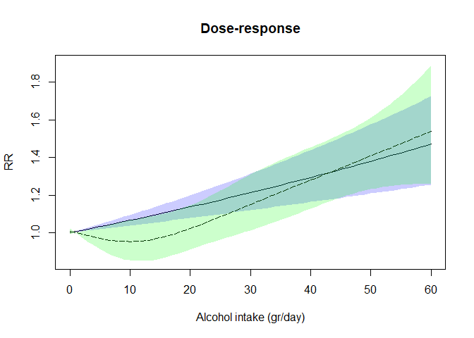

Dose-response meta-analysis
================

``` r
pacman::p_load(
        rio,            # import and export files
        here,           # locate files 
        tidyverse,      # data management and visualization
        mixmeta,
        skimr,
        dosresmeta,
        splines
)
```

## Data

``` r
# data #-----------
tibble(alcohol)
```

    ## # A tibble: 48 × 7
    ##    id    type   dose cases peryears   logrr     se
    ##    <fct> <fct> <dbl> <int>    <dbl>   <dbl>  <dbl>
    ##  1 atm   ir     0       28   22186.  0      NA    
    ##  2 atm   ir     1.83    38   43031. -0.417   0.251
    ##  3 atm   ir     9.20    43   53089. -0.396   0.246
    ##  4 atm   ir    22.9     32   45348. -0.488   0.263
    ##  5 atm   ir    35.7     16   19791. -0.279   0.321
    ##  6 atm   ir    58.4     27   19920.  0.202   0.286
    ##  7 hpm   ir     0      100  103002.  0      NA    
    ##  8 hpm   ir     2.10    65  106826. -0.416   0.160
    ##  9 hpm   ir     9.5    104  119846. -0.0986  0.143
    ## 10 hpm   ir    18.8     63   58034.  0.0938  0.165
    ## # ℹ 38 more rows

``` r
skimr::skim(alcohol)
```

|                                                  |         |
|:-------------------------------------------------|:--------|
| Name                                             | alcohol |
| Number of rows                                   | 48      |
| Number of columns                                | 7       |
| \_\_\_\_\_\_\_\_\_\_\_\_\_\_\_\_\_\_\_\_\_\_\_   |         |
| Column type frequency:                           |         |
| factor                                           | 2       |
| numeric                                          | 5       |
| \_\_\_\_\_\_\_\_\_\_\_\_\_\_\_\_\_\_\_\_\_\_\_\_ |         |
| Group variables                                  | None    |

Data summary

**Variable type: factor**

| skim_variable | n_missing | complete_rate | ordered | n_unique | top_counts |
|:---|---:|---:|:---|---:|:---|
| id | 0 | 1 | FALSE | 8 | atm: 6, hpm: 6, io: 6, n1: 6 |
| type | 0 | 1 | FALSE | 1 | ir: 48 |

**Variable type: numeric**

| skim_variable | n_missing | complete_rate | mean | sd | p0 | p25 | p50 | p75 | p100 | hist |
|:---|---:|---:|---:|---:|---:|---:|---:|---:|---:|:---|
| dose | 0 | 1.00 | 20.80 | 20.57 | 0.00 | 1.80 | 14.25 | 35.82 | 60.60 | ▇▂▂▁▂ |
| cases | 0 | 1.00 | 75.96 | 76.72 | 4.00 | 27.00 | 56.00 | 101.00 | 446.00 | ▇▂▁▁▁ |
| peryears | 0 | 1.00 | 52321.33 | 65759.99 | 100.02 | 3960.05 | 22405.08 | 67950.61 | 234829.55 | ▇▁▂▁▁ |
| logrr | 0 | 1.00 | 0.02 | 0.28 | -0.74 | -0.11 | 0.00 | 0.20 | 0.88 | ▁▃▇▂▁ |
| se | 8 | 0.83 | 0.23 | 0.10 | 0.09 | 0.17 | 0.21 | 0.27 | 0.53 | ▇▇▃▂▁ |

``` r
alcohol %>% count(id)
```

    ##    id n
    ## 1 atm 6
    ## 2 hpm 6
    ## 3  io 6
    ## 4  n1 6
    ## 5  n2 6
    ## 6  nt 6
    ## 7 ntm 6
    ## 8 nym 6

``` r
alcohol %>% count(type)
```

    ##   type  n
    ## 1   ir 48

## Reproduce example in `mixmeta::bcg`

``` r
# example #------------------------

### REPRODUCE THE RESULTS IN CRIPPA ET AL (2016) AND ORSINI ET AL (2012)

# COMPUTE THE WITHIN-STUDY CORRELATIONS EXCLUDING THE REFERENCE
addS <- lapply(split(alcohol, alcohol$id), function(x)
        # computes the covariance matrix for a set of log relative risks
        covar.logrr(y=logrr, 
                    v=se^2, 
                    cases=cases, 
                    n=peryears, 
                    type=type,
                    data=x))

addS %>% enframe()
```

    ## # A tibble: 8 × 2
    ##   name  value        
    ##   <chr> <list>       
    ## 1 atm   <dbl [5 × 5]>
    ## 2 hpm   <dbl [5 × 5]>
    ## 3 io    <dbl [5 × 5]>
    ## 4 n1    <dbl [5 × 5]>
    ## 5 n2    <dbl [5 × 5]>
    ## 6 nt    <dbl [5 × 5]>
    ## 7 ntm   <dbl [5 × 5]>
    ## 8 nym   <dbl [5 × 5]>

``` r
addS %>% enframe() %>% pluck("value", 1)
```

    ##            [,1]       [,2]       [,3]       [,4]       [,5]
    ## [1,] 0.06305000 0.03628839 0.03695363 0.03830468 0.03895039
    ## [2,] 0.03628839 0.06032000 0.03790255 0.03928829 0.03995058
    ## [3,] 0.03695363 0.03790255 0.06937001 0.04000852 0.04068295
    ## [4,] 0.03830468 0.03928829 0.04000852 0.10292001 0.04217034
    ## [5,] 0.03895039 0.03995058 0.04068295 0.04217034 0.08189000

``` r
addS %>% enframe() %>% pluck("value", 2)
```

    ##            [,1]       [,2]       [,3]        [,4]        [,5]
    ## [1,] 0.02570000 0.01044728 0.01045524 0.010044149 0.010081780
    ## [2,] 0.01044728 0.02037000 0.01046186 0.010050511 0.010088167
    ## [3,] 0.01045524 0.01046186 0.02739000 0.010058173 0.010095857
    ## [4,] 0.01004415 0.01005051 0.01005817 0.034170004 0.009698896
    ## [5,] 0.01008178 0.01008817 0.01009586 0.009698896 0.048279998

``` r
(sub <- tibble(alcohol) %>% filter(!is.na(se)))
```

    ## # A tibble: 40 × 7
    ##    id    type   dose cases peryears   logrr    se
    ##    <fct> <fct> <dbl> <int>    <dbl>   <dbl> <dbl>
    ##  1 atm   ir     1.83    38   43031. -0.417  0.251
    ##  2 atm   ir     9.20    43   53089. -0.396  0.246
    ##  3 atm   ir    22.9     32   45348. -0.488  0.263
    ##  4 atm   ir    35.7     16   19791. -0.279  0.321
    ##  5 atm   ir    58.4     27   19920.  0.202  0.286
    ##  6 hpm   ir     2.10    65  106826. -0.416  0.160
    ##  7 hpm   ir     9.5    104  119846. -0.0986 0.143
    ##  8 hpm   ir    18.8     63   58034.  0.0938 0.165
    ##  9 hpm   ir    36.7     46   33081.  0.205  0.185
    ## 10 hpm   ir    59.4     30   18455.  0.343  0.220
    ## # ℹ 30 more rows

``` r
# NOT ACCOUNTING FOR WITHIN-STUDY CORRELATIONS
nocor <- mixmeta(logrr ~ 0 + dose, S=se^2, 
                 random= ~ 0 + dose|id, 
                 data=sub,
                 method="ml")
summary(nocor)
```

    ## Call:  mixmeta(formula = logrr ~ 0 + dose, S = se^2, data = sub, random = ~0 + 
    ##     dose | id, method = "ml")
    ## 
    ## Univariate extended random-effects meta-regression
    ## Dimension: 1
    ## Estimation method: ML
    ## 
    ## Fixed-effects coefficients
    ##       Estimate  Std. Error       z  Pr(>|z|)  95%ci.lb  95%ci.ub    
    ## dose    0.0039      0.0013  2.9727    0.0030    0.0013    0.0064  **
    ## ---
    ## Signif. codes:  0 '***' 0.001 '**' 0.01 '*' 0.05 '.' 0.1 ' ' 1 
    ## 
    ## Random-effects (co)variance components
    ##  Formula: ~0 + dose | id
    ##  Structure: General positive-definite
    ##   Std. Dev
    ##     0.0000
    ## 
    ## Univariate Cochran Q-test for residual heterogeneity:
    ## Q = 43.9080 (df = 39), p-value = 0.2713
    ## I-square statistic = 11.2%
    ## 
    ## 40 units, 1 outcome, 40 observations, 1 fixed and 1 random-effects parameters
    ##  logLik      AIC      BIC  
    ##  3.0317  -2.0633   1.3144

``` r
# ACCOUNTING FOR WITHIN-STUDY CORRELATIONS
lin <- mixmeta(logrr ~ 0 + dose, 
               random= ~ 0 + dose|id, 
               data=sub, 
               method="ml",
               control=list(addSlist=addS))
summary(lin)
```

    ## Call:  mixmeta(formula = logrr ~ 0 + dose, data = sub, random = ~0 + 
    ##     dose | id, method = "ml", control = list(addSlist = addS))
    ## 
    ## Univariate extended random-effects meta-regression
    ## Dimension: 1
    ## Estimation method: ML
    ## 
    ## Fixed-effects coefficients
    ##       Estimate  Std. Error       z  Pr(>|z|)  95%ci.lb  95%ci.ub     
    ## dose    0.0064      0.0014  4.7613    0.0000    0.0038    0.0091  ***
    ## ---
    ## Signif. codes:  0 '***' 0.001 '**' 0.01 '*' 0.05 '.' 0.1 ' ' 1 
    ## 
    ## Random-effects (co)variance components
    ##  Formula: ~0 + dose | id
    ##  Structure: General positive-definite
    ##   Std. Dev
    ##     0.0000
    ## 
    ## Univariate Cochran Q-test for residual heterogeneity:
    ## Q = 48.2102 (df = 39), p-value = 0.1481
    ## I-square statistic = 19.1%
    ## 
    ## 40 units, 1 outcome, 40 observations, 1 fixed and 1 random-effects parameters
    ##  logLik      AIC      BIC  
    ##  5.0662  -6.1323  -2.7546

``` r
# ALLOWING NON-LINEARITY IN BOTH FIXED AND RANDOM PARTS
nonlin <- mixmeta(logrr ~ 0 + ns(dose, knots=c(10,25)), 
                  data=sub, 
                  random= ~ 0 + ns(dose, knots=c(10,25))|id, 
                  method="ml",
                  control=list(addSlist=addS))
summary(nonlin)
```

    ## Call:  mixmeta(formula = logrr ~ 0 + ns(dose, knots = c(10, 25)), data = sub, 
    ##     random = ~0 + ns(dose, knots = c(10, 25)) | id, method = "ml", 
    ##     control = list(addSlist = addS))
    ## 
    ## Univariate extended random-effects meta-regression
    ## Dimension: 1
    ## Estimation method: ML
    ## 
    ## Fixed-effects coefficients
    ##                               Estimate  Std. Error       z  Pr(>|z|)  95%ci.lb  95%ci.ub     
    ## ns(dose, knots = c(10, 25))1    0.2132      0.1239  1.7209    0.0853   -0.0296    0.4560    .
    ## ns(dose, knots = c(10, 25))2    0.2589      0.1033  2.5049    0.0122    0.0563    0.4614    *
    ## ns(dose, knots = c(10, 25))3    0.4806      0.1031  4.6631    0.0000    0.2786    0.6826  ***
    ## ---
    ## Signif. codes:  0 '***' 0.001 '**' 0.01 '*' 0.05 '.' 0.1 ' ' 1 
    ## 
    ## Random-effects (co)variance components
    ##  Formula: ~0 + ns(dose, knots = c(10, 25)) | id
    ##  Structure: General positive-definite
    ##                               Std. Dev                          Corr                              
    ## ns(dose, knots = c(10, 25))1    0.0305  ns(dose, knots = c(10, 25))1  ns(dose, knots = c(10, 25))2
    ## ns(dose, knots = c(10, 25))2    0.1201                            -1                              
    ## ns(dose, knots = c(10, 25))3    0.0547                             1                            -1
    ## 
    ## Univariate Cochran Q-test for residual heterogeneity:
    ## Q = 42.4654 (df = 37), p-value = 0.2472
    ## I-square statistic = 12.9%
    ## 
    ## 40 units, 1 outcome, 40 observations, 3 fixed and 6 random-effects parameters
    ##  logLik      AIC      BIC  
    ##  8.3580   1.2841  16.4840

``` r
# SIMPLIFY THE MODEL BY ASSUMING LINEARITY IN THE RANDOM PART
nonlin2 <- update(nonlin, 
                  random= ~ 0 + dose|id)
summary(nonlin2)
```

    ## Call:  mixmeta(formula = logrr ~ 0 + ns(dose, knots = c(10, 25)), data = sub, 
    ##     random = ~0 + dose | id, method = "ml", control = list(addSlist = addS))
    ## 
    ## Univariate extended random-effects meta-regression
    ## Dimension: 1
    ## Estimation method: ML
    ## 
    ## Fixed-effects coefficients
    ##                               Estimate  Std. Error       z  Pr(>|z|)  95%ci.lb  95%ci.ub     
    ## ns(dose, knots = c(10, 25))1    0.2072      0.1232  1.6825    0.0925   -0.0342    0.4487    .
    ## ns(dose, knots = c(10, 25))2    0.2819      0.0926  3.0430    0.0023    0.1003    0.4634   **
    ## ns(dose, knots = c(10, 25))3    0.4754      0.1008  4.7187    0.0000    0.2780    0.6729  ***
    ## ---
    ## Signif. codes:  0 '***' 0.001 '**' 0.01 '*' 0.05 '.' 0.1 ' ' 1 
    ## 
    ## Random-effects (co)variance components
    ##  Formula: ~0 + dose | id
    ##  Structure: General positive-definite
    ##   Std. Dev
    ##     0.0000
    ## 
    ## Univariate Cochran Q-test for residual heterogeneity:
    ## Q = 42.4654 (df = 37), p-value = 0.2472
    ## I-square statistic = 12.9%
    ## 
    ## 40 units, 1 outcome, 40 observations, 3 fixed and 1 random-effects parameters
    ##  logLik      AIC      BIC  
    ##  7.9386  -7.8772  -1.1216

``` r
# FIXED-EFFECTS MODEL (TRICK: random TO DEFINE THE GROUPING, THEN FIX IT TO 0)
nonlinfix <- mixmeta(logrr ~ 0 + ns(dose, knots=c(10,25)), 
                     random= ~ 1|id,
                     data=sub, 
                     method="ml",
                     bscov="fixed", 
                     control=list(addSlist=addS, Psifix=0))
summary(nonlinfix)
```

    ## Call:  mixmeta(formula = logrr ~ 0 + ns(dose, knots = c(10, 25)), data = sub, 
    ##     random = ~1 | id, method = "ml", bscov = "fixed", control = list(addSlist = addS, 
    ##         Psifix = 0))
    ## 
    ## Univariate extended random-effects meta-regression
    ## Dimension: 1
    ## Estimation method: ML
    ## 
    ## Fixed-effects coefficients
    ##                               Estimate  Std. Error       z  Pr(>|z|)  95%ci.lb  95%ci.ub     
    ## ns(dose, knots = c(10, 25))1    0.2072      0.1232  1.6825    0.0925   -0.0342    0.4487    .
    ## ns(dose, knots = c(10, 25))2    0.2819      0.0926  3.0430    0.0023    0.1003    0.4634   **
    ## ns(dose, knots = c(10, 25))3    0.4754      0.1008  4.7187    0.0000    0.2780    0.6729  ***
    ## ---
    ## Signif. codes:  0 '***' 0.001 '**' 0.01 '*' 0.05 '.' 0.1 ' ' 1 
    ## 
    ## Random-effects (co)variance components
    ##  Formula: ~1 | id
    ##  Structure: Fixed
    ##   Std. Dev
    ##     0.0000
    ## 
    ## Univariate Cochran Q-test for residual heterogeneity:
    ## Q = 42.4654 (df = 37), p-value = 0.2472
    ## I-square statistic = 12.9%
    ## 
    ## 40 units, 1 outcome, 40 observations, 3 fixed and 0 random-effects parameters
    ##  logLik      AIC      BIC  
    ##  7.9386  -9.8772  -4.8105

``` r
# COMPARE THE MODELS
AIC(nocor, lin, nonlin, nonlin2, nonlinfix)
```

    ##           df       AIC
    ## nocor      2 -2.063346
    ## lin        2 -6.132310
    ## nonlin     9  1.284081
    ## nonlin2    4 -7.877151
    ## nonlinfix  3 -9.877151

``` r
# PREDICT THE RR FOR 12g/day FROM TWO MODELS
exp(predict(nocor, 
            newdata=data.frame(dose=12), 
            ci=TRUE))
```

    ##      fit    ci.lb    ci.ub 
    ## 1.047711 1.016005 1.080407

``` r
exp(predict(lin, 
            newdata=data.frame(dose=12), 
            ci=TRUE))
```

    ##      fit    ci.lb    ci.ub 
    ## 1.080313 1.046500 1.115218

``` r
# PREDICT (RECREATE SPLINES FOR EASY CODING)
(predlin <- exp(predict(lin, 
                       newdata=data.frame(dose=0:60), 
                       ci=TRUE)))
```

    ##         fit    ci.lb    ci.ub
    ## 1  1.000000 1.000000 1.000000
    ## 2  1.006458 1.003795 1.009129
    ## 3  1.012958 1.007604 1.018341
    ## 4  1.019500 1.011428 1.027637
    ## 5  1.026085 1.015266 1.037019
    ## 6  1.032711 1.019118 1.046486
    ## 7  1.039381 1.022986 1.056039
    ## 8  1.046094 1.026868 1.065679
    ## 9  1.052850 1.030764 1.075408
    ## 10 1.059649 1.034676 1.085225
    ## 11 1.066493 1.038602 1.095132
    ## 12 1.073380 1.042544 1.105129
    ## 13 1.080313 1.046500 1.115218
    ## 14 1.087290 1.050471 1.125399
    ## 15 1.094312 1.054457 1.135672
    ## 16 1.101379 1.058459 1.146040
    ## 17 1.108492 1.062475 1.156502
    ## 18 1.115651 1.066507 1.167060
    ## 19 1.122856 1.070554 1.177714
    ## 20 1.130108 1.074617 1.188465
    ## 21 1.137407 1.078695 1.199314
    ## 22 1.144752 1.082788 1.210263
    ## 23 1.152145 1.086897 1.221311
    ## 24 1.159586 1.091022 1.232460
    ## 25 1.167075 1.095162 1.243711
    ## 26 1.174613 1.099318 1.255065
    ## 27 1.182199 1.103489 1.266522
    ## 28 1.189834 1.107677 1.278084
    ## 29 1.197518 1.111880 1.289752
    ## 30 1.205252 1.116099 1.301526
    ## 31 1.213036 1.120335 1.313407
    ## 32 1.220870 1.124586 1.325397
    ## 33 1.228755 1.128854 1.337497
    ## 34 1.236690 1.133137 1.349707
    ## 35 1.244677 1.137437 1.362028
    ## 36 1.252716 1.141754 1.374462
    ## 37 1.260806 1.146086 1.387009
    ## 38 1.268949 1.150436 1.399671
    ## 39 1.277144 1.154801 1.412448
    ## 40 1.285392 1.159183 1.425343
    ## 41 1.293694 1.163582 1.438354
    ## 42 1.302049 1.167998 1.451485
    ## 43 1.310458 1.172430 1.464735
    ## 44 1.318921 1.176879 1.478107
    ## 45 1.327439 1.181345 1.491600
    ## 46 1.336012 1.185828 1.505217
    ## 47 1.344641 1.190328 1.518958
    ## 48 1.353325 1.194845 1.532824
    ## 49 1.362065 1.199379 1.546818
    ## 50 1.370861 1.203930 1.560938
    ## 51 1.379715 1.208499 1.575188
    ## 52 1.388626 1.213085 1.589568
    ## 53 1.397594 1.217688 1.604079
    ## 54 1.406620 1.222309 1.618722
    ## 55 1.415704 1.226948 1.633499
    ## 56 1.424847 1.231604 1.648411
    ## 57 1.434049 1.236277 1.663460
    ## 58 1.443311 1.240969 1.678645
    ## 59 1.452632 1.245678 1.693969
    ## 60 1.462014 1.250405 1.709433
    ## 61 1.471456 1.255150 1.725039

``` r
(prednonlin <- exp(predict(nonlin, 
                          newdata=data.frame(dose=0:60), 
                          ci=TRUE)))
```

    ##          fit     ci.lb    ci.ub
    ## 1  1.0076801 0.9925038 1.023088
    ## 2  0.9997365 0.9992140 1.000259
    ## 3  0.9918916 0.9759774 1.008065
    ## 4  0.9843098 0.9537238 1.015877
    ## 5  0.9771793 0.9328284 1.023639
    ## 6  0.9706836 0.9136308 1.031299
    ## 7  0.9650017 0.8964408 1.038806
    ## 8  0.9603100 0.8815438 1.046114
    ## 9  0.9567838 0.8692072 1.053184
    ## 10 0.9545996 0.8596869 1.059991
    ## 11 0.9539371 0.8532315 1.066529
    ## 12 0.9549298 0.8499812 1.072837
    ## 13 0.9575093 0.8496633 1.079044
    ## 14 0.9615619 0.8519217 1.085313
    ## 15 0.9669787 0.8564138 1.091818
    ## 16 0.9736544 0.8628031 1.098748
    ## 17 0.9814853 0.8707531 1.106299
    ## 18 0.9903678 0.8799267 1.114671
    ## 19 1.0001978 0.8899899 1.124053
    ## 20 1.0108684 0.9006221 1.134610
    ## 21 1.0222698 0.9115312 1.146461
    ## 22 1.0342877 0.9224713 1.159658
    ## 23 1.0468031 0.9332588 1.174162
    ## 24 1.0596907 0.9437818 1.189835
    ## 25 1.0728194 0.9539995 1.206438
    ## 26 1.0860509 0.9639318 1.223641
    ## 27 1.0992654 0.9736558 1.241080
    ## 28 1.1124388 0.9833093 1.258526
    ## 29 1.1255716 0.9930152 1.275823
    ## 30 1.1386648 1.0028671 1.292851
    ## 31 1.1517193 1.0129336 1.309520
    ## 32 1.1647365 1.0232622 1.325771
    ## 33 1.1777179 1.0338822 1.341564
    ## 34 1.1906654 1.0448075 1.356886
    ## 35 1.2035810 1.0560377 1.371738
    ## 36 1.2164668 1.0675596 1.386144
    ## 37 1.2293256 1.0793476 1.400143
    ## 38 1.2421600 1.0913638 1.413792
    ## 39 1.2549730 1.1035580 1.427163
    ## 40 1.2677678 1.1158680 1.440345
    ## 41 1.2805480 1.1282190 1.453444
    ## 42 1.2933173 1.1405244 1.466579
    ## 43 1.3060796 1.1526864 1.479885
    ## 44 1.3188392 1.1645982 1.493508
    ## 45 1.3316004 1.1761465 1.507601
    ## 46 1.3443681 1.1872153 1.522323
    ## 47 1.3571471 1.1976917 1.537832
    ## 48 1.3699427 1.2074707 1.554276
    ## 49 1.3827603 1.2164619 1.571793
    ## 50 1.3956055 1.2245940 1.590498
    ## 51 1.4084844 1.2318186 1.610487
    ## 52 1.4214030 1.2381120 1.631829
    ## 53 1.4343679 1.2434748 1.654566
    ## 54 1.4473858 1.2479292 1.678722
    ## 55 1.4604636 1.2515161 1.704296
    ## 56 1.4736085 1.2542907 1.731275
    ## 57 1.4868281 1.2563186 1.759632
    ## 58 1.5001301 1.2576718 1.789330
    ## 59 1.5135225 1.2584260 1.820330
    ## 60 1.5270136 1.2586580 1.852585
    ## 61 1.5406120 1.2584441 1.886048

``` r
# DISPLAY THE NON-LINEAR EFFECT
(col1 <- do.call(rgb, c(as.list(col2rgb("blue") / 255), list(0.2))))
```

    ## [1] "#0000FF33"

``` r
(col2 <- do.call(rgb, c(as.list(col2rgb("green") / 255), list(0.2))))
```

    ## [1] "#00FF0033"

``` r
plot(0:60, 
     predlin[,1], 
     type="l", 
     ylim=c(0.85,1.9), 
     ylab="RR",
     xlab="Alcohol intake (gr/day)", 
     main="Dose-response")

polygon(c(0:60,60:0), 
        c(predlin[,2], rev(predlin[,3])), 
        col=col1, 
        border=NA)

lines(0:60,
      prednonlin[,1], 
      lty=5)

polygon(c(0:60,60:0), 
        c(prednonlin[,2], rev(prednonlin[,3])), 
        col=col2, 
        border=NA)
```

<!-- -->
