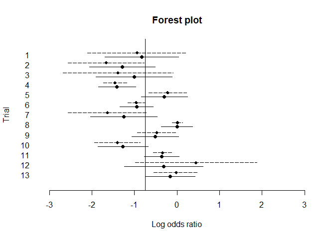

Standard meta-analysis
================

``` r
pacman::p_load(
        rio,            # import and export files
        here,           # locate files 
        tidyverse,      # data management and visualization
        mixmeta,
        skimr
)
```

## Data

``` r
# data #-----------
tibble(bcg)
```

    ## # A tibble: 13 × 13
    ##    trial author           year  tpos  tneg  cpos  cneg ablat alloc   logrr logrrvar   logor logorvar
    ##    <int> <fct>           <int> <int> <int> <int> <int> <int> <fct>   <dbl>    <dbl>   <dbl>    <dbl>
    ##  1     1 Aronson          1948     4   119    11   128    44 rand… -0.889   0.326   -0.939   0.357  
    ##  2     2 Ferguson & Sim…  1949     6   300    29   274    55 rand… -1.59    0.195   -1.67    0.208  
    ##  3     3 Rosenthal et al  1960     3   228    11   209    42 rand… -1.35    0.415   -1.39    0.433  
    ##  4     4 Hart & Sutherl…  1977    62 13536   248 12619    52 rand… -1.44    0.0200  -1.46    0.0203 
    ##  5     5 Frimodt-Moller…  1973    33  5036    47  5761    13 alte… -0.218   0.0512  -0.219   0.0520 
    ##  6     6 Stein & Aronson  1953   180  1361   372  1079    44 alte… -0.786   0.00691 -0.958   0.00991
    ##  7     7 Vandiviere et …  1973     8  2537    10   619    19 rand… -1.62    0.223   -1.63    0.227  
    ##  8     8 TPT Madras       1980   505 87886   499 87892    13 rand…  0.0120  0.00396  0.0120  0.00401
    ##  9     9 Coetzee & Berj…  1968    29  7470    45  7232    27 rand… -0.469   0.0564  -0.472   0.0570 
    ## 10    10 Rosenthal et al  1961    17  1699    65  1600    42 syst… -1.37    0.0730  -1.40    0.0754 
    ## 11    11 Comstock et al   1974   186 50448   141 27197    18 syst… -0.339   0.0124  -0.341   0.0125 
    ## 12    12 Comstock & Web…  1969     5  2493     3  2338    33 syst…  0.446   0.533    0.447   0.534  
    ## 13    13 Comstock et al   1976    27 16886    29 17825    33 syst… -0.0173  0.0714  -0.0173  0.0716

``` r
skimr::skim(bcg)
```

|                                                  |      |
|:-------------------------------------------------|:-----|
| Name                                             | bcg  |
| Number of rows                                   | 13   |
| Number of columns                                | 13   |
| \_\_\_\_\_\_\_\_\_\_\_\_\_\_\_\_\_\_\_\_\_\_\_   |      |
| Column type frequency:                           |      |
| factor                                           | 2    |
| numeric                                          | 11   |
| \_\_\_\_\_\_\_\_\_\_\_\_\_\_\_\_\_\_\_\_\_\_\_\_ |      |
| Group variables                                  | None |

Data summary

**Variable type: factor**

| skim_variable | n_missing | complete_rate | ordered | n_unique | top_counts |
|:---|---:|---:|:---|---:|:---|
| author | 0 | 1 | FALSE | 11 | Com: 2, Ros: 2, Aro: 1, Coe: 1 |
| alloc | 0 | 1 | FALSE | 3 | ran: 7, sys: 4, alt: 2 |

**Variable type: numeric**

| skim_variable | n_missing | complete_rate | mean | sd | p0 | p25 | p50 | p75 | p100 | hist |
|:---|---:|---:|---:|---:|---:|---:|---:|---:|---:|:---|
| trial | 0 | 1 | 7.00 | 3.89 | 1.00 | 4.00 | 7.00 | 10.00 | 13.00 | ▇▅▇▅▇ |
| year | 0 | 1 | 1966.23 | 10.93 | 1948.00 | 1960.00 | 1969.00 | 1974.00 | 1980.00 | ▆▂▂▇▇ |
| tpos | 0 | 1 | 81.92 | 141.93 | 3.00 | 6.00 | 27.00 | 62.00 | 505.00 | ▇▂▁▁▁ |
| tneg | 0 | 1 | 14615.31 | 25915.13 | 119.00 | 1361.00 | 2537.00 | 13536.00 | 87886.00 | ▇▁▁▁▁ |
| cpos | 0 | 1 | 116.15 | 159.13 | 3.00 | 11.00 | 45.00 | 141.00 | 499.00 | ▇▁▁▁▁ |
| cneg | 0 | 1 | 12674.85 | 24063.07 | 128.00 | 619.00 | 2338.00 | 12619.00 | 87892.00 | ▇▂▁▁▁ |
| ablat | 0 | 1 | 33.46 | 14.44 | 13.00 | 19.00 | 33.00 | 44.00 | 55.00 | ▇▂▃▇▃ |
| logrr | 0 | 1 | -0.74 | 0.69 | -1.62 | -1.37 | -0.79 | -0.22 | 0.45 | ▇▂▃▆▂ |
| logrrvar | 0 | 1 | 0.15 | 0.17 | 0.00 | 0.02 | 0.07 | 0.22 | 0.53 | ▇▁▁▂▁ |
| logor | 0 | 1 | -0.77 | 0.71 | -1.67 | -1.40 | -0.94 | -0.22 | 0.45 | ▇▃▂▆▂ |
| logorvar | 0 | 1 | 0.16 | 0.18 | 0.00 | 0.02 | 0.07 | 0.23 | 0.53 | ▇▁▁▁▂ |

## Reproduce example in `mixmeta::bcg`

``` r
# example #------------------------

### REPRODUCE THE RESULTS IN VAN HOUWELINGEN ET AL (2002)

# FIXED-EFFECTS META-ANALYSIS (SECTION 3.1.1)
unifix <- mixmeta(logor, logorvar, data=bcg, method="fixed")

print(summary(unifix), digits=3)
```

    ## Call:  mixmeta(formula = logor, S = logorvar, data = bcg, method = "fixed")
    ## 
    ## Univariate fixed-effects meta-analysis
    ## Dimension: 1
    ## 
    ## Fixed-effects coefficients
    ##              Estimate  Std. Error        z  Pr(>|z|)  95%ci.lb  95%ci.ub     
    ## (Intercept)    -0.436       0.042  -10.319     0.000    -0.519    -0.353  ***
    ## ---
    ## Signif. codes:  0 '***' 0.001 '**' 0.01 '*' 0.05 '.' 0.1 ' ' 1 
    ## 
    ## Univariate Cochran Q-test for heterogeneity:
    ## Q = 163.165 (df = 12), p-value = 0.000
    ## I-square statistic = 92.6%
    ## 
    ## 13 units, 1 outcome, 13 observations, 1 fixed and 0 random-effects parameters
    ##  logLik      AIC      BIC  
    ## -76.029  154.058  154.623

``` r
# RANDOM-EFFECTS META-ANALYSIS WITH MAXIMUM LIKELIHOOD (SECTION 3.1.2)
uniran <- mixmeta(logor, logorvar, data=bcg, method="ml")

print(summary(uniran), digits=3, report="var")
```

    ## Call:  mixmeta(formula = logor, S = logorvar, data = bcg, method = "ml")
    ## 
    ## Univariate random-effects meta-analysis
    ## Dimension: 1
    ## Estimation method: ML
    ## 
    ## Fixed-effects coefficients
    ##              Estimate  Std. Error       z  Pr(>|z|)  95%ci.lb  95%ci.ub     
    ## (Intercept)    -0.742       0.178  -4.169     0.000    -1.091    -0.393  ***
    ## ---
    ## Signif. codes:  0 '***' 0.001 '**' 0.01 '*' 0.05 '.' 0.1 ' ' 1 
    ## 
    ## Random-effects (co)variance components
    ##  Structure: General positive-definite
    ##     Var
    ##   0.302
    ## 
    ## Univariate Cochran Q-test for heterogeneity:
    ## Q = 163.165 (df = 12), p-value = 0.000
    ## I-square statistic = 92.6%
    ## 
    ## 13 units, 1 outcome, 13 observations, 1 fixed and 1 random-effects parameters
    ##  logLik      AIC      BIC  
    ## -13.073   30.146   31.275

``` r
# ORIGINAL ESTIMATES AND BEST-LINEAR UNBIASED PREDICTIONS (FIGURE 3)
pred <- with(bcg, cbind(logor, logor-1.96*sqrt(logorvar),
                        logor+1.96*sqrt(logorvar)))

# Best Linear Unbiased Predictions
blup <- blup(uniran, pi=TRUE)

plot(pred[,1], rev(bcg$trial)+0.2, xlim=c(-3,3), ylim=c(0,14), pch=18,
     axes=FALSE, xlab="Log odds ratio", ylab="Trial", main="Forest plot")
axis(1)
axis(2, at=bcg$trial, labels=rev(bcg$trial), lty=0, las=1)
abline(v=coef(uniran))
segments(pred[,2], rev(bcg$trial)+0.2, pred[,3], rev(bcg$trial)+0.2, lty=5)
points(blup[,1], rev(bcg$trial)-0.2, pch=19)
segments(blup[,2], rev(bcg$trial)-0.2, blup[,3], rev(bcg$trial)-0.2)
```

<!-- -->

``` r
# COMPUTE THE OUTCOME SEPARATELY FOR TREATMENT AND CONTROL GROUPS
y <- with(bcg, log(cbind(tpos/tneg, cpos/cneg)))
S <- with(bcg, cbind(1/tpos+1/tneg, 1/cpos+1/cneg))

# BIVARIATE RANDOM-EFFECTS META-ANALYSIS (SECTION 4)
mvran <- mixmeta(y, S, method="ml")
print(summary(mvran), digits=3, report="var")
```

    ## Call:  mixmeta(formula = y, S = S, method = "ml")
    ## 
    ## Multivariate random-effects meta-analysis
    ## Dimension: 2
    ## Estimation method: ML
    ## 
    ## Fixed-effects coefficients
    ##     Estimate  Std. Error        z  Pr(>|z|)  95%ci.lb  95%ci.ub     
    ## y1    -4.834       0.340  -14.233     0.000    -5.499    -4.168  ***
    ## y2    -4.096       0.435   -9.423     0.000    -4.948    -3.244  ***
    ## ---
    ## Signif. codes:  0 '***' 0.001 '**' 0.01 '*' 0.05 '.' 0.1 ' ' 1 
    ## 
    ## Random-effects (co)variance components
    ##  Structure: General positive-definite
    ##       Var   Corr
    ## y1  1.431     y1
    ## y2  2.407  0.947
    ## 
    ## Multivariate Cochran Q-test for heterogeneity:
    ## Q = 5270.386 (df = 24), p-value = 0.000
    ## I-square statistic = 99.5%
    ## 
    ## 13 units, 2 outcomes, 26 observations, 2 fixed and 3 random-effects parameters
    ##  logLik      AIC      BIC  
    ## -33.088   76.176   82.466

``` r
# META-REGRESSION (SECTION 5)
uniranlat <- update(uniran, .~. + ablat)
print(summary(uniranlat), digits=3, report="var")
```

    ## Call:  mixmeta(formula = logor ~ ablat, S = logorvar, data = bcg, method = "ml")
    ## 
    ## Univariate random-effects meta-regression
    ## Dimension: 1
    ## Estimation method: ML
    ## 
    ## Fixed-effects coefficients
    ##              Estimate  Std. Error       z  Pr(>|z|)  95%ci.lb  95%ci.ub     
    ## (Intercept)     0.371       0.106   3.502     0.000     0.163     0.579  ***
    ## ablat          -0.033       0.003  -9.705     0.000    -0.039    -0.026  ***
    ## ---
    ## Signif. codes:  0 '***' 0.001 '**' 0.01 '*' 0.05 '.' 0.1 ' ' 1 
    ## 
    ## Random-effects (co)variance components
    ##  Structure: General positive-definite
    ##     Var
    ##   0.004
    ## 
    ## Univariate Cochran Q-test for residual heterogeneity:
    ## Q = 25.095 (df = 11), p-value = 0.009
    ## I-square statistic = 56.2%
    ## 
    ## 13 units, 1 outcome, 13 observations, 2 fixed and 1 random-effects parameters
    ## logLik     AIC     BIC  
    ## -6.963  19.927  21.622

``` r
drop1(uniranlat, test="Chisq")
```

    ## Single term deletions
    ## 
    ## Model:
    ## logor ~ ablat
    ##        Df    AIC    LRT  Pr(>Chi)    
    ## <none>    19.927                     
    ## ablat   1 30.145 12.219 0.0004731 ***
    ## ---
    ## Signif. codes:  0 '***' 0.001 '**' 0.01 '*' 0.05 '.' 0.1 ' ' 1
